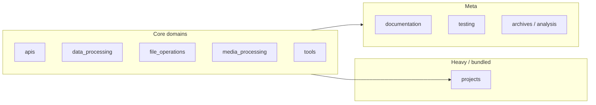

# Preview · Python automation hub (`pythons`)

**Elevator pitch:** A large, organized Python workspace for **file/media automation**, **API and data scripts**, and **bundled projects** (bots, galleries, ML tooling)—packaged conceptually as **python-automation-framework** (MIT), with the main CLI around `pythons_sort`.

**Canonical scope:** Use paths under `~/pythons` **excluding** `.worktrees/` for counts and portfolio stories (worktrees mirror the repo; do not double-count).

---

## Three flagship demos *(fill in run commands & screenshots)*

| # | Lane | Suggested path | One-liner |
|---|------|----------------|-----------|
| 1 | **File / organization spine** | `file_operations/pythons_sort.py` | CLI for analyze / organize workflows (see `--help`). |
| 2 | **API or data** | `apis/` or `data_processing/` | Pick one script with clear input → output. |
| 3 | **Product / vertical** | `projects/` (e.g. `simplegallery`, `botty`, media) | One project you want to show on a resume or gig. |

**Run template (after `pip install -r requirements.txt` in repo root):**

```bash
python file_operations/pythons_sort.py --help
```

---

## Folder map (mental model)



| Area | Role |
|------|------|
| `apis/` | Service integrations and API scripts |
| `data_processing/` | Analytics, CSV/data tooling |
| `file_operations/` | Dedup, rename, organize—including `pythons_sort.py` |
| `media_processing/` | Audio / video / image pipelines |
| `tools/` | Shared automation and utilities |
| `projects/` | Apps, clients, frameworks (e.g. axolotl, galleries, bots) |

---

## Package & repo facts

- **Distribution name (pyproject):** `python-automation-framework`
- **Upstream links (metadata):** see `pyproject.toml` → `[project.urls]`
- **Note:** `pyproject.toml` expects a `src/` layout; if `src/` is missing, align packaging or folder layout before publishing to PyPI.

---

## Docs index

| Doc | Use |
|-----|-----|
| `README.md` | Overview, stats, navigation |
| `AGENTS.md` | Structure & conventions for contributors / future you |
| `INDEX.md` / `QUICK_REFERENCE.md` | Deep navigation (if present) |

---

## Suggested next edits to this preview

1. Replace the three **One-liner** cells with real commands + outputs.
2. Add **one screenshot** or **asciicast** per flagship row.
3. Add **one line** on secrets: `.env` from `.env.example` only.

---

*Generated as a living preview—trim or copy sections into Upwork, README, or a personal site.*
