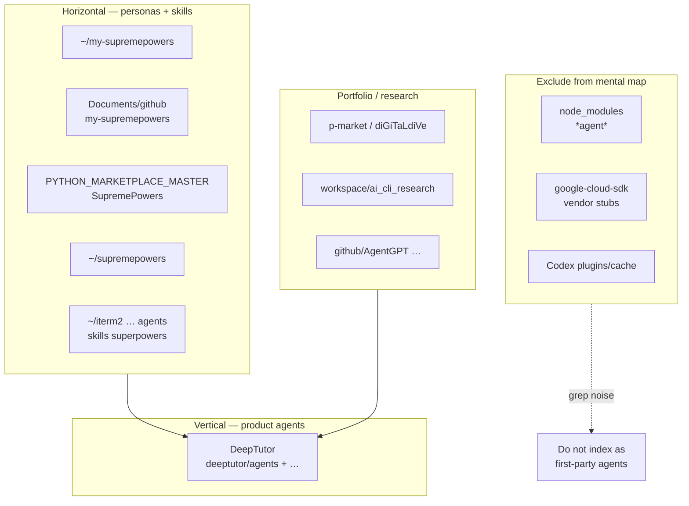

# Agent-related paths — index and review

**Path:** `/Users/steven/Guides/AGENT_ECOSYSTEM_INDEX_AND_REVIEW.md`  
**Machine path list (203 entries):** [`_agent_paths_inventory.txt`](./_agent_paths_inventory.txt)

**Scan:** 2026-05-09 — every path in the inventory **`test -d`** true on this Mac (no missing rows for that snapshot).

**Framing:** Treat “agents” as four different things — [horizontal vs vertical](HORIZONTAL_VERTICAL_FLOWS_AND_EXAMPLES.md) — **orchestrator personas** (SupremePower-style), **LLM pipeline code** (DeepTutor `deeptutor/agents/`), **vendor/SDK folders** whose name happens to include `agent`, and **ephemeral IDE caches**. This review separates them so future `find` / `rg` work does not drown in noise.

---

## 1. Executive summary

| Bucket | Count | Verdict |
|--------|------:|---------|
| **First-party agent + skill ecosystems** (SupremePower / my-supremepowers / mirrors) | ~67 | **Primary horizontal** surface — skills, extension agents, tests, fixtures. |
| **DeepTutor “agents”** (Python pipelines, UI route, tests) | 28 | **Vertical product** code — same tree repeated under Downloads, `MY_SETUP/deeptutor-mimic`, `My-Deep-Proprietary` (+ web/tests). |
| **diGiTaLdiVe / p-market** | 21 | **Product + imports** mix — templates, EXTERNAL_IMPORTS, docs. |
| **Codex plugin cache** (`iterm2/Codex/plugins/cache/...`) | 21 | **Ephemeral** — safe to ignore for “what I authored”; may be wiped by cache eviction. |
| **`node_modules` *agent* paths** | 15 | **False positives** — HTTP `agent-base`, Playwright internals, etc. |
| **Google Cloud SDK** | 9 | **Vendor** — Dialogflow / ops agents / Bedrock **API data**, not your agent library. |
| **GitHub clones** (AgentGPT, Gorilla, Deepgram, …) | 11 | **Third-party** research or apps. |
| **`workspace/ai_cli_research`** | 12 | **Research sandboxes** — gemini-cli, starter packs, categorised CSVs. |
| **Marketplace SKUs** (`fabric`, `multi-agent-skill-pack`, FINISHED_PRODUCTS, …) | 6 | **Inventory** / deliverable trees. |
| **n8n workflow exports** | 2 | **Automation** — duplicate path under `AutoTagger` and `n8n_workflows`. |
| **Cursor / misc** | 4 | Starter plugin, Sora skill pack, loose “Agents” doc folder, etc. |
| **Home `~/supremepowers`** | 11 | Parallel to `my-supremepowers` / marketplace — **another copy** of the same product family. |
| **iterm2 repo** (non-cache: `agents`, `gemini`, `superpowers`, `skill-creator`, `agent_ops`) | 11 | **Canonical repo** worktree — overlaps conceptually with `~/my-supremepowers` content. |

Counts align with classifier output from the inventory script (sums may differ by 1 due to rounding / `Z_other` lumping).

---

## 2. Taxonomy diagram



---

## 3. Duplicate and overlap map (review)

### 3.1 SupremePower family — many roots, one conceptual product

You currently have **parallel trees**:

| Location | Role |
|----------|------|
| `~/my-supremepowers` | Likely **daily driver** home for extensions + skills. |
| `~/Documents/github/my-supremepowers` | **Git working copy** — should track `origin`; merge into home or symlink policy. |
| `~/PYTHON_MARKETPLACE_MASTER/SupremePowers` | **Marketplace pack** — may track releases / SKUs. |
| `~/supremepowers` | **Another full copy** at home — highest drift risk. |
| `~/iterm2/...` | **Repo** containing `superpowers/`, `gemini/`, `Codex/`, top-level `agents/`. |

**Recommendation:** Pick **one write root** for skill edits (`~/my-supremepowers` is typical), one **git remote** canonical (`Documents/github/...` or `iterm2` if that is the true upstream), and treat marketplace copies as **publish targets** or rsync destinations — document in `FUNDAMENTALS.md` ledger.

### 3.2 DeepTutor `deeptutor/agents` — triple vertical copies

Identical **product** subtrees appear under:

- `~/Downloads/Compressed/DeepTutor-main/`
- `~/PYTHON_MARKETPLACE_MASTER/MY_SETUP/deeptutor-mimic/`
- `~/PYTHON_MARKETPLACE_MASTER/My-Deep-Proprietary/`

**Recommendation:** One **canonical** checkout for edits (`Downloads` or `My-Deep-Proprietary` per your merge policy); others **rsync or symlink** — already partially addressed elsewhere in your Guides work.

### 3.3 `dispatching-parallel-agents` skill — many copies

Appears under: `my-supremepowers`, `Documents/github/...`, `iterm2` Codex + superpowers, `p-market`, `PYTHON_MARKETPLACE_MASTER/SupremePowers`, disabled snapshots, etc.

**Recommendation:** Treat **one** directory as canonical skill body; others wrappers or symlinks.

### 3.4 n8n `agentic-workflow-builder-pro`

Two filesystem locations point at the **same workflow export** pattern:

- `~/AutoTagger/n8n_workflows/...`
- `~/n8n_workflows/...`

**Recommendation:** Confirm whether one is symlink; if duplicate, keep one.

---

## 4. “Ignore list” for future ripgrep / inventory

When building **curated** agent inventories, **exclude** (or flag) glob segments:

```
**/node_modules/**
**/google-cloud-sdk/**
**/Codex/plugins/cache/**
**/docs-site/build/**
**/third_party/botocore/data/**
```

Include **explicitly** if you want vendor API shapes:

- `bedrock-agent` JSON under gcloud — only for AWS API reference archaeology.

---

## 5. Horizontal vs vertical placement (quick)

| Path pattern | Horizontal | Vertical |
|--------------|------------|----------|
| `**/skills/**/dispatching-parallel-agents` | Yes — portable workflow | No |
| `**/extensions/supremepower/agents/*.md` | Yes — persona definitions | No |
| `deeptutor/agents/**/*.py` | No | Yes — product pipeline |
| `web/app/(workspace)/agents` | No | Yes — UI route slice |
| `workspace/ai_cli_research/repos/**` | Research (pre-horizontal) | Sometimes fork becomes vertical product |

---

## 6. Regenerate counts (optional)

The inventory file is plain text — one absolute path per line. To re-check existence:

```bash
while IFS= read -r p; do test -d "$p" && echo "OK $p" || echo "MISSING $p"; done < /Users/steven/Guides/_agent_paths_inventory.txt | tail -5
```

To rebuild the category breakdown, re-run the classifier embedded in history or parse with your own taxonomy — the categories in **section 1** are stable enough for navigation until you add new roots.

---

## 7. Suggested next actions (prioritised)

1. **Declare canonical SupremePower write path** in `MY_SETUP/FUNDAMENTALS.md` (+ ledger).  
2. **Deduplicate** `~/supremepowers` vs `~/my-supremepowers` vs `Documents/github/...` (symlink or archive).  
3. **Exclude** `node_modules`, `google-cloud-sdk`, and `Codex/plugins/cache` from any automated “agent inventory” job.  
4. **Merge** n8n duplicate workflow folders if both are real copies.  
5. **Keep** this `AGENT_ECOSYSTEM_INDEX_AND_REVIEW.md` as the **human** index; keep `_agent_paths_inventory.txt` as the **machine** list.

---

## 8. Related Guides

- [`HORIZONTAL_LOGIC_COMPREHENSIVE.md`](./HORIZONTAL_LOGIC_COMPREHENSIVE.md)  
- [`VERTICAL_LOGIC_COMPREHENSIVE.md`](./VERTICAL_LOGIC_COMPREHENSIVE.md)  
- [`AGENTIC_LOCAL_VS_TRENDSHIFT.md`](./AGENTIC_LOCAL_VS_TRENDSHIFT.md) — if present at `~/Guides` root
