# DeepTutor — architecture map, Mermaid diagrams, and code exploration

**Canonical copy:** `~/PYTHON_MARKETPLACE_MASTER/Guides/DeepTutor-ARCHITECTURE_MAP_MERMAID_AND_EXPLORATION.md`  
**Repository roots (pick one when reading paths):**

- Upstream-style checkout: e.g. `~/Downloads/Compressed/DeepTutor-main`
- Your replica: `~/PYTHON_MARKETPLACE_MASTER/My-Deep-Proprietary`

**Purpose:** Visual and textual maps for how DeepTutor **runs**, how **code flows**, and how it behaves as an **extensible framework** (capabilities, tools, APIs, CLI).

---

## 1. Big picture — three delivery surfaces, one runtime spine

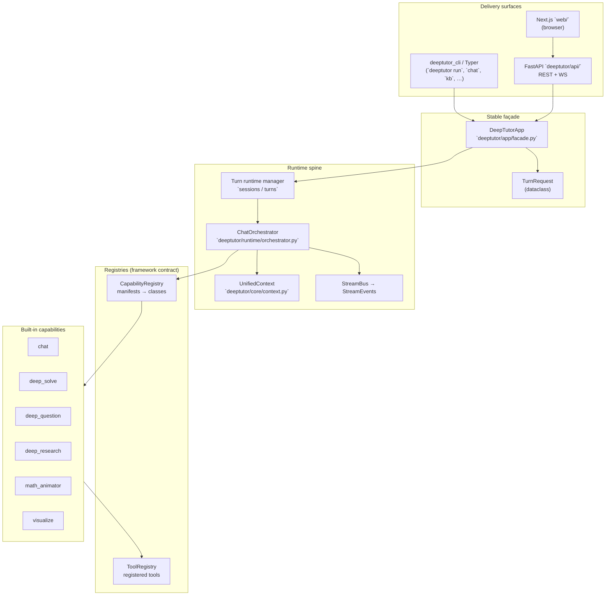

**Reading this diagram:** Every human or agent eventually reaches **`DeepTutorApp`** (or the same payload shape via HTTP). The **`ChatOrchestrator`** is the single routing choke-point: **`UnifiedContext` in → streamed events out**.

---

## 2. Layered architecture (framework vs product features)

| Layer | Location (typical) | Responsibility |
|-------|---------------------|----------------|
| **Adapters** | `deeptutor_cli/`, `deeptutor/api/routers/` | HTTP/Typer/WS wire format → **`TurnRequest`** / **`UnifiedContext`**. |
| **Application façade** | `deeptutor/app/facade.py` | Stable API for **`start_turn`**, **`stream_turn`**, capability resolution, availability checks. |
| **Orchestration** | `deeptutor/runtime/orchestrator.py` | Pick capability, create **`StreamBus`**, run **`capability.run(context, bus)`**, emit **`SESSION`** marker events. |
| **Domain context** | `deeptutor/core/context.py` | **`UnifiedContext`**: message, history, KB names, tools, attachments, language, metadata. |
| **Capabilities** | `deeptutor/capabilities/*` | Product modes (chat, solve, quiz, research, …) — **plugins at the framework level**. |
| **Tools & RAG** | `deeptutor/tools/`, `deeptutor/knowledge/` | Callable tools + retrieval pipelines invoked **inside** capabilities. |
| **Services** | `deeptutor/services/` | Config, paths, session store, notebooks, providers—**shared infrastructure**. |
| **Optional bots** | `deeptutor/tutorbot/` | Autonomous tutors + channel stacks (extra deps via `pyproject` extras). |

---

## 3. CLI command tree (how operators navigate the framework)

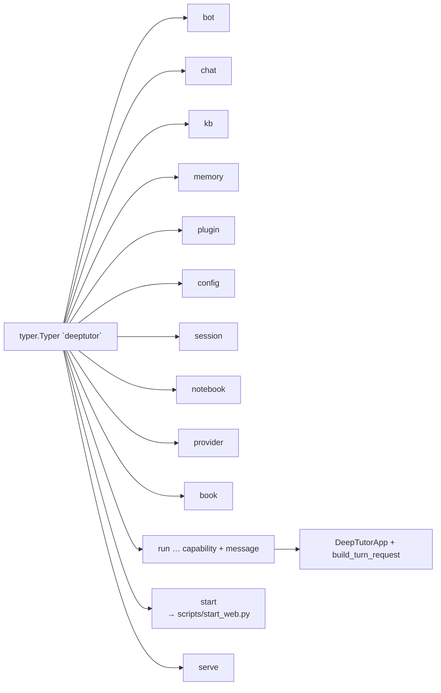

Reference: `deeptutor_cli/main.py` wires sub-apps and **`deeptutor run`** as the **agent-first single-shot** entry (`run_capability`).

---

## 4. HTTP API surface (REST) — router attachment map

Auth is **public** only on `/api/v1/auth/*`. Other routers use **`require_auth`** when `AUTH_ENABLED=true` (no-op locally).

```mermaid
flowchart TB
  ROOT["FastAPI app\n`deeptutor/api/main.py`"]

  ROOT --> AUTH["/api/v1/auth\n`auth`"]
  ROOT --> MU["/api/v1/multi-user\n`multi_user`"]

  ROOT --> SOLVE["`/api/v1` solve"]
  ROOT --> CHATR["`/api/v1` chat"]
  ROOT --> Q["`/api/v1/question`"]
  ROOT --> KNOW["`/api/v1/knowledge`"]
  ROOT --> DASH["`/api/v1/dashboard`"]
  ROOT --> CW["`/api/v1/co_writer`"]
  ROOT --> NOTE["`/api/v1/notebook`"]
  ROOT --> BOOK["`/api/v1/book`"]
  ROOT --> MEM["`/api/v1/memory`"]
  ROOT --> SESS["`/api/v1/sessions`"]
  ROOT --> QN["`/api/v1/question-notebook`"]
  ROOT --> SET["`/api/v1/settings`"]
  ROOT --> SK["`/api/v1/skills`"]
  ROOT --> SYS["`/api/v1/system`"]
  ROOT --> PL["`/api/v1/plugins`"]
  ROOT --> AC["`/api/v1/agent-config`"]
  ROOT --> VS["`/api/v1` vision_solver"]
  ROOT --> TB["`/api/v1/tutorbot`"]
  ROOT --> ATT["`/api/attachments`"]

  ROOT --> UWS["`/api/v1` unified_ws\n(WebSocket — auth inside handler)"]
```

---

## 5. Turn execution sequence (conceptual)

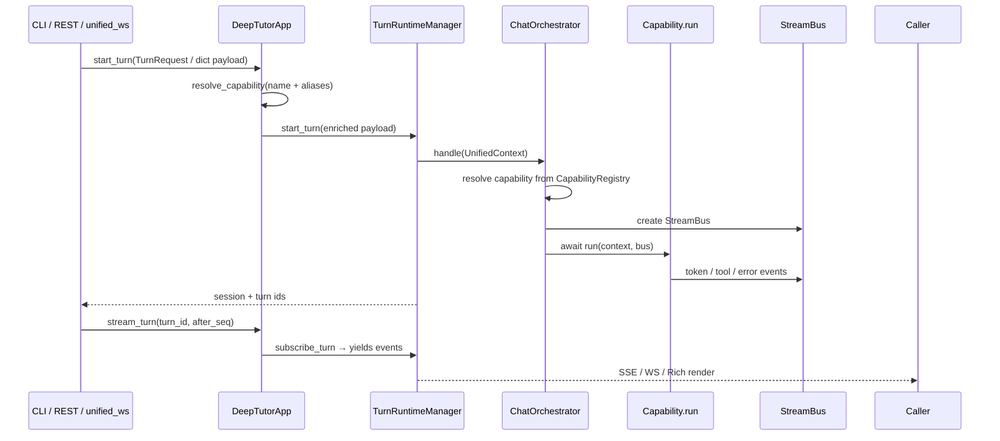

---

## 6. Orchestrator routing (framework core)

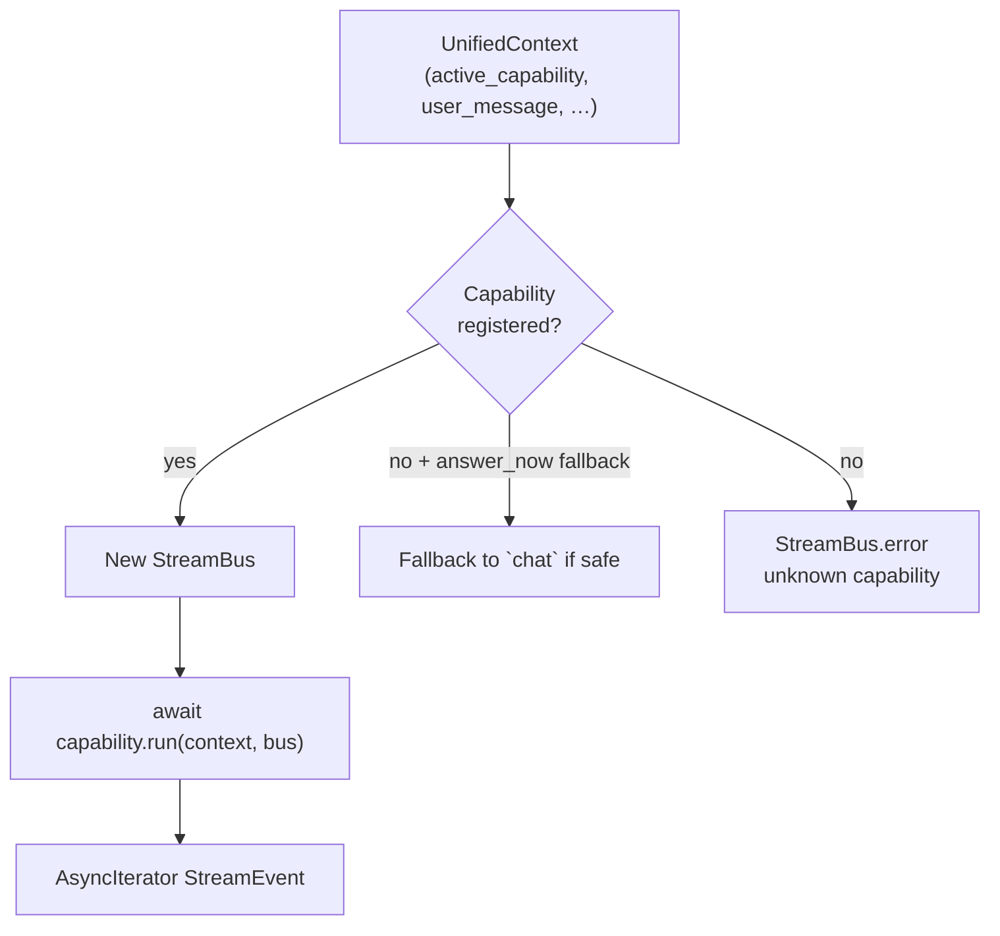

Logic reference: `deeptutor/runtime/orchestrator.py` (`ChatOrchestrator.handle`).

---

## 7. Built-in capability plug-in map

Capabilities are **framework plug-ins**: registered by name and loaded from class paths.

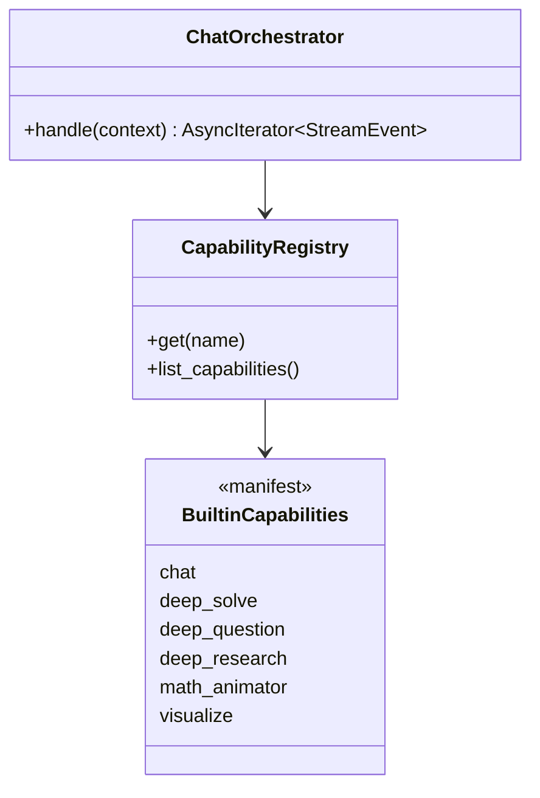

Class paths (bootstrap): `deeptutor/runtime/bootstrap/builtin_capabilities.py` maps each name to `deeptutor.capabilities.<module>:<Class>`.

---

## 8. Startup integrity — tools vs capability manifests

On API startup, **`validate_tool_consistency()`** ensures every tool name referenced in capability manifests exists in **`ToolRegistry`**. If not, startup fails with a clear **configuration drift** error.

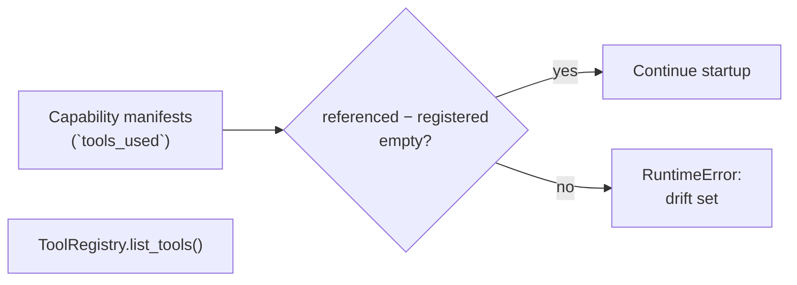

Reference: `deeptutor/api/main.py` (`validate_tool_consistency`, invoked from lifespan).

---

## 9. `UnifiedContext` — what flows through the framework

High-signal fields (see `deeptutor/core/context.py`):

```text
session_id, user_message, conversation_history
enabled_tools (None vs [] semantics matter)
active_capability, knowledge_bases, attachments[]
config_overrides (e.g. answer_now_context)
language
notebook_context, history_context, memory_context, skills_context
metadata (turn_id, extras)
```

**Framework lesson:** New features should either **extend context metadata carefully** or **add services**—avoid forking orchestrator unless routing rules change.

---

## 10. Frontend (`web/`) — how it fits

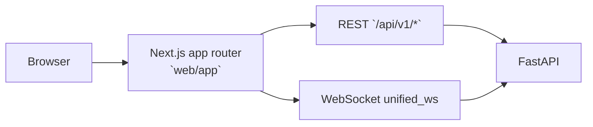

Explore: `web/features`, `web/lib`, `web/i18n` for product modules; Playwright tests under `web/tests`.

---

## 11. Exploration playbook — where to read first

| Goal | Start file / directory |
|------|-------------------------|
| Single-turn CLI path | `deeptutor_cli/main.py` → `deeptutor_cli/common.py` → `deeptutor/app/facade.py` |
| Orchestration | `deeptutor/runtime/orchestrator.py` |
| Context model | `deeptutor/core/context.py`, `deeptutor/core/stream*.py` |
| Capability list | `deeptutor/runtime/bootstrap/builtin_capabilities.py` then `deeptutor/capabilities/` |
| Tools | `deeptutor/tools/` + `deeptutor/runtime/registry/tool_registry.py` |
| HTTP surface | `deeptutor/api/main.py` then `deeptutor/api/routers/*.py` |
| WebSocket protocol | `deeptutor/api/routers/unified_ws.py` |
| RAG / KB | `deeptutor/knowledge/`, `deeptutor/api/routers/knowledge.py` |
| Packaging extras | `pyproject.toml` `[project.optional-dependencies]` |
| Docker paths | `Dockerfile`, `docker-compose*.yml` |

**Ripgrep recipes** (run from repo root):

```bash
rg -n "class .*Capability" deeptutor/capabilities
rg -n "get_capability_registry|CapabilityRegistry" deeptutor
rg -n "UnifiedContext\(" deeptutor
rg -n "include_router" deeptutor/api/main.py
```

---

## 12. Mental model — DeepTutor as a framework

Use this checklist when extending DeepTutor:

1. **New teaching mode?** → Prefer a **new Capability** + manifest tools list + register class path (mirror builtins).
2. **New side-effecting action for agents?** → Implement a **Tool**, register it, reference from manifests; run **`validate_tool_consistency`** mentally when editing YAML/JSON.
3. **New transport?** → Adapt wire format → build **`UnifiedContext`** → reuse **`ChatOrchestrator`** (same as CLI/Web parity goal).
4. **New channel (Discord/Slack/…)?** → Usually **`tutorbot`** / extras — keep dependency cones aligned with `pyproject.toml`.

---

## Rendering notes

- **GitHub / VS Code:** native Mermaid preview on many builds.
- **Obsidian / Notion:** paste diagrams into a Mermaid block.
- **MkDocs:** enable `pymdownx.superfences` with `mermaid` support or use Mermaid CLI for PNG/SVG exports.

---

*Upstream narrative docs remain each repo’s `README.md` and `AGENTS.md`. Edit **this** file when diagrams drift from code; optional rsync into `My-Deep-Proprietary` does not need a second copy under `docs/guides`.*

---

## 13. Dual scope — this checkout **and** how DeepTutor works in general

Everything **above** stays valid for **any** DeepTutor tree. Use this section when you want both:

| Track | Meaning |
|-------|---------|
| **Concrete anchor** | Your machine path **`CHECKOUT=/Users/steven/Downloads/Compressed/DeepTutor-main`** — substitute **`{REPO_ROOT}`** in prose below if your clone differs (`My-Deep-Proprietary`, etc.). |
| **Abstract mechanics** | **Roles** (transport → façade → turn runtime → orchestrator → capability → tools/LLM) stay the same across clones; only paths change. |

**Quick mental merge:** Read diagrams as **patterns**; open files under `{REPO_ROOT}/deeptutor/...` on disk.

---

## 14. Structural decomposition — directories as **roles** (not “misc folders”)

Path prefix always `{REPO_ROOT}/…`.

| Area | Role in the machine |
|------|---------------------|
| `deeptutor_cli/` | **Adapters:** Typer commands → `TurnRequest` / subprocess `start_web`. |
| `deeptutor/api/` | **Adapters:** FastAPI routers + lifespan hooks (e.g. tool drift check); WebSocket `unified_ws`. |
| `deeptutor/app/` | **Stable façade:** `DeepTutorApp`, `TurnRequest` — what CLI/SDK/HTTP should target. |
| `deeptutor/runtime/` | **Scheduling:** `ChatOrchestrator`, turn/session managers, **CapabilityRegistry** wiring. |
| `deeptutor/core/` | **Contracts:** `UnifiedContext`, `StreamBus`, streaming types, capability/tool protocols. |
| `deeptutor/capabilities/` | **Product modes:** each `BaseCapability` + `CapabilityManifest` (name, stages, `tools_used`). |
| `deeptutor/agents/` | **Pipelines:** multi-step LLM loops (e.g. chat agentic pipeline) that **consume** `ToolRegistry`. |
| `deeptutor/tools/` | **Side-effecting units:** `BaseTool` implementations; registered in `ToolRegistry`. |
| `deeptutor/knowledge/` | **RAG / KB** backing for tools and routers. |
| `deeptutor/services/` | **Infra:** config, prompts, LLM bindings, paths, session stores. |
| `deeptutor/tutorbot/` | **Optional product plane:** bots/channels (extra deps). |
| `web/` | **UI adapter:** Next.js → REST + WS to same backend. |
| `scripts/` | **Ops:** tours, migrations, smoke tests. |

This table is the bridge between **“what folder do I open?”** and **“what responsibility does the framework assign?”**

---

## 15. How capabilities, tools, and the LLM **call each other** (collaboration graph)

DeepTutor separates **routing** (orchestrator picks **one** capability) from **execution** (capability runs an internal pipeline that may loop LLM ↔ tools).

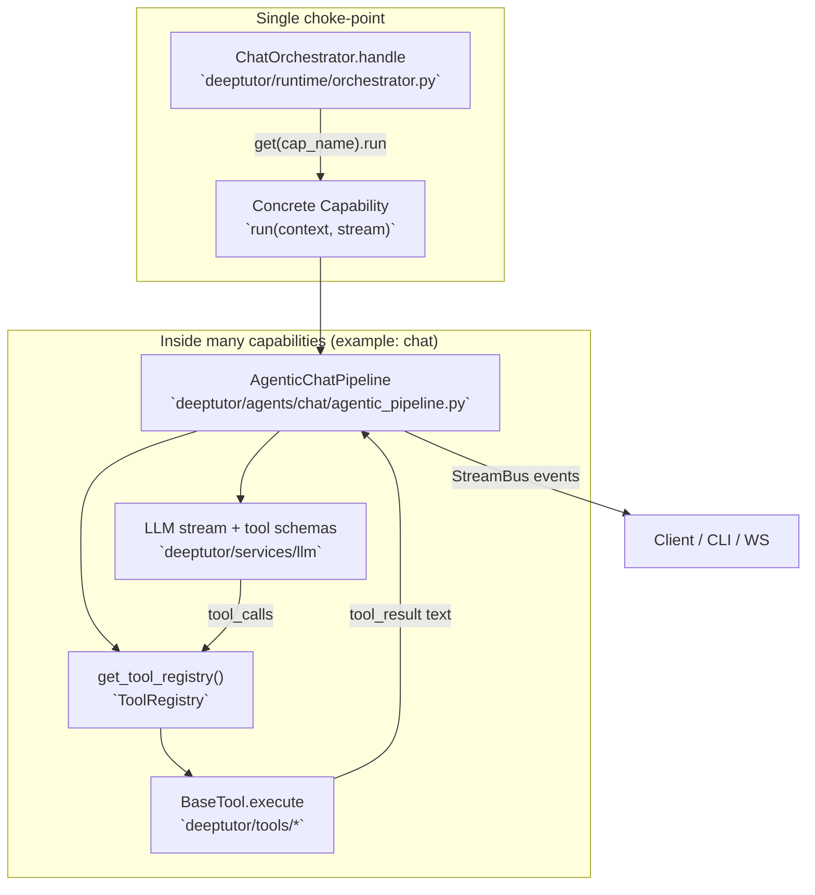

**Contract reminders:**

- **`CapabilityManifest.tools_used`** must list tool names that **`ToolRegistry`** actually exposes — API startup **`validate_tool_consistency()`** enforces that (`deeptutor/api/main.py`).
- **`UnifiedContext.enabled_tools`** expresses **user-selected** subsets for optional tools (`None` vs `[]` semantics matter — see `deeptutor/core/context.py`).

**Concrete files to read together:**

1. `{REPO_ROOT}/deeptutor/core/capability_protocol.py` — `BaseCapability`, `CapabilityManifest`.
2. `{REPO_ROOT}/deeptutor/capabilities/chat.py` — thin capability delegating to pipeline.
3. `{REPO_ROOT}/deeptutor/agents/chat/agentic_pipeline.py` — **`get_tool_registry()`**, LLM stages, parallel tool caps.
4. `{REPO_ROOT}/deeptutor/runtime/registry/tool_registry.py` — register / `get` / `execute` pattern.

---

## 16. Implementation comparison — map DeepTutor’s pattern to **your** build

Use this when deciding **fork**, **extract library**, or **reenact ideas elsewhere**.

| DeepTutor construct | Responsibility | If you implement elsewhere |
|---------------------|----------------|---------------------------|
| `UnifiedContext` | One bag of state per turn | Same idea: single DTO passed through graph; avoid scattering globals. |
| `ChatOrchestrator` | Capability router + `StreamBus` lifecycle | Equivalent: state machine / router node before domain logic. |
| `CapabilityRegistry` | Name → class + manifest | Plugin registry, entry_points, or YAML → import string. |
| `ToolRegistry` + `BaseTool` | Named tools with schemas | OpenAI tool schema registry, MCP tools, or internal service objects. |
| `CapabilityManifest.tools_used` | Declared dependency surface | Keep manifest ↔ runtime validation or accept drift bugs. |
| `AgenticChatPipeline` | LLM ↔ tool loop | LangGraph / custom ReAct / Assistants API — same loop, different wrapper. |
| `deeptutor_cli` / `api/routers` | Transports | Your FastAPI + your CLI; keep façade stable if you want parity. |
| `validate_tool_consistency` | Fail-fast config | Equivalent: CI check or pytest that manifests match registry. |

**Fork checklist (minimal):**

1. Preserve **`UnifiedContext`** shape or write an adapter — orchestrator and capabilities assume fields exist.
2. Adding tools: implement **`BaseTool`**, register, update manifests, **restart API** and confirm drift check passes.
3. Adding modes: new **`BaseCapability`**, register in bootstrap mapping (`deeptutor/runtime/bootstrap/builtin_capabilities.py` pattern).
4. Keep **streaming contract** (`StreamBus` events) stable if `web/` or CLI consumers must not break.

---

## 17. Path cheat sheet (your anchor only)

Replace if you relocate the repo; mechanics unchanged.

```text
CHECKOUT=/Users/steven/Downloads/Compressed/DeepTutor-main

{REPO_ROOT}/deeptutor/runtime/orchestrator.py     # routing
{REPO_ROOT}/deeptutor/app/facade.py               # façade
{REPO_ROOT}/deeptutor/core/context.py             # UnifiedContext
{REPO_ROOT}/deeptutor/core/capability_protocol.py # capability contract
{REPO_ROOT}/deeptutor/api/main.py                 # routers + startup validation
{REPO_ROOT}/deeptutor_cli/main.py                 # Typer entry
{REPO_ROOT}/web/                                  # Next.js
```

---

*Sections 13–17 added after the original body (§1–§12); §19 clarifies edit conventions.*

---

## 18. Maintenance convention — references using `-` and `+`

“Don’t overwrite the original” applies **especially** to **reference lines** tracked with diff-style prefixes:

- **`-`** — previous or alternate reference (still useful for comparison, or staged for removal).
- **`+`** — current canonical reference.

**Preferred update:** **append** new `+` lines (and optional `-` lines for what they replace) instead of silently rewriting a whole bullet list or path block—so history of “what pointed where” stays visible in one scroll.

**Not a global rule:** diagrams, tables, and prose may still be edited normally when you intentionally revise content; the `-` / `+` pattern is for **path churn, repo aliases, and citation lists** where silent replacement caused confusion.

**Granular replacement (allowed for clarity):** You may **rewrite or replace an individual section, subsection, diagram, or table** when that improves readability—e.g. swap a Mermaid diagram for a table where renderer support is weak, tighten one numbered §, or fix a misleading explanation—**without** duplicating the whole section below as an append. Prefer **small scoped diffs**: touch only the unit that confused readers; leave unrelated sections and **reference ledgers** on the append-first rule above.

**Example (repository roots):**

```text
- ~/Downloads/Compressed/DeepTutor-main          # example upstream checkout
+ ~/PYTHON_MARKETPLACE_MASTER/My-Deep-Proprietary # full replica + overlay
+ CHECKOUT=/Users/steven/Downloads/Compressed/DeepTutor-main  # concrete anchor (this doc §13)
```

---

## 19. Quick mapping: markdown `-` bullets vs diff `-` / `+`

| Syntax | Meaning in **this** guide |
|--------|---------------------------|
| `- item` at start of line (normal list) | Ordinary Markdown bullet — unchanged by convention. |
| `- path` or `+ path` inside a fenced `text` / `diff` block | **Reference ledger** — treat as append-first edits per §18. |

When in doubt: put reference churn inside a fenced block with explicit `-` / `+` lines; keep narrative bullets as regular `-` lists.

---

## 20. Exploration pass — `DeepTutor-main` **with** `/Users/steven/my-supremepowers` discipline

Use SupremePower as **how you work** while DeepTutor stays **what you read**. Below is a factual snapshot plus a skill mapping (no repo files were modified in DeepTutor for this pass).

### 20.1 Reference ledger (session anchors)

```text
+ CHECKOUT=/Users/steven/Downloads/Compressed/DeepTutor-main
+ MY_SUPREMEPOWERS=/Users/steven/my-supremepowers
```

### 20.2 Measured layout (2026-05-09, this disk)

| Metric | Value |
|--------|------:|
| Repo `du -sh` | ~17 MB |
| `deeptutor/` | ~4.9 MB, **416** `*.py` files |
| `web/` | ~2.9 MB |
| `tests/` | ~1.1 MB |
| FastAPI routers under `deeptutor/api/routers/` | **23** modules |

Top-level packages under `deeptutor/`: `agents`, `api`, `app`, `book`, `capabilities`, `co_writer`, `config`, `core`, `events`, `knowledge`, `logging`, `multi_user`, `runtime`, `services`, `tools`, `tutorbot`, `utils` (plus `__init__.py`, `__main__.py`).

### 20.3 Doc vs tree drift (verify before automation)

`AGENTS.md` describes **`deeptutor/plugins/`** and playground plugins. On this checkout **`deeptutor/plugins/` is absent** — treat plugin docs as **forward-looking or version-skew** until the directory appears upstream.

```text
- AGENTS.md § “Playground Plugins” → path deeptutor/plugins/
+ (disk) no deeptutor/plugins/ — reconcile with upstream release or local sparse export
```

### 20.4 How `my-supremepowers` fits this exploration

| SupremePower asset | Use while exploring DeepTutor |
|--------------------|-------------------------------|
| `docs/INDEX.md` | Jump-off for **workflow** docs (`WORKFLOW_DEBUGGING`, `WORKFLOW_FEATURE_DEVELOPMENT`, …). |
| `skills/workflow-bootstrap/SKILL.md` | **Brainstorm → design → plan → implement** before you fork or patch DeepTutor heavily. |
| `skills/using-superpowers/SKILL.md` | Reminder to **invoke process skills** (debugging, verification) instead of ad-hoc edits. |
| `skills/systematic-debugging` / `verification-before-completion` | After you **run** DeepTutor locally — trace failures along orchestrator → capability → pipeline paths from §15 above. |
| `docs/WORKFLOW_CONTROL_PLANE_ANALYSIS.md` | Same **canonical vs archive** instinct applies: treat `AGENTS.md` + this **`Guides/`** file as runtime truth; treat stale chat logs as noise. |

**Practical pairing:** Open **`CHECKOUT/AGENTS.md`** (architecture summary) side-by-side with **`MY_SUPREMEPOWERS/docs/INDEX.md`** — DeepTutor tells you *what the product is*; SupremePower tells you *in what order to change it safely*.

### 20.5 Suggested next exploration steps (ordered)

1. **`deeptutor/runtime/orchestrator.py`** + **`deeptutor/app/facade.py`** — confirm `UnifiedContext` fields used by your intended feature.
2. **One capability file** + matching **`agents/.../pipeline`** — e.g. `capabilities/chat.py` → `agents/chat/agentic_pipeline.py`.
3. **`deeptutor/api/main.py`** lifespan — `validate_tool_consistency()` after any manifest edit.
4. **`web/`** — grep feature folder for API path matching router names from §4 above.
5. Resolve **`plugins/` drift** — check upstream Git tag / issue or sparse checkout.

### 20.6 Optional command stubs (run from `CHECKOUT`)

```bash
cd /Users/steven/Downloads/Compressed/DeepTutor-main
/usr/bin/find deeptutor -name "*.py" | wc -l
ls deeptutor/api/routers
rg -n "plugins" AGENTS.md deeptutor
deeptutor --help 2>/dev/null || true   # after venv install
```

---

## 21. User-listed paths — inventory & roles (`CHECKOUT`)

**Append-only snapshot.** Scope matches your explicit list: subtrees `assets`, `deeptutor`, `deeptutor_cli`, `requirements`, `scripts`, `tests`, `web`, plus named root artifacts.

### 21.1 Reference ledger

```text
+ CHECKOUT=/Users/steven/Downloads/Compressed/DeepTutor-main
+ Inventory date: 2026-05-09 (local disk scan)
```

### 21.2 Subtree scale (file count = regular files recursive)

| Path under `CHECKOUT` | Files | `du -sh` | Role (short) |
|----------------------|------:|----------|----------------|
| `assets/` | 62 | ~7.4 MB | i18n README fragments, `releases/` changelog MD, `figs/`, `roster/` SVGs — **marketing/repo UX**, not runtime imports. |
| `deeptutor/` | 542 | ~4.9 MB | **Python product:** API, orchestrator, capabilities, agents, tools, knowledge, services, tutorbot, multi_user. |
| `deeptutor_cli/` | 15 | ~92 KB | **Typer CLI** entry + command modules → façade / subprocess `start_web`. |
| `requirements/` | 6 | ~24 KB | Layered pins mirroring `pyproject.toml` extras (`cli`, `server`, `tutorbot`, …). |
| `scripts/` | 14 | ~208 KB | Operator helpers: tour, migrations, probes, `start_web.py`, etc. |
| `tests/` | 169 | ~1.1 MB | Pytest mirror of package concerns. |
| `web/` | 239 | ~2.9 MB | Next.js UI, Playwright config, locales. |

### 21.3 Root artifacts you listed — purpose line each

| File | Purpose |
|------|---------|
| `.dockerignore` | Shrinks Docker build context. |
| `.env.example` / `.env.example_CN` | Document required env vars (CN variant for localized onboarding). |
| `.gitattributes` | Line endings / binary hygiene. |
| `.gitignore` | Exclude `.env`, caches, build dirs. |
| `.pre-commit-config.yaml` | Hooks (format/lint/security) for contributors. |
| `.secrets.baseline` | `detect-secrets` baseline for CI hygiene. |
| `AGENTS.md` | **Agent-oriented architecture** summary (tools vs capabilities); verify against tree (`plugins/` drift noted in §20.3). |
| `CITATION.cff` | Citation metadata. |
| `Communication.md` | Community channels pointer. |
| `CONTRIBUTING.md` | Contribution workflow. |
| `DeepTutor.code-workspace` | Minimal VS Code/Cursor workspace file. |
| `docker-compose*.yml` | Dev / GHCR / default compose stacks. |
| `Dockerfile` | Container build for backend/services. |
| `LICENSE` | Apache-2.0 (upstream). |
| `pyproject.toml` | Package **`deeptutor`**, extras, console script `deeptutor`. |
| `README.md` | Human onboarding + feature narrative. |
| `requirements.txt` | Umbrella / entry pin; cross-check with `requirements/*.txt`. |
| **`SKILL.md`** | **Agent skill doc** for coding assistants: when to use CLI, `deeptutor run` patterns, KB/bot/memory commands — parallels “skills” ecosystems (e.g. Claude/Cursor) **without** replacing `pyproject` install. |

All listed paths **exist** on `CHECKOUT` at scan time.

### 21.4 How this list connects to §2 / §14 maps

- **`deeptutor/` + `deeptutor_cli/` + `web/`** implement the **three surfaces** in §1 diagram.
- **`requirements/` + `pyproject.toml` + `requirements.txt`** define **install cones** for Docker vs local dev.
- **`scripts/`** is the **operator** layer adjacent to CLI (`deeptutor start` → `scripts/start_web.py`).
- **`assets/`** feeds **README/docs presentation**, not the orchestrator hot path.
- **`tests/`** is the safety net when you change **`deeptutor/`** contracts.

### 21.5 Optional ripgrep (from `CHECKOUT`)

```bash
cd /Users/steven/Downloads/Compressed/DeepTutor-main
rg -n "TODO|FIXME" deeptutor deeptutor_cli web scripts
rg -n "include_router" deeptutor/api/main.py
```

---

## 22. Expanded atlas — Mermaids + reference points for **your** work

**Cross-read:** Personal host discipline (`~/.qwen`, `~/.gemini`, layers, flows) lives in **`Guides/QWEN_AND_GEMINI_HOME_REVIEW_2026-05-09.md`**. This section connects that **workflow plane** to DeepTutor’s **product/framework plane** as **stealable reference patterns** — not a merge of repos.

### 22.1 Reference ledger

```text
+ CHECKOUT=/Users/steven/Downloads/Compressed/DeepTutor-main
+ GUIDES=/Users/steven/PYTHON_MARKETPLACE_MASTER/Guides
+ HOME_AI_REVIEW=GUIDES/QWEN_AND_GEMINI_HOME_REVIEW_2026-05-09.md
```

### 22.2 Two planes — where DeepTutor sits vs where you operate daily

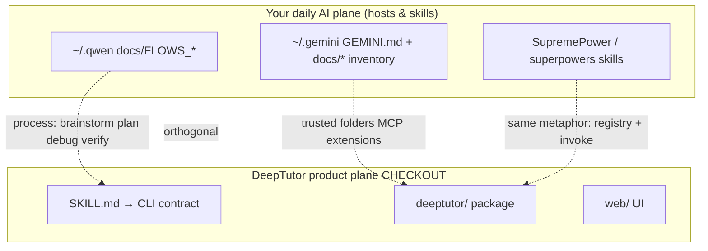

**Takeaway:** Use **host docs** for *how you change anything*; use **DeepTutor** for *how a shipped tutoring stack is layered*. Copy **patterns**, not files.

---

### 22.3 `deeptutor/` internal shape — dependency-of-concern (exploration map)

Not an import graph — **which folders intellectually depend on which** when you read code.

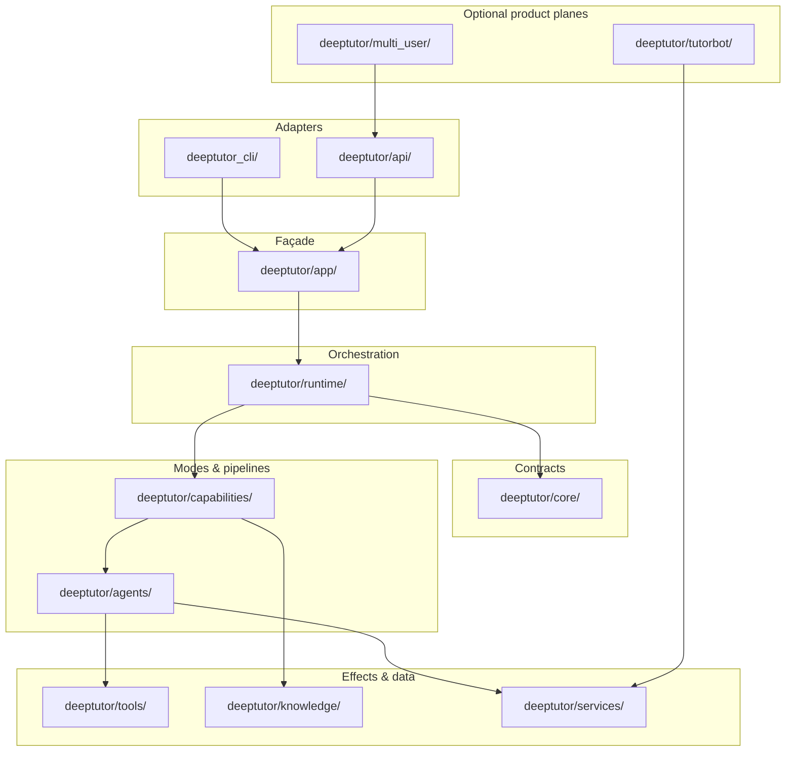

**How to use:** Pick an adapter edge (CLI or HTTP), walk **APP → RT → CAP → AG**, then dive **TOOLS / KNOW / SVC** only when the capability needs them.

---

### 22.4 Turn state machine — one user message through the framework

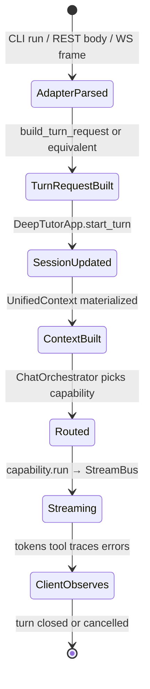

---

### 22.5 Framework extension points — **fork / reference hooks**

Use as a checklist when mirroring ideas in **`PYTHON_MARKETPLACE_MASTER`** or a private app.

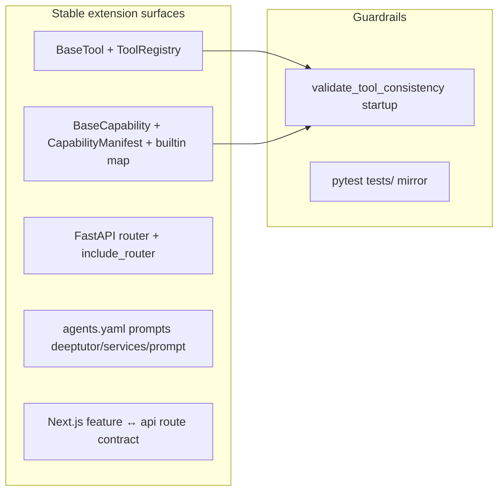

| Extension | Primary files | Your-work analogue |
|-----------|---------------|-------------------|
| Tool | `deeptutor/tools/`, `tool_registry.py` | Named function service, MCP tool, marketplace script with CLI wrapper |
| Capability | `deeptutor/capabilities/`, `runtime/bootstrap/builtin_capabilities.py` | Multi-step “job mode” or SKU pipeline stage |
| Transport | `deeptutor_cli/`, `api/routers/` | n8n HTTP node, separate FastAPI microservice |
| Streaming UX | `core/stream_bus.py`, WS `unified_ws.py` | SSE endpoint, progress JSONL |
| Config drift | `main.py` lifespan validation | CI manifest vs exported tools |

---

### 22.6 Where DeepTutor patterns land in **your** portfolio (2×2)

Many renderers do not support `quadrantChart` — use this table instead of a diagram.

|  | **Thin / composable** | **Heavy / vertical** |
|--|------------------------|----------------------|
| **Loosely coupled** | Script SKUs in `PYTHON_MARKETPLACE_MASTER`; one-off automations | Large category pools; many independent tools |
| **Tightly coupled** | Extract **registry + manifest validation**; **`SKILL.md`-style** agent docs per product | **My-Deep-Proprietary**; full tutor stack fork |

**Reading the grid:** Marketplace inventory sits **upper-left** (many thin SKUs). DeepTutor-like work sits **lower-right**. **Lower-left** is where most *patterns* port without importing the whole repo (drift checks, façade, stream bus metaphor).

---

### 22.7 Exploration ladder — ordered reads for “framework as reference”

| Step | Path under `CHECKOUT` | Pattern to steal |
|-----|------------------------|------------------|
| 1 | `deeptutor/core/context.py` | Single turn DTO |
| 2 | `deeptutor/core/capability_protocol.py` | Declared manifest + `run()` |
| 3 | `deeptutor/runtime/orchestrator.py` | Single router + stream lifecycle |
| 4 | `deeptutor/runtime/registry/*.py` | Registry singletons |
| 5 | One `capabilities/*.py` + matching `agents/*/` | Thin mode → fat pipeline |
| 6 | `deeptutor/api/main.py` | Compose + fail-fast validation |
| 7 | `SKILL.md` | Agent-operable surface doc |

---

### 22.8 Ripgrep — framework vocabulary hunt

```bash
cd /Users/steven/Downloads/Compressed/DeepTutor-main
rg -n "class BaseCapability|BaseTool|CapabilityManifest" deeptutor
rg -n "get_tool_registry|get_capability_registry" deeptutor
rg -n "StreamBus|StreamEvent" deeptutor/core deeptutor/runtime
rg -n "async def run\(" deeptutor/capabilities
```

---

*§22 appended: integrates prior sections §1–§21 with home-ai guide context and adds exploration artifacts for reuse in your marketplace / fork work.*

---

## 23. Edit policy — one-glance summary

| Kind of content | How to change it |
|-----------------|------------------|
| Paths, checkout aliases, “what points where” lists | **Append-first** inside fenced `-` / `+` ledgers (§18). |
| A single §, diagram, table, or code block | **Replace that unit** wholesale if clearer (§18 granular rule). |
| New topic | **Append** a new numbered § (e.g. §24…) unless you are deliberately folding into an existing §. |

§19 still distinguishes normal Markdown `-` bullets from ledger `-` / `+` lines.

