# DeepTutor — comprehensive guide: layout, flows, logic, and operations

**Location:** `/Users/steven/Guides/library/DeepTutor-REPO_LAYOUT_FLOWS_AND_HOWTO.md`

**Default checkout:** `/Users/steven/Downloads/Compressed/DeepTutor-main` — export once:

```bash
export DEEPTUTOR_ROOT="/Users/steven/Downloads/Compressed/DeepTutor-main"
```

**How this doc relates to others**

| Doc | Role |
|-----|------|
| This file | **Single-scroll narrative**: repo topology, packaging, env semantics, Docker, runtime logic (tools vs capabilities), HTTP/CLI paths, tests/scripts inventory, extension playbook, copy-paste ops. |
| [`DeepTutor-ARCHITECTURE_MAP_MERMAID_AND_EXPLORATION.md`](file:///Users/steven/Guides/library/DeepTutor-ARCHITECTURE_MAP_MERMAID_AND_EXPLORATION.md) | **Local atlas** (same dir). Upstream: [`PYTHON_MARKETPLACE_MASTER/Guides/...`](file:///Users/steven/PYTHON_MARKETPLACE_MASTER/Guides/DeepTutor-ARCHITECTURE_MAP_MERMAID_AND_EXPLORATION.md). Numbered sections, `-`/`+` ledgers, SupremePower notes. |
| Repo [`AGENTS.md`](file:///Users/steven/Downloads/Compressed/DeepTutor-main/AGENTS.md) | **Upstream agent summary** (tools/capabilities tables, plugin sketch). |
| Repo [`SKILL.md`](file:///Users/steven/Downloads/Compressed/DeepTutor-main/SKILL.md) | **Assistant-facing CLI recipes**. |
| Repo [`How-To.md`](file:///Users/steven/Downloads/Compressed/DeepTutor-main/How-To.md) | **Short phased local setup**. |

**Optional mirror** inside a clone: `assets/REPO_LAYOUT_FLOWS_AND_HOWTO.md` — prefer editing **this** file under `~/Guides/library/` first.

---

## Table of contents

1. [Executive model — what DeepTutor is](#1-executive-model--what-deeptutor-is)
2. [Repository topology](#2-repository-topology)
3. [Root artifacts (full list you care about)](#3-root-artifacts-full-list-you-care-about)
4. [Configuration logic — `.env` as control plane](#4-configuration-logic--env-as-control-plane)
5. [Python packaging — extras and `requirements/`](#5-python-packaging--extras-and-requirements)
6. [Structural decomposition — folders as roles](#6-structural-decomposition--folders-as-roles)
7. [Internal dependency-of-concern (how to read code)](#7-internal-dependency-of-concern-how-to-read-code)
8. [Tools vs capabilities — the product contract](#8-tools-vs-capabilities--the-product-contract)
9. [Delivery surfaces — CLI, HTTP, Web UI](#9-delivery-surfaces--cli-http-web-ui)
10. [Turn lifecycle — state and sequence](#10-turn-lifecycle--state-and-sequence)
11. [Orchestrator routing logic](#11-orchestrator-routing-logic)
12. [Inside a capability — LLM ↔ tools loop](#12-inside-a-capability--llm--tools-loop)
13. [HTTP API map (REST)](#13-http-api-map-rest)
14. [WebSocket and streaming](#14-websocket-and-streaming)
15. [Startup integrity — tool drift checks](#15-startup-integrity--tool-drift-checks)
16. [`UnifiedContext` — what crosses layer boundaries](#16-unifiedcontext--what-crosses-layer-boundaries)
17. [CLI command tree](#17-cli-command-tree)
18. [RAG / knowledge base — conceptual data flow](#18-rag--knowledge-base--conceptual-data-flow)
19. [TutorBot and optional planes](#19-tutorbot-and-optional-planes)
20. [Docker — compose variants and runtime wiring](#20-docker--compose-variants-and-runtime-wiring)
21. [`web/` frontend](#21-web-frontend)
22. [`scripts/` — operator encyclopedia](#22-scripts--operator-encyclopedia)
23. [`tests/` — taxonomy](#23-tests--taxonomy)
24. [Exploration playbook](#24-exploration-playbook)
25. [Extension and fork patterns](#25-extension-and-fork-patterns)
26. [How-tos and examples](#26-how-tos-and-examples)
27. [Doc vs tree drift to verify](#27-doc-vs-tree-drift-to-verify)
28. [Maintenance](#28-maintenance)

---

## 1. Executive model — what DeepTutor is

DeepTutor is an **agent-native** tutoring stack: a **Python framework** (registries, orchestrator, streaming contracts) wrapped in **product features** (chat, deep solve, knowledge workspaces, notebooks, books, TutorBot channels). Conceptually:

- **One runtime spine** turns every user message into **one capability execution** that streams **structured events** back to CLI, HTTP, or WebSocket clients.
- **Level 1 — Tools** are small, named actions (RAG retrieval, web search, code execution, …) exposed to the LLM with schemas.
- **Level 2 — Capabilities** are multi-stage pipelines (chat, deep_solve, deep_question, …) that own UX and may loop **LLM ↔ tools** internally.
- **Three adapters** sit on top: **Typer CLI**, **FastAPI (REST + WS)**, **Next.js**. They must all converge on the same façade types so behavior stays **parity-preserving**.

If you remember nothing else: **`DeepTutorApp` → turn/session runtime → `ChatOrchestrator` → one `BaseCapability.run` → `StreamBus` events**.

---

## 2. Repository topology

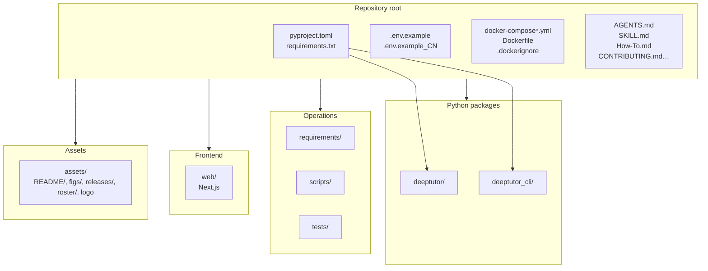

**Scale snapshot** (order-of-magnitude on a typical checkout; re-measure with `du` / `find` when auditing):

| Path | Role |
|------|------|
| `deeptutor/` | Bulk of Python — API, runtime, capabilities, agents, tools, knowledge, services, tutorbot, multi_user. |
| `web/` | Next.js UI, locales, Playwright tests. |
| `tests/` | Pytest mirror across api, capabilities, services, multi_user, cli, … |
| `deeptutor_cli/` | Thin Typer adapter. |
| `requirements/` | Frozen slices for Docker/CI matching `pyproject` extras. |
| `scripts/` | Tours, migrations, smoke tests, `start_web`. |
| `assets/` | Marketing/i18n README fragments and figures — **not** imported by runtime hot path. |

---

## 3. Root artifacts (full list you care about)

Paths relative to **`DEEPTUTOR_ROOT`**.

| Path | Role |
|------|------|
| **`pyproject.toml`** | Package **`deeptutor`**, console script **`deeptutor`**, optional extras (`cli`, `server`, `tutorbot`, `matrix`, `math-animator`, `dev`, `all`). |
| **`requirements.txt`** | Entry/minimal pins; detailed stacks live under **`requirements/`**. |
| **`requirements/`** | **`cli.txt`**, **`server.txt`**, **`tutorbot.txt`**, **`matrix.txt`**, **`math-animator.txt`**, **`dev.txt`** — aligned with extras. |
| **`.env.example`** | Annotated template: ports, LLM, embedding, search, networking, security, auth/multi-user, PocketBase, storage. |
| **`.env.example_CN`** | Same structure with Chinese comments for onboarding. |
| **`Dockerfile`** | Multi-stage build; **`production`** target used by compose; **`BACKEND_PORT`** baked for Next static hints. |
| **`docker-compose.yml`** | Build from context + optional **PocketBase** sidecar + **`deeptutor`** all-in-one service. |
| **`docker-compose.ghcr.yml`** | Pull prebuilt **`ghcr.io`** image instead of local build. |
| **`docker-compose.dev.yml`** | Developer overrides (compose merge pattern). |
| **`.dockerignore`** | Keeps build context small (drops caches, local data noise). |
| **`.gitignore`** | `.env`, venvs, build artifacts. |
| **`.gitattributes`** | Line endings and binary handling. |
| **`.pre-commit-config.yaml`** | Format/lint/security hooks for contributors. |
| **`.secrets.baseline`** | Baseline for secret scanning false positives. |
| **`AGENTS.md`** | Architecture summary for coding agents. |
| **`SKILL.md`** | Operator commands for assistants (parallel to “skills” in IDE ecosystems). |
| **`How-To.md`** | Compact setup walkthrough. |
| **`CONTRIBUTING.md`**, **`Communication.md`**, **`CITATION.cff`**, **`LICENSE`** | Community and citation. |
| **`DeepTutor.code-workspace`** | Multi-root workspace convenience. |
| **`README.md`** | Human-facing features and getting started. |

---

## 4. Configuration logic — `.env` as control plane

`.env.example` is structured into **numbered concerns**. Understanding them explains **why** the app boots or **why** a feature silently degrades.

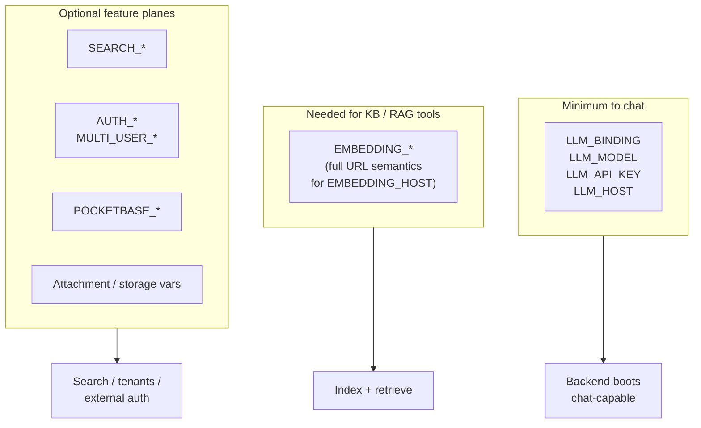

**Logic highlights**

- **Chat-only:** LLM variables suffice per template comments.
- **Knowledge:** Embedding block must be coherent — note **`EMBEDDING_HOST` is a full endpoint URL** (not the same composition rules as `LLM_HOST`); dimension and `EMBEDDING_SEND_DIMENSIONS` interact with provider quirks.
- **Docker + host LLM:** Replace `localhost` with **`host.docker.internal`** (macOS/Windows Docker Desktop) or LAN IP on Linux — commented examples live in `.env.example`.
- **Auth:** Public routes are limited (e.g. `/api/v1/auth/*`); other routers apply **`require_auth`** when **`AUTH_ENABLED=true`** — locally auth may be a no-op.

---

## 5. Python packaging — extras and `requirements/`

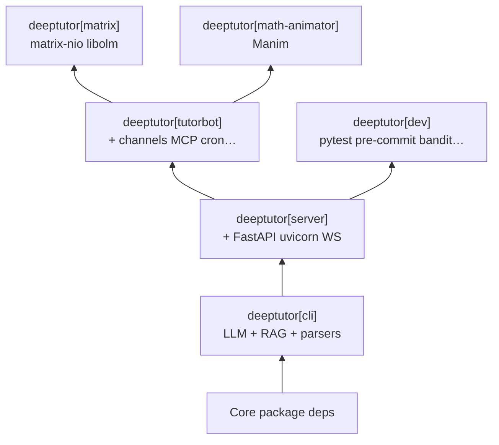

| Extra | Typical `requirements/` file | When you need it |
|-------|-------------------------------|------------------|
| **`cli`** | `cli.txt` | `deeptutor run`, `chat`, `kb`, providers, document ingestion. |
| **`server`** | `server.txt` | Local **`deeptutor serve`** or **`python -m deeptutor.api.run_server`**. |
| **`tutorbot`** | `tutorbot.txt` | Autonomous tutors + messaging platforms. |
| **`matrix`** | `matrix.txt` | Matrix/Element channel — native **`libolm`** dependency. |
| **`math-animator`** | `math-animator.txt` | Manim-backed animation capability. |
| **`dev`** | `dev.txt` | **`pytest`**, **`pre-commit`**, static checks. |
| **`all`** | (composite in `pyproject`) | Full vertical — heavy install. |

**Install recipes**

- **Web developer default:** `pip install -e ".[server]"`.
- **Bots:** add **`[tutorbot]`** (and optionally **`[matrix]`**).
- **CI that mirrors Docker:** pip-install the matching **`requirements/*.txt`** slice.

---

## 6. Structural decomposition — folders as roles

| Area | Responsibility |
|------|------------------|
| **`deeptutor_cli/`** | Typer commands → **`TurnRequest`** / subprocess **`start_web`**. |
| **`deeptutor/api/`** | FastAPI app, routers, lifespan hooks, **`unified_ws`**. |
| **`deeptutor/app/`** | **`DeepTutorApp`** façade — stable SDK-shaped API. |
| **`deeptutor/runtime/`** | **`ChatOrchestrator`**, session/turn managers, registries bootstrap. |
| **`deeptutor/core/`** | Contracts: **`UnifiedContext`**, **`StreamBus`**, streaming types, **`BaseTool`** / **`BaseCapability`**. |
| **`deeptutor/capabilities/`** | Product modes — thin wrappers over **`agents/`** pipelines. |
| **`deeptutor/agents/`** | Multi-step LLM loops (chat agentic pipeline, solve, research, …). |
| **`deeptutor/tools/`** | **`BaseTool`** implementations; registered by **`ToolRegistry`**. |
| **`deeptutor/knowledge/`** | KB lifecycle, indexing, manager APIs backing RAG. |
| **`deeptutor/services/`** | Config, prompts, LLM factory, embeddings, search, session stores, paths. |
| **`deeptutor/tutorbot/`** | Optional bots plane — extra deps. |
| **`deeptutor/multi_user/`** | Tenancy and scoped access when enabled. |
| **`web/`** | Next.js UI calling REST + WS. |
| **`scripts/`** | Operator automation — not imported as library API. |

---

## 7. Internal dependency-of-concern (how to read code)

Not an import graph — **reading order** when tracing a feature:

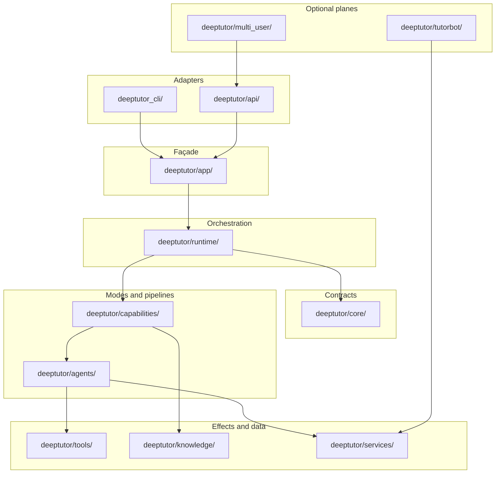

**Method:** Enter from CLI or HTTP → **`app/`** → **`runtime/`** → pick **one** **`capabilities/`** file → follow into **`agents/`** → only then open **`tools/`**, **`knowledge/`**, **`services/`**.

---

## 8. Tools vs capabilities — the product contract

### Level 1 — Tools (representative)

| Tool | Purpose |
|------|---------|
| **`rag`** | Knowledge base retrieval |
| **`web_search`** | Web search with citations |
| **`code_execution`** | Sandboxed Python |
| **`reason`** | Dedicated reasoning pass |
| **`brainstorm`** | Breadth-first ideation |
| **`paper_search`** | arXiv search |
| **`geogebra_analysis`** | Vision-heavy geometry assist |

### Level 2 — Capabilities (representative)

| Capability | Stages (conceptual) |
|------------|---------------------|
| **`chat`** | Default responding path — tool-augmented |
| **`deep_solve`** | planning → reasoning → writing |
| **`deep_question`** | ideation → evaluation → generation → validation |

Extended/product capabilities also exist (e.g. research, visualize, math animator) — discover via **`deeptutor/runtime/bootstrap/builtin_capabilities.py`** and **`deeptutor/capabilities/`**.

**Collaboration rule:** orchestrator selects **exactly one** capability per turn; that capability’s internals may issue **many** tool calls across **many** LLM iterations.

---

## 9. Delivery surfaces — CLI, HTTP, Web UI

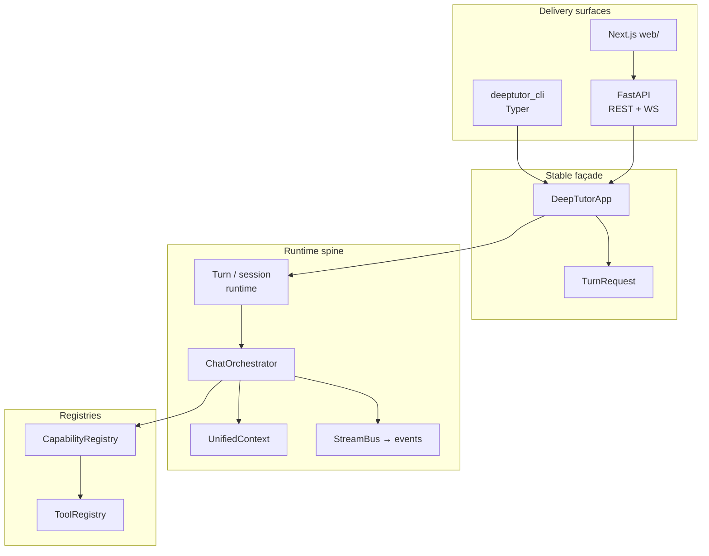

---

## 10. Turn lifecycle — state and sequence

### State machine (conceptual)

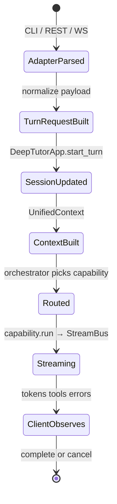

### Sequence (happy path)

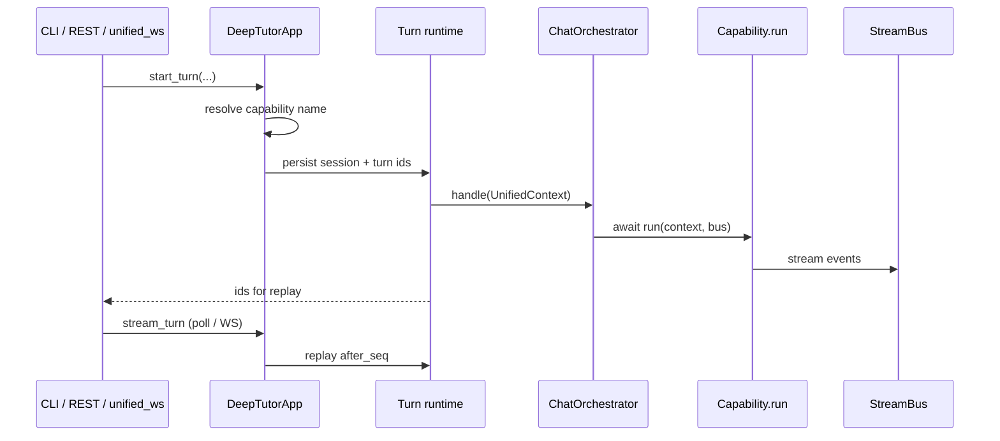

---

## 11. Orchestrator routing logic

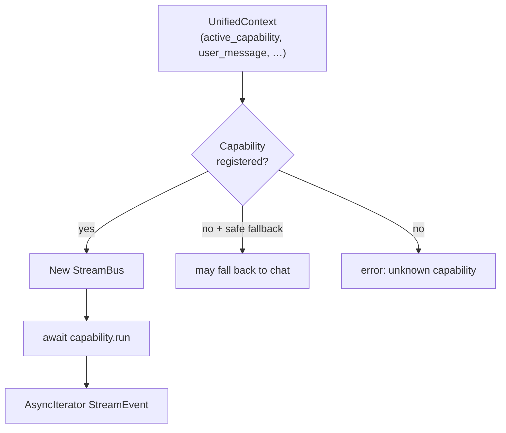

Implementation reference: **`deeptutor/runtime/orchestrator.py`** (`ChatOrchestrator.handle`).

---

## 12. Inside a capability — LLM ↔ tools loop

Many capabilities delegate to **`deeptutor/agents/...`** pipelines. Chat is the canonical example:

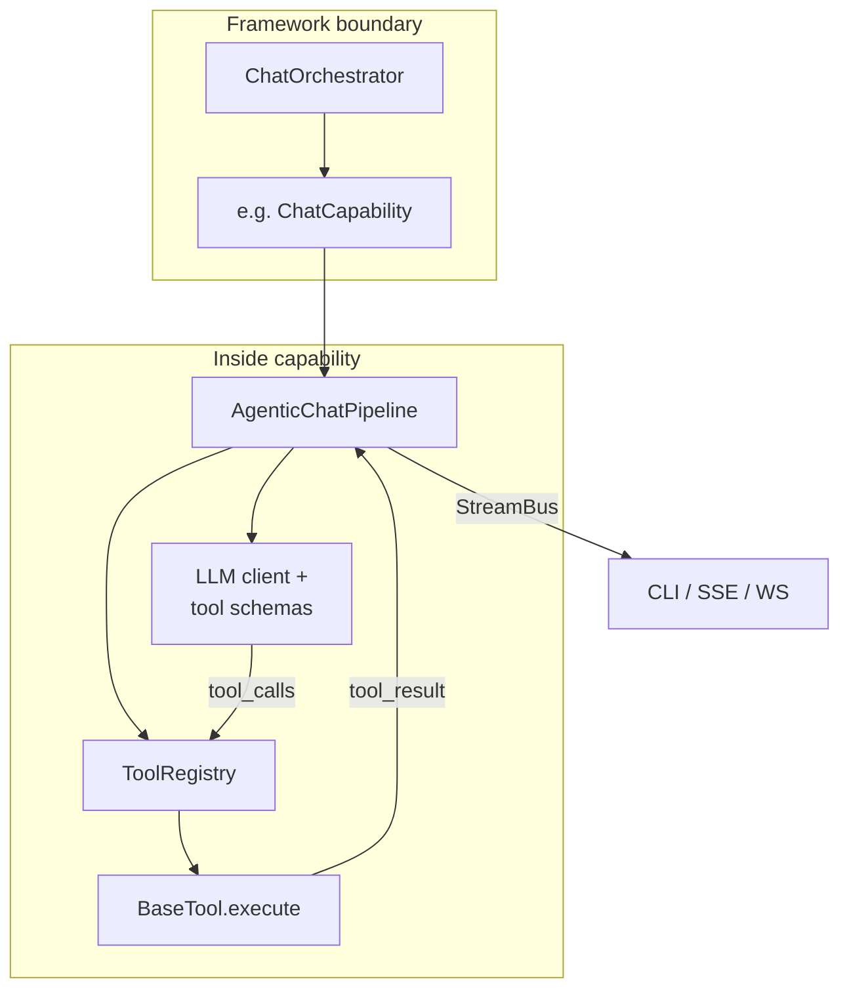

**Guardrail:** **`CapabilityManifest.tools_used`** must agree with **`ToolRegistry`** — see §15.

---

## 13. HTTP API map (REST)

Auth is **public** only on **`/api/v1/auth/*`**. Other routers may enforce **`require_auth`** when auth is enabled.

```mermaid
flowchart TB
  ROOT["FastAPI\n deeptutor/api/main.py"]

  ROOT --> AUTH["/api/v1/auth"]
  ROOT --> MU["/api/v1/multi-user"]
  ROOT --> SOLVE["/api/v1 solve"]
  ROOT --> CHATR["/api/v1 chat"]
  ROOT --> Q["/api/v1/question"]
  ROOT --> KNOW["/api/v1/knowledge"]
  ROOT --> DASH["/api/v1/dashboard"]
  ROOT --> CW["/api/v1/co_writer"]
  ROOT --> NOTE["/api/v1/notebook"]
  ROOT --> BOOK["/api/v1/book"]
  ROOT --> MEM["/api/v1/memory"]
  ROOT --> SESS["/api/v1/sessions"]
  ROOT --> QN["/api/v1/question-notebook"]
  ROOT --> SET["/api/v1/settings"]
  ROOT --> SK["/api/v1/skills"]
  ROOT --> SYS["/api/v1/system"]
  ROOT --> PL["/api/v1/plugins"]
  ROOT --> AC["/api/v1/agent-config"]
  ROOT --> VS["/api/v1 vision_solver"]
  ROOT --> TB["/api/v1/tutorbot"]
  ROOT --> ATT["/api/attachments"]
  ROOT --> UWS["/api/v1 unified_ws\nWebSocket"]
```

Router modules live under **`deeptutor/api/routers/`** — trace **`include_router`** in **`main.py`** when reconciling this diagram with code.

---

## 14. WebSocket and streaming

- **`deeptutor/api/routers/unified_ws.py`** — unified streaming surface for rich clients.
- **`deeptutor/core/stream_bus.py`**, **`deeptutor/core/stream.py`** — event shapes and fan-out.
- Frontend consumes REST for CRUD-like flows and WS/SSE-style streams for token/tool traces depending on feature implementation.

---

## 15. Startup integrity — tool drift checks

On API startup, **`validate_tool_consistency()`** compares capability **`tools_used`** manifests against **`ToolRegistry`**. Mismatch → **fail-fast** `RuntimeError` (configuration drift).

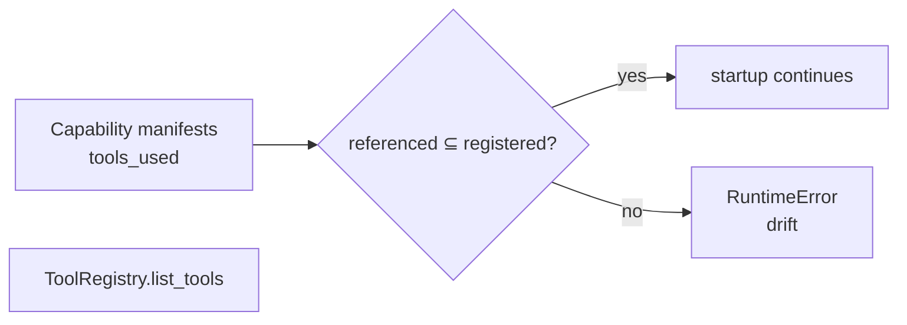

Reference: **`deeptutor/api/main.py`** lifespan.

---

## 16. `UnifiedContext` — what crosses layer boundaries

High-signal fields (see **`deeptutor/core/context.py`**):

```text
session_id, user_message, conversation_history
enabled_tools          # None vs [] semantics matter for “all vs none”
active_capability
knowledge_bases
attachments[]
config_overrides       # e.g. answer_now_context
language
notebook_context, history_context, memory_context, skills_context
metadata               # turn_id, extras
```

**Framework lesson:** Prefer extending **`metadata`** or adding **services** over forking **`ChatOrchestrator`** unless routing rules truly change.

---

## 17. CLI command tree

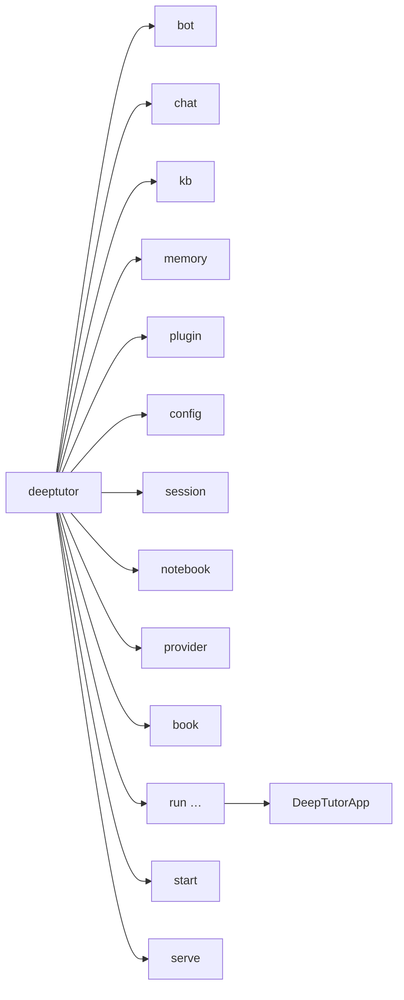

**`deeptutor run`** is the **agent-first** single-shot entry — wired in **`deeptutor_cli/main.py`**.

---

## 18. RAG / knowledge base — conceptual data flow

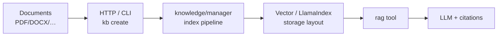

Deep paths: **`deeptutor/knowledge/`**, **`deeptutor/services/rag/`**, **`deeptutor/tools/`** (RAG tool), **`deeptutor/api/routers/knowledge.py`**.

---

## 19. TutorBot and optional planes

- **`deeptutor/tutorbot/`** — autonomous tutors, channel integrations, manager/runtime — requires **`deeptutor[tutorbot]`** (and optionally **`[matrix]`**).
- Keeps **dependency cone** explicit: don’t import TutorBot stacks from bare **`[server]`** installs.

---

## 20. Docker — compose variants and runtime wiring

| File | Logic |
|------|-------|
| **`docker-compose.yml`** | Builds **`Dockerfile`** **`production`** target; exposes **`BACKEND_PORT`** and **`FRONTEND_PORT`**; passes through `.env`; optional **PocketBase** service with healthcheck and **`./data/pocketbase`** volume. |
| **`docker-compose.dev.yml`** | Merge overlay for dev workflows (`docker compose -f docker-compose.yml -f docker-compose.dev.yml up`). |
| **`docker-compose.ghcr.yml`** | Uses **prebuilt image** — fastest path when you trust upstream tags. |

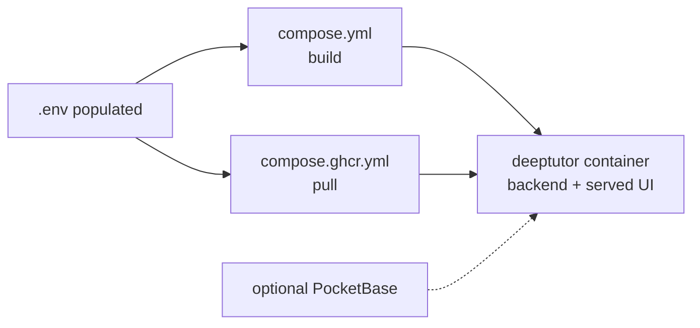

**PocketBase:** When **`POCKETBASE_URL`** points at the sidecar, auth/storage flows use it; when blank, SQLite-style paths described in README/template apply.

---

## 21. `web/` frontend

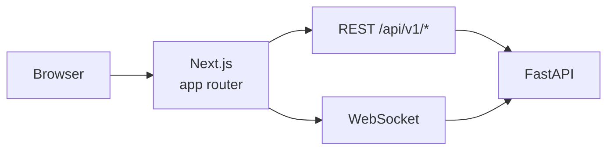

Explore **`web/app`**, **`web/features`**, **`web/lib`**, **`web/i18n`**. E2E: **`web/tests`** (Playwright).

---

## 22. `scripts/` — operator encyclopedia

| Script | Purpose |
|--------|---------|
| **`start_tour.py`** | Guided first-time setup |
| **`start_web.py`** | Backend + frontend launcher |
| **`stop_web.py`** | Tear down `start_web` processes |
| **`update.py`** | Safe git fast-forward helper |
| **`check_install.py`** | Environment validation |
| **`pb_setup.py`** | PocketBase helper flows |
| **`migrate_kb.py`**, **`migrate_user_data.py`** | Data migrations |
| **`test_llm_api.py`**, **`test_embedding.py`** | Provider smoke tests |
| **`audit_prompts.py`**, **`sync_prompts_from_en.py`** | Prompt maintenance |
| **`generate_roster.py`** | Roster assets → **`assets/roster/`** |
| **`_cli_kit.py`** | Shared CLI helpers for scripts |

---

## 23. `tests/` — taxonomy

Tests are organized **by concern** (mirror architecture):

| Prefix | Covers |
|--------|--------|
| **`tests/api/`** | Routers, WS turn runtime, auth-adjacent behaviors |
| **`tests/capabilities/`** | Capability-level semantics (e.g. answer_now, RAG consistency) |
| **`tests/agents/`** | Pipelines — chat, solve, research, math animator, notebook |
| **`tests/cli/`** | Typer commands |
| **`tests/core/`** | Context, stream bus, protocols, orchestrator imports |
| **`tests/knowledge/`** | KB manager, naming, embeddings flags |
| **`tests/multi_user/`** | Tenancy, grants, scoped skills/RAG |
| **`tests/runtime/`** | Orchestrator behavior |
| **`tests/services/`** | LLM registry, RAG pipelines, embeddings, search, session stores |
| **`tests/tools/`** | Individual tools |
| **`tests/scripts/`** | Operator scripts |
| **`tests/book/`**, **`tests/logging/`**, **`tests/utils/`** | Vertical slices |

Run from repo root:

```bash
cd "$DEEPTUTOR_ROOT"
pytest tests/ -q --tb=short
```

---

## 24. Exploration playbook

| Goal | Start here |
|------|------------|
| Single-shot CLI | **`deeptutor_cli/main.py`** → **`deeptutor/app/facade.py`** |
| Orchestration | **`deeptutor/runtime/orchestrator.py`** |
| Context | **`deeptutor/core/context.py`**, **`deeptutor/core/stream*.py`** |
| Capability list | **`deeptutor/runtime/bootstrap/builtin_capabilities.py`** |
| Tools | **`deeptutor/tools/`**, **`deeptutor/runtime/registry/tool_registry.py`** |
| HTTP surface | **`deeptutor/api/main.py`**, then **`deeptutor/api/routers/`** |
| WS protocol | **`deeptutor/api/routers/unified_ws.py`** |
| RAG | **`deeptutor/knowledge/`**, **`deeptutor/api/routers/knowledge.py`** |

**Ripgrep recipes**

```bash
cd "$DEEPTUTOR_ROOT"
rg -n "class .*Capability" deeptutor/capabilities
rg -n "get_capability_registry|CapabilityRegistry" deeptutor
rg -n "UnifiedContext\(" deeptutor
rg -n "include_router" deeptutor/api/main.py
rg -n "validate_tool_consistency" deeptutor/api/main.py
```

---

## 25. Extension and fork patterns

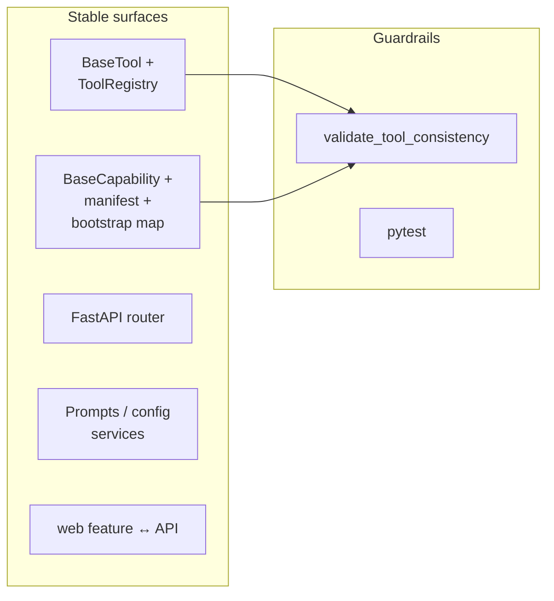

| Change | Touch |
|--------|-------|
| New tool | Implement **`BaseTool`**, register, update **`tools_used`** manifests |
| New teaching mode | New **`BaseCapability`**, bootstrap registration |
| New transport | Adapter only — preserve **`UnifiedContext`** construction |
| New channel | TutorBot plane + extras |

---

## 26. How-tos and examples

```bash
export DEEPTUTOR_ROOT="/Users/steven/Downloads/Compressed/DeepTutor-main"
cd "$DEEPTUTOR_ROOT"
```

### Bootstrap

```bash
python3 -m venv .venv
source .venv/bin/activate
python -m pip install --upgrade pip
python -m pip install -e ".[server]"
cd web && npm install && cd ..
cp .env.example .env
```

### Guided tour

```bash
python scripts/start_tour.py
```

### Full local web stack

```bash
python scripts/start_web.py
```

### Split terminals

```bash
python -m deeptutor.api.run_server
# other terminal
cd web && npm run dev -- -p 3782
```

### Docker (prebuilt)

```bash
docker compose -f docker-compose.ghcr.yml up -d
```

### CLI examples

```bash
deeptutor run chat "Explain Fourier transform in one paragraph."
deeptutor run deep_solve "Solve x^2=4" -t rag --kb my-kb
deeptutor chat
deeptutor kb list
deeptutor kb create my-kb --doc textbook.pdf
deeptutor serve --port 8001
```

### Provider smoke tests

```bash
python scripts/test_llm_api.py
python scripts/test_embedding.py
```

### Contributor hooks

```bash
pip install pre-commit
pre-commit install
```

---

## 27. Doc vs tree drift to verify

**`AGENTS.md`** references **`deeptutor/plugins/`** for playground plugins. On some checkouts that directory may be **absent** — treat plugin docs as **version-skew** until the tree matches. Reconcile against your Git tag or upstream release.

---

## 28. Maintenance

When behavior or paths change:

1. Update **this Guides file** (diagrams + tables + §27 drift notes).
2. Update repo **`AGENTS.md`** if agent-facing contracts move.
3. Append or revise numbered sections in the [**architecture atlas**](file:///Users/steven/PYTHON_MARKETPLACE_MASTER/Guides/DeepTutor-ARCHITECTURE_MAP_MERMAID_AND_EXPLORATION.md) using its **edit policy** when you need ledger-style path history.

---

*Synthesized from `AGENTS.md`, `pyproject.toml`, `.env.example`, `docker-compose.yml`, and DeepTutor runtime layout; diagrams align with `deeptutor/app`, `deeptutor/runtime/orchestrator.py`, and `deeptutor/api/main.py` patterns.*
