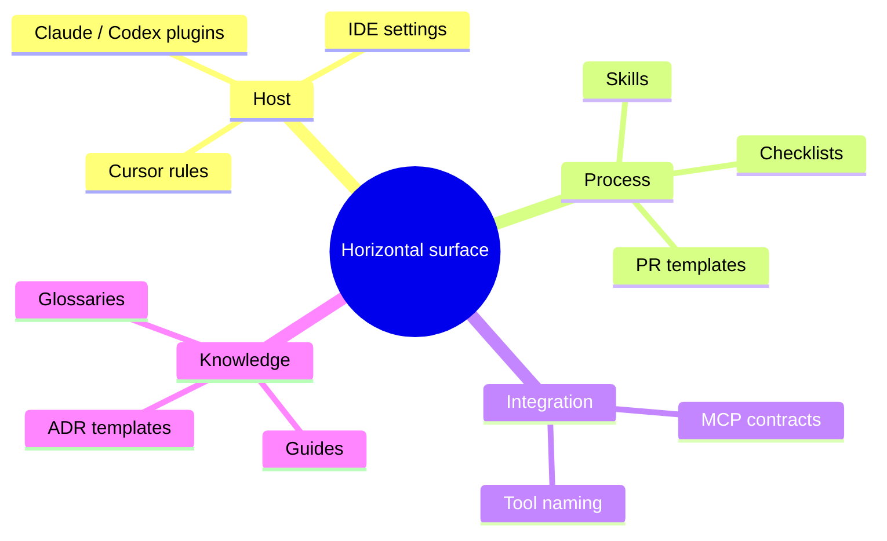
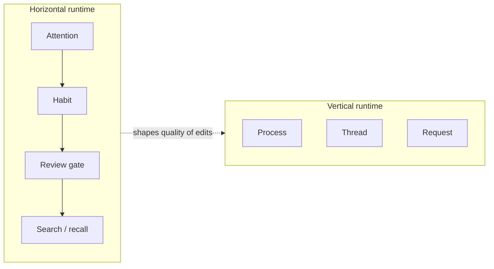
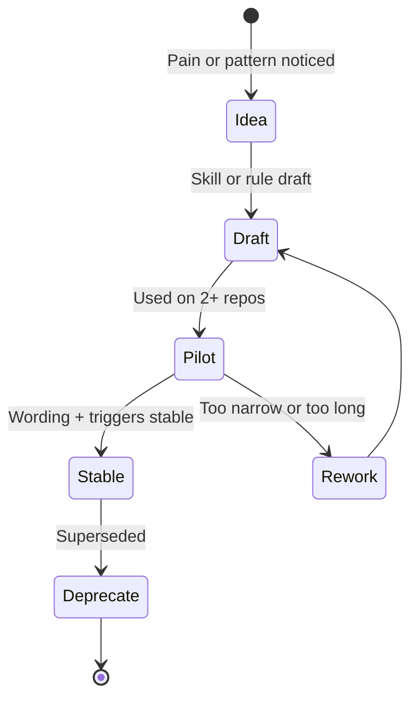
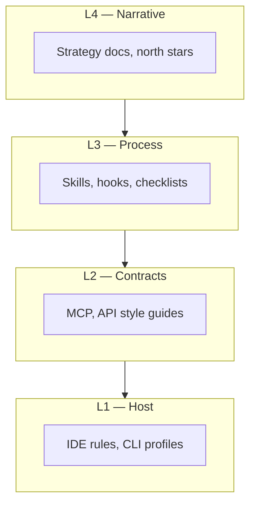
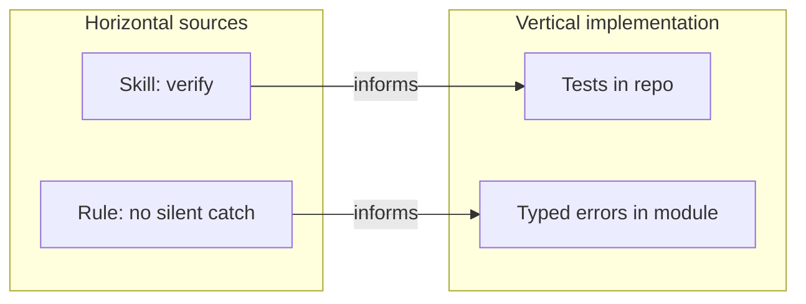
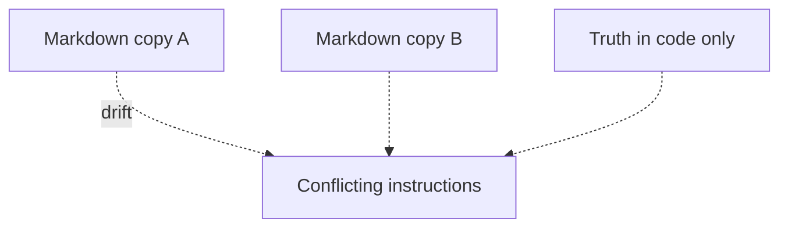
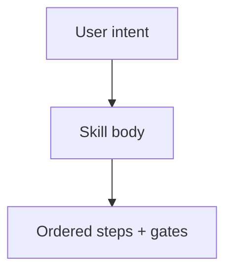
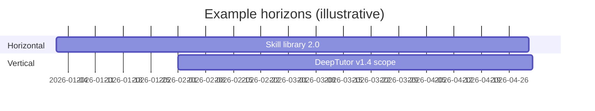

# Horizontal logic — comprehensive guide

**Path:** `/Users/steven/Guides/HORIZONTAL_LOGIC_COMPREHENSIVE.md`

**Paired doc:** [`VERTICAL_LOGIC_COMPREHENSIVE.md`](./VERTICAL_LOGIC_COMPREHENSIVE.md)  
**Bridge (flows + quick examples):** [`HORIZONTAL_VERTICAL_FLOWS_AND_EXAMPLES.md`](./HORIZONTAL_VERTICAL_FLOWS_AND_EXAMPLES.md)  
**Factor matrix (H vs V table):** [`PYTHON_MARKETPLACE_MASTER/Guides/HORIZONTAL_VERTICAL_FACTORS.md`](file:///Users/steven/PYTHON_MARKETPLACE_MASTER/Guides/HORIZONTAL_VERTICAL_FACTORS.md)

---

## How to use this document

Read **horizontally** in the metaphorical sense: skim headings, stop at diagrams and tables that match your current problem. This guide is **normative for portability** — it describes how ideas, habits, and artifacts stay **valid across** repositories, hosts, and time. It is **not** a substitute for any one product’s internal architecture doc.

---

## Part A — Core concepts

### A1. Definition (precise)

**Horizontal logic** is reasoning and commitment under the constraint:

> *If I move to another codebase, another employer, another IDE profile, or another machine, this should still help me without a rewrite of its core idea.*

Horizontal artifacts tend to be:

- **Declarative** (markdown, YAML, policy text) more than imperative code tied to one import graph.
- **Convention-driven** (naming, folder shapes, “always verify before done”) more than API-stable binaries.
- **Host-mediated** (Cursor rules, Claude plugins, shell aliases, git hooks) more than process-internal singletons.

**Non-goals:** Horizontal logic does **not** try to encode your product’s business rules, database schema, or release artifact. When it does, it has **collapsed into vertical** by accident.

### A2. Horizontal vs “generic” vs “reusable library”

| Phrase | Meaning |
|--------|---------|
| **Horizontal** | Portability across **contexts** (repos, teams, hosts) — may be non-code. |
| **Generic** | Fewer assumptions — often a library API — still **vertical** if shipped as one versioned package with breaking-change policy. |
| **Reusable library** | **Diagonal:** horizontal *intent* inside a vertical *delivery* (semver, CI, consumers). |

Use this table (Mermaid `quadrantChart` is omitted for broad renderer compatibility):

|  | **Few assumptions** | **Many assumptions** |
|--|---------------------|----------------------|
| **Many contexts** | Skills, checklists, patterns | Fragile “copy everywhere” bash with hardcoded paths |
| **One product** | Internal util module | Feature + schema + UI |

### A3. The horizontal obligation

Horizontal logic carries an **obligation to stay boring**:

1. **Stable vocabulary** — same words for same ideas (`verify`, `facade`, `registry`) across docs.
2. **Low surprise** — a skill should not secretly assume repo layout except where frontmatter declares it.
3. **Explicit scope** — “when to use” and “when not to use” in the first screen of a skill or rule.
4. **Graceful degradation** — if a path is missing, the horizontal artifact should **fail readable**, not half-run.

---

## Part B — Where horizontal logic lives (taxonomy)

### B1. Artifact classes



| Class | Examples | Failure mode when bloated |
|-------|----------|---------------------------|
| **Host rules** | `.cursor/rules`, `AGENTS.md` templates | Rules longer than the code they guard |
| **Skills** | `SKILL.md` bodies, progressive disclosure | Trigger phrases overlap; nobody knows which skill runs |
| **Hooks** | PreToolUse validation | False positives; people bypass with `--no-verify` culture |
| **MCP** | Tool descriptions, server layout | Schema drift vs clients; undocumented side effects |
| **Meta-repo docs** | `MY_SETUP/FUNDAMENTALS.md`, ledgers | Paths rot; duplicate canonicals |
| **Cross-repo guides** | DeepTutor atlas in `Guides/` | Edited in one checkout only; mirrors lie |

### B2. Horizontal “runtime” is social and cognitive

Unlike vertical runtime (CPU, asyncio, HTTP), horizontal runtime is:



**Implication:** Horizontal improvements show up as **variance reduction** across sessions and engineers, not as a single latency graph.

---

## Part C — Dimensions of horizontal logic

Each subsection: **what**, **why horizontal**, **signals**, **anti-pattern**.

### C1. Strategy and positioning

**What:** Narrative about *how you work* and *what you optimize globally* (e.g. “agent-native parity”, “evidence before assertions”).

**Why horizontal:** Strategy that only applies inside one microservice is not strategy — it is a module comment.

**Signals:** You can explain it to a new hire **without opening a repo**.

**Anti-pattern:** “Our strategy is in Jira epics only” — no portable doctrine; horizontal memory is zero.

### C2. Knowledge architecture

**What:** Glossaries, atlases, `FUNDAMENTALS.md`, path ledgers (`+` / `-` blocks), cross-links between SupremePower, Guides, and products.

**Why horizontal:** Knowledge is most valuable when **indexed** across work, not trapped in one Slack thread.

**Signals:** One **hub** path (`~/Guides`, `MY_SETUP`) answers “where do I start?”.

**Anti-pattern:** Three “canonical” copies of the same atlas with no merge policy.

### C3. Tooling and integration contracts

**What:** MCP tool schemas, “how to name tools”, OAuth placement, “stdio vs HTTP” deployment patterns.

**Why horizontal:** Multiple products and hosts will call the **same** MCP surface; the **contract** is the horizontal plane.

**Signals:** Breaking a tool name is treated like a **semver major** for humans.

**Anti-pattern:** Tool descriptions that omit prerequisites — horizontal clarity debt becomes vertical incidents.

### C4. Engineering process

**What:** TDD discipline, verification-before-completion, branching norms, security review checklist.

**Why horizontal:** Process is how **any** repo gets safer; it should not fork per service unless compliance demands it.

**Signals:** Junior engineers produce similar PR descriptions across repos.

**Anti-pattern:** Process so heavy it is only followed on “the important repo” — horizontal collapse.

### C5. Quality and risk posture

**What:** “No secrets in markdown”, dependency update cadence, allowed license list.

**Why horizontal:** Same leak hurts **every** repo on the laptop; same license mistake repeats.

**Signals:** `detect-secrets` baseline files, shared `.gitignore` templates.

**Anti-pattern:** Secrets in “just local” guides under `~/Guides`.

### C6. People and coordination

**What:** RACI templates, on-call playbooks, incident comms patterns.

**Why horizontal:** Teams rotate; the **shape** of coordination should survive personnel change.

**Anti-pattern:** Hero-only debugging knowledge never written down.

### C7. Economics of reuse

**What:** When to extract a library vs duplicate; marketplace SKUs vs bespoke forks.

**Why horizontal:** Reuse is a **portfolio** decision across N repos.

**Signals:** Duplication is **measured** (search, dep graphs), not felt.

**Anti-pattern:** Premature extraction — a “horizontal library” nobody versions becomes vertical glue hell.

### C8. Security and compliance (horizontal slice)

**What:** “Where tokens live”, MCP least-privilege, allowed data classes in prompts.

**Why horizontal:** One bad habit (pasting `.env` into chat) crosses **all** projects.

**Signals:** Shared red-team checklist before demos.

**Anti-pattern:** Per-repo contradictory policies on PII in logs.

### C9. Observability philosophy

**What:** Naming conventions for spans, log fields, correlation IDs — as **policy**, not one service’s implementation.

**Why horizontal:** Engineers carry naming habits across codebases.

**Anti-pattern:** Three different words for `user_id` in logs across services without mapping doc.

### C10. Learning and onboarding

**What:** “Day one” reading order, sandbox repos, kata lists.

**Why horizontal:** Onboarding is repeated per human, not per microservice.

**Anti-pattern:** Onboarding doc only in wiki page 7 levels deep with no link from README.

---

## Part D — Lifecycle of horizontal artifacts



| Stage | Horizontal quality gate |
|-------|-------------------------|
| **Draft** | Can a stranger apply it in 10 minutes? |
| **Pilot** | Did it **reduce** variance in outcomes? |
| **Stable** | Is there an **owner** and a **changelog** entry? |
| **Deprecate** | Is there a **pointer** to the replacement? |

---

## Part E — Deep diagrams

### E1. Horizontal layers (not the OSI stack — the “human stack”)



**Rule of thumb:** The higher the layer, the **slower** it should change and the **fewer** forks you tolerate.

### E2. Propagation — how horizontal ideas reach vertical code



Horizontal items **do not compile** into vertical code automatically — **humans or agents** translate.

### E3. Fragmentation risk map



**Mitigation:** One canonical path + symlinks or rsync policy + “do not edit mirror” banners.

---

## Part F — Pattern catalog (horizontal)

Each row: **pattern**, **good when**, **cost**, **example**.

| Pattern | Good when | Cost | Example |
|---------|-----------|------|---------|
| **Thin skill, fat reference** | Skill triggers often; body stays short | More clicks | NotebookLM skill with appendix files |
| **Rule + escape hatch** | Safety without blocking emergencies | People overuse escape | “Ask before rm -rf” |
| **Template PR** | Teams >2 | Blank fields ignored | Conventional commits + checklist |
| **Ledger paths (`+`/`-`)** | Paths churn | Noise if overused | DeepTutor atlas append policy |
| **MCP as façade** | Many clients, one tool server | Ops for server | Single search MCP reused by 3 apps |
| **Meta-README hub** | Many trees on one disk | Stale links | `~/Guides/README.md` |
| **Verification gate** | High-stakes claims | Latency to “done” | Run tests before saying “fixed” |

---

## Part G — Horizontal logic in AI-native workflows

### G1. Skills as horizontal functions

Treat a skill as a **pure function** of:

`(user intent, repo context) → procedure`

Side effects should be **explicit** (filesystem paths, MCP calls), not hidden in prose.



### G2. Agent parity (horizontal principle)

**Statement:** Anything a user can do from the UI, an agent should be able to do via **documented** tools or APIs.

**Why horizontal:** It is a **design rule** you carry across products, not one endpoint.

**Vertical instantiation:** Each product implements parity in **its** router layer.

### G3. Multi-model, multi-host discipline

Horizontal logic includes:

- Which **model** to pick for which **task class** (research vs codegen) — as policy.
- Where **API keys** live — as policy.

Vertical logic includes:

- The actual **`openai` client** construction in one service.

---

## Part H — Interaction with vertical (handshake)

Horizontal logic **constrains** vertical work; vertical work **feeds** horizontal updates.

```mermaid
sequenceDiagram
  participant V as Vertical change (feature)
  participant H as Horizontal doc/skill

  V->>H: Lesson learned (new pitfall)
  H->>V: Updated guard or checklist
  Note over V,H: Loop; avoid ping-pong without owner
```

**Contract:** Every significant vertical incident should produce **either** a code fix **or** a horizontal doc/skill update — not neither.

---

## Part I — Metrics (horizontal)

| Metric | What it tells you |
|--------|-------------------|
| **Time-to-first-successful-PR** for new hire | Onboarding + horizontal clarity |
| **Duplicate policy count** across repos | Fragmentation |
| **Skill trigger false-positive rate** | Horizontal UX quality |
| **Mean time to recover from “wrong doc”** | Hub link health |
| **% PRs touching only vertical layers** | Healthy separation |

---

## Part J — Anti-patterns encyclopedia (horizontal)

1. **Skill sprawl** — 40 skills with overlapping triggers; merge or nest.
2. **Rules as codebase** — 5k lines in `.cursor/rules`; split by scope.
3. **Zombie mirrors** — rsync destinations nobody updates.
4. **MCP god-object** — one server with 200 tools; partition domains.
5. **Process theater** — gates nobody can pass without heroics.
6. **Horizontal security theater** — “we have a policy” with zero enforcement path.
7. **Copy-paste architecture** — same paragraph in six repos; use link.
8. **Implicit host state** — “it works on my machine” skills referencing `/Users/me/...` without substitution.
9. **Horizontal coupling** — two skills must be read together or both fail; compose badly.
10. **No deprecation** — old skills never removed; model confusion rises.

---

## Part K — Scenarios (worked)

### K1. New microservice repo

**Horizontal first:** Apply branch naming, PR template, secret scanning, logging field names.  
**Vertical second:** Implement handlers, DB, deploy YAML.

### K2. Adopting MCP across products

**Horizontal:** Standard tool description template, auth pattern, error shape.  
**Vertical:** Each product’s client wiring and timeouts.

### K3. “We bought a company” integration

**Horizontal:** Merge style guides where possible; keep one skill library.  
**Vertical:** Merge schemas, users, billing — product-specific.

---

## Part L — Glossary (horizontal)

| Term | Meaning here |
|------|----------------|
| **Artifact** | Any file or convention subject to versioning or copy |
| **Host** | IDE, CLI, or platform executing agents |
| **Ledger** | Append-only path changelog blocks |
| **Parity** | User/agent capability equivalence |
| **Mirror** | Non-canonical copy of canonical knowledge |

---

## Part M — Further reading (links)

- [`HORIZONTAL_VERTICAL_FACTORS.md`](file:///Users/steven/PYTHON_MARKETPLACE_MASTER/Guides/HORIZONTAL_VERTICAL_FACTORS.md)
- [`SUPREMEPOWERS_AND_DEEPTUTOR_CROSS_MAP.md`](file:///Users/steven/PYTHON_MARKETPLACE_MASTER/Guides/SUPREMEPOWERS_AND_DEEPTUTOR_CROSS_MAP.md)
- [`DeepTutor-ARCHITECTURE_MAP_MERMAID_AND_EXPLORATION.md`](file:///Users/steven/PYTHON_MARKETPLACE_MASTER/Guides/DeepTutor-ARCHITECTURE_MAP_MERMAID_AND_EXPLORATION.md) (vertical product reference)
- [`my-supremepowers/docs/INDEX.md`](file:///Users/steven/my-supremepowers/docs/INDEX.md) (if present on your machine)

---

## Part N — FAQ (horizontal)

**Q: Is a shared Python package horizontal?**  
**A:** The *idea* of reuse is horizontal; the *package* is vertical — it has semver, CI, and consumers who will break if you change carelessly.

**Q: Should AGENTS.md in every repo be identical?**  
**A:** Rarely. Shared *sections* can be horizontal templates; repo-specific paths and capabilities stay vertical deltas.

**Q: Where do Cursor rules end and product code begin?**  
**A:** Rules encode **how to edit**; code encodes **what runs**. When rules import file paths unique to one product, you have leaked vertical into horizontal.

**Q: How many skills is too many?**  
**A:** When trigger overlap causes the wrong skill >5% of the time, merge or narrow triggers — horizontal UX problem.

**Q: Do horizontal policies need owners?**  
**A:** Yes — otherwise they decay without a vertical “build broke” alarm to wake anyone.

---

## Part O — Extended scenarios

### O1. Open-source library maintainers

**Horizontal:** Contributor covenant, issue templates, semantic versioning policy.  
**Vertical:** Actual API design, performance regressions, security patches in releases.

### O2. Data science notebooks

**Horizontal:** “Never commit raw credentials” rule across all notebooks.  
**Vertical:** This notebook’s feature engineering assumptions and random seeds for reproducibility.

### O3. Game studios with engine + gameplay

**Horizontal:** Engine coding standards shared across titles.  
**Vertical:** Per-title gameplay systems, assets, and netcode tuned for that title.

### O4. Regulated industries (finance, health)

**Horizontal:** Training on PII handling, audit log vocabulary.  
**Vertical:** The signed-off control implementation in the deployed system.

---

## Part P — Checklist: “is this artifact horizontal enough?”

- [ ] Could another team adopt it **without** reading our codebase first?  
- [ ] Does it avoid **hardcoded** paths to one repo?  
- [ ] Is the **failure mode** a clear message, not silent wrong behavior?  
- [ ] Is there a **single canonical URL or path** documented for updates?  
- [ ] Is the **owner** named (person or team)?  
- [ ] Is **deprecation** possible without breaking unrelated repos?

---

## Part Q — Time horizons

| Horizon | Horizontal emphasis | Vertical emphasis |
|---------|---------------------|-------------------|
| **Days** | Small rule tweak | Hotfix branch |
| **Weeks** | Skill pack iteration | Feature release |
| **Quarters** | Workflow culture shift | Architecture milestone |
| **Years** | Portable career capital | Product lineage and migrations |



If Gantt is unsupported in your viewer, ignore the diagram — the table above is sufficient.

---

## Part R — Closing synthesis

Horizontal logic **scales with headcount and repo count** — it is the amortized cost of coordination. Invest when:

- You context-switch across **many** codebases, or  
- You onboard frequently, or  
- You use **multiple** AI hosts and need parity.

Stop investing when horizontal artifacts **duplicate** vertical tests without adding clarity — that is where vertical ownership should take over.

---

*Horizontal logic is the slow compound interest of engineering culture. Vertical logic is the quarterly revenue of product execution. You need both ledgers.*
