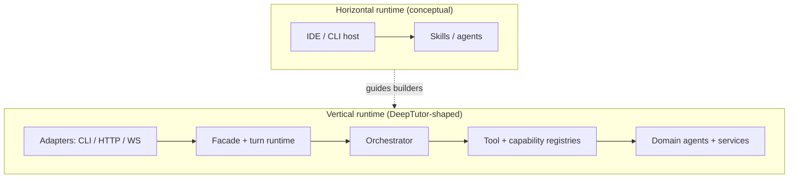
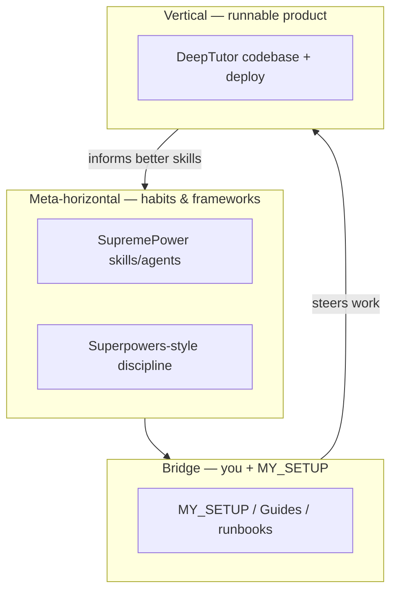

# Horizontal vs vertical — detailed factors

**Canonical copy:** `~/PYTHON_MARKETPLACE_MASTER/Guides/HORIZONTAL_VERTICAL_FACTORS.md`

Companion to [`SUPREMEPOWERS_AND_DEEPTUTOR_CROSS_MAP.md`](./SUPREMEPOWERS_AND_DEEPTUTOR_CROSS_MAP.md). Uses **SupremePower** as the main **horizontal** example and **DeepTutor** as the main **vertical** example; factors generalize to other stacks.

---

## Table of contents

1. [Definitions](#1-definitions)
2. [Factor map (quick matrix)](#2-factor-map-quick-matrix)
3. [Strategic and product factors](#3-strategic-and-product-factors)
4. [Architecture and runtime factors](#4-architecture-and-runtime-factors)
5. [Engineering process factors](#5-engineering-process-factors)
6. [Quality, safety, and compliance](#6-quality-safety-and-compliance)
7. [Operations, packaging, distribution](#7-operations-packaging-distribution)
8. [Knowledge, onboarding, discoverability](#8-knowledge-onboarding-discoverability)
9. [Economics and leverage (metaphor)](#9-economics-and-leverage-metaphor)
10. [Interactions diagram](#10-interactions-diagram)
11. [Decision guide](#11-decision-guide)
12. [Anti-patterns](#12-anti-patterns)

---

## 1. Definitions

**Horizontal capability** — A behavior, convention, or asset intended to apply **across many repositories, teams, or hosts** with minimal rewrite. It optimizes for **breadth** and **reuse**.  
*Examples:* a “verification before completion” skill; an MCP design pattern; a code-review checklist used in every project.

**Vertical capability** — A behavior **wired through one product’s stack** from surface (UI/CLI) down to domain logic and persistence. It optimizes for **depth** and **coherence** inside **one boundary**.  
*Examples:* DeepTutor’s `deep_solve` capability; tool drift check at FastAPI startup; Next.js routes that assume DeepTutor session semantics.

**Diagonal / hybrid** — Shared libraries **inside** a monorepo (packages consumed by multiple apps) feel “horizontal” locally but “vertical” at company boundary. This doc focuses on **cross-repo horizontal** vs **single-product vertical**.

---

## 2. Factor map (quick matrix)

Legend: **H** = horizontal bias, **V** = vertical bias, **B** = both / bridge.

| Factor | Typical H | Typical V |
|--------|-----------|-----------|
| Primary win | Repeatability across contexts | End-user value in one product |
| Boundary | Host + human habits | Repo + deploy unit |
| Change cadence | Slow skill evolution; fast copy | Fast feature iteration inside app |
| Enforcement | Soft (lint, review, habit) | Hard (types, tests, startup checks) |
| Failure blast radius | Low per repo; habit rot if ignored | High if prod breaks |

---

## 3. Strategic and product factors

| Factor | Horizontal (e.g. SupremePower) | Vertical (e.g. DeepTutor) |
|--------|-------------------------------|---------------------------|
| **Value proposition** | “Improve how work gets done everywhere” | “Solve tutoring / learning workflow end-to-end” |
| **Customer** | You (and anyone who adopts your skills/agents) | Learners + operators hosting DeepTutor |
| **Differentiation** | Breadth of workflows + integration story | Depth of modes (chat, solve, RAG, TutorBot, …) |
| **Roadmap unit** | Skill packs, agent personas, hook packs | Versions, migrations, API compatibility |
| **Competition** | Other workflow frameworks / IDE ecosystems | Other tutoring / LMS / AI education products |
| **Exit / portability** | Skills move with you across jobs and repos | Product fork or vendor depends on codebase + license |

---

## 4. Architecture and runtime factors

| Factor | Horizontal | Vertical |
|--------|------------|----------|
| **Deployment unit** | Usually *none* (files consumed by host) or thin CLI wrapper | Server + worker + DB + frontend containers/images |
| **Orchestration locus** | Host router (Cursor rules, CLI skill picker, custom wrapper reading `config.json`) | In-process orchestrator (`ChatOrchestrator`) |
| **State model** | Chat/session state owned by host or scattered | Session store, memory services, KB indexes — **product-owned** |
| **Contract shape** | Markdown + loose YAML frontmatter | Typed contexts (`UnifiedContext`), OpenAPI/WS payloads |
| **Extensibility** | Drop-in folders (`skills/`, `agents/`) | Registries, manifests, optional extras (`[tutorbot]`) |
| **Coupling** | Loose — skills should not import product code | Tight — layers share internal APIs |
| **Observability** | Host logs; optional skill telemetry | App logs, tracing, health endpoints, user-visible errors |
| **Scaling dimension** | Human attention across projects | Requests/sec, KB size, model quota |



---

## 5. Engineering process factors

| Factor | Horizontal | Vertical |
|--------|------------|----------|
| **Design artifact** | SKILL.md, agent brief, hook doc | ADRs in repo, capability specs, UI mocks |
| **Testing** | Often informal; skill “evals” if you build them | pytest, Playwright/e2e, API contract tests |
| **CI** | Optional; lint markdown; publish skill packs | Required for releases; Docker/build matrices |
| **Versioning** | Informal folders; git tags optional | Semantic versioning, migrations, changelog |
| **Refactor risk** | Low globally; fragmentation if forks multiply | High — internal APIs ripple |
| **Parallelism** | Many agents/skills **dispatch** in parallel ideologically | Actual async tasks (streams, jobs) **inside** one app |

---

## 6. Quality, safety, and compliance

| Factor | Horizontal | Vertical |
|--------|------------|----------|
| **Correctness** | Depends on human following procedure | Enforced by code paths + tests |
| **Security** | Host secrets; scope of MCP/tools | Auth modes, `.env`, PocketBase option, attachment sandboxing |
| **Privacy** | User must avoid pasting secrets into rules | Data retention policies per deployment |
| **Consistency** | Drift between copies of same skill | Drift between environments (staging vs prod) |
| **Governance** | Self-governed library | Needs threat model when multi-user / hosted |

DeepTutor explicitly validates **tool vs capability manifest** alignment at API startup — that is a **vertical**, **hard** enforcement mechanism rare in pure horizontal libraries.

---

## 7. Operations, packaging, distribution

| Factor | Horizontal | Vertical |
|--------|------------|----------|
| **Install** | Clone / symlink into host paths | `pip install`, `npm install`, Docker Compose |
| **Upgrade** | Pull repo; merge skill folders | `update.py`, image tags, DB migrations |
| **Rollback** | Revert git in skill repo | Roll container / migrate down |
| **Support surface** | Self-support + docs | Issues, releases, operators |

---

## 8. Knowledge, onboarding, discoverability

| Factor | Horizontal | Vertical |
|--------|------------|----------|
| **Discovery** | INDEX.md, README, agent registry | Product README, `SKILL.md` for CLI operators |
| **Onboarding time** | Low to start; high to master breadth | High until tours/env work |
| **Documentation style** | Patterns, triggers, “when to use” | Architecture maps, API routers, runbooks |
| **Searchability** | Many small files; naming matters | Monorepo search + generated docs |

Your [**DeepTutor atlas**](./DeepTutor-ARCHITECTURE_MAP_MERMAID_AND_EXPLORATION.md) is **vertical** documentation. [**SupremePower architecture Mermaid**](file:///Users/steven/my-supremepowers/docs/ARCHITECTURE_MERMAID_AND_NARRATIVE.md) is **horizontal** documentation.

---

## 9. Economics and leverage (metaphor)

Not financial advice — **intuition only**:

| Idea | Horizontal | Vertical |
|------|------------|----------|
| **Leverage** | One skill hour improves *N* repos | One feature hour improves *one* product’s revenue/retention |
| **Capital** | Low marginal cost to duplicate files | Higher marginal cost (infra, design, QA) |
| **Moat** | Personal workflow + habit | Product + distribution + data (KB, memory) |

---

## 10. Interactions diagram

How layers stack in **your** setup:



Feedback loop: shipping vertical software surfaces **new** horizontal patterns (debugging playbooks, MCP tools).

---

## 11. Decision guide

**Prefer horizontal** when:

- The rule should survive **repo switches** (e.g. always run tests before claiming green).
- Multiple **unrelated codebases** benefit equally.
- Enforcement via **host** is enough.

**Prefer vertical** when:

- Behavior needs **shared types**, **transactions**, or **one deployment boundary**.
- Users pay for **integrated UX**, not a markdown checklist.
- You need **machine-checked** invariants (registry drift, schema).

**Split deliberately** when:

- “Horizontal” skill describes **policy**; vertical code implements **mechanism** (e.g. skill says “use streaming”; product defines `StreamEvent` schema).

---

## 12. Anti-patterns

| Anti-pattern | Why it hurts |
|----------------|--------------|
| **Vertical logic hidden only in skills** | No tests, no startup validation — bugs reproduce across sessions silently. |
| **Horizontal frameworks pasted inside product core** | Couples release cadence; fork drift; unclear ownership. |
| **Duplicate truth** | Same rule in SKILL.md and code comment — one side always rots. Pick **policy horizontal / mechanism vertical** or generate one from the other. |
| **Ignoring host limits** | Horizontal skills assume tools that sandbox disallows — wasted prose. |

---

## Related links

| Doc | Purpose |
|-----|---------|
| [`SUPREMEPOWERS_AND_DEEPTUTOR_CROSS_MAP.md`](./SUPREMEPOWERS_AND_DEEPTUTOR_CROSS_MAP.md) | Short map + links |
| [`DeepTutor-ARCHITECTURE_MAP_MERMAID_AND_EXPLORATION.md`](./DeepTutor-ARCHITECTURE_MAP_MERMAID_AND_EXPLORATION.md) | Vertical architecture depth |
| [`ARCHITECTURE_MERMAID_AND_NARRATIVE.md`](file:///Users/steven/my-supremepowers/docs/ARCHITECTURE_MERMAID_AND_NARRATIVE.md) | Horizontal framework diagrams |

---

## Optional ledger

```text
+ HORIZONTAL_VERTICAL_FACTORS=this file
```
