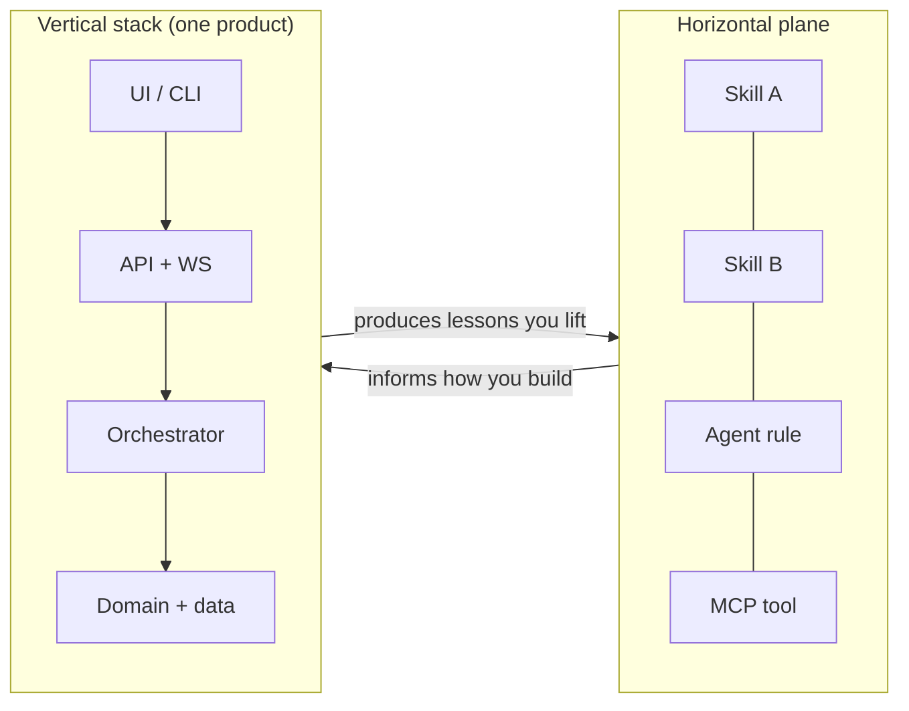
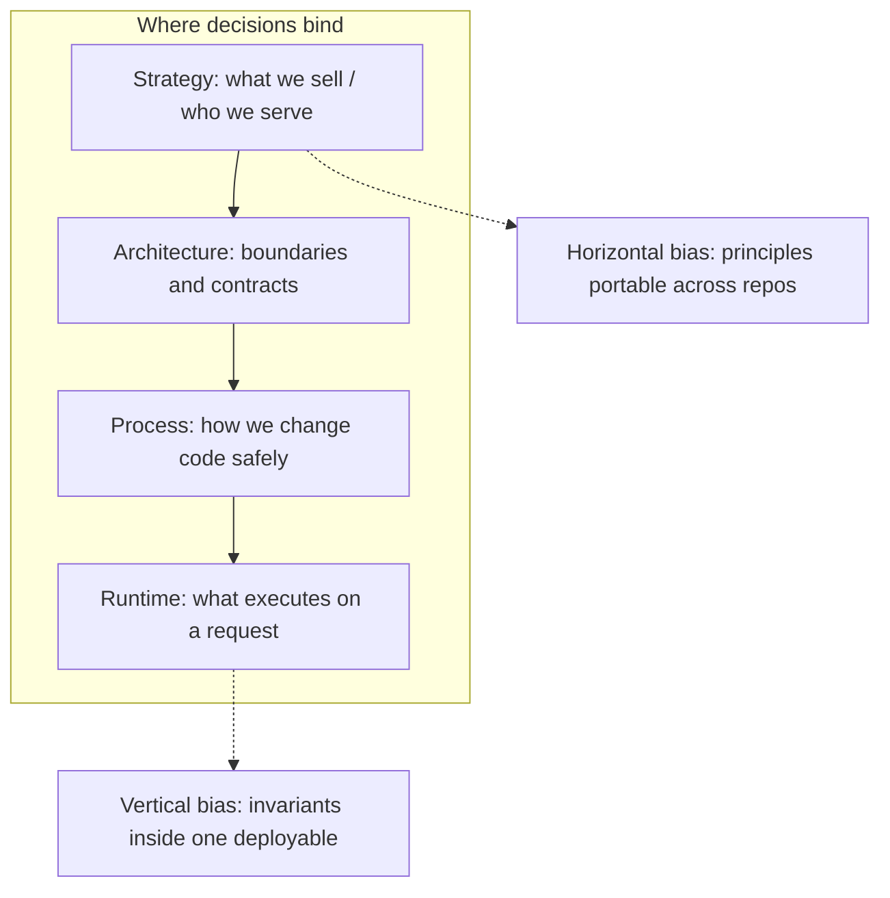
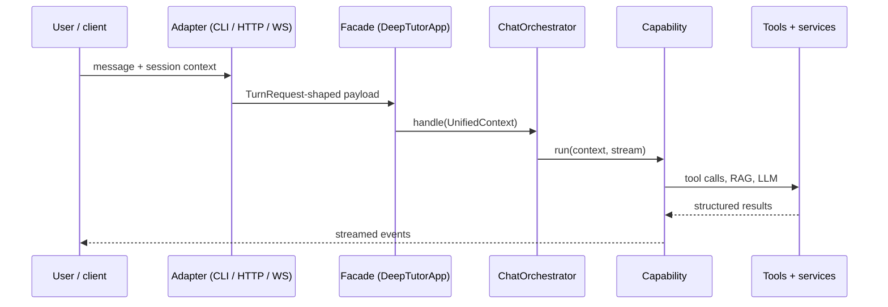
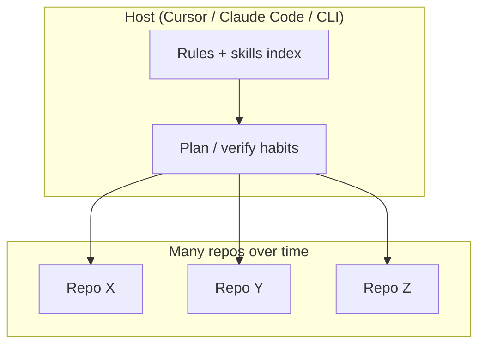
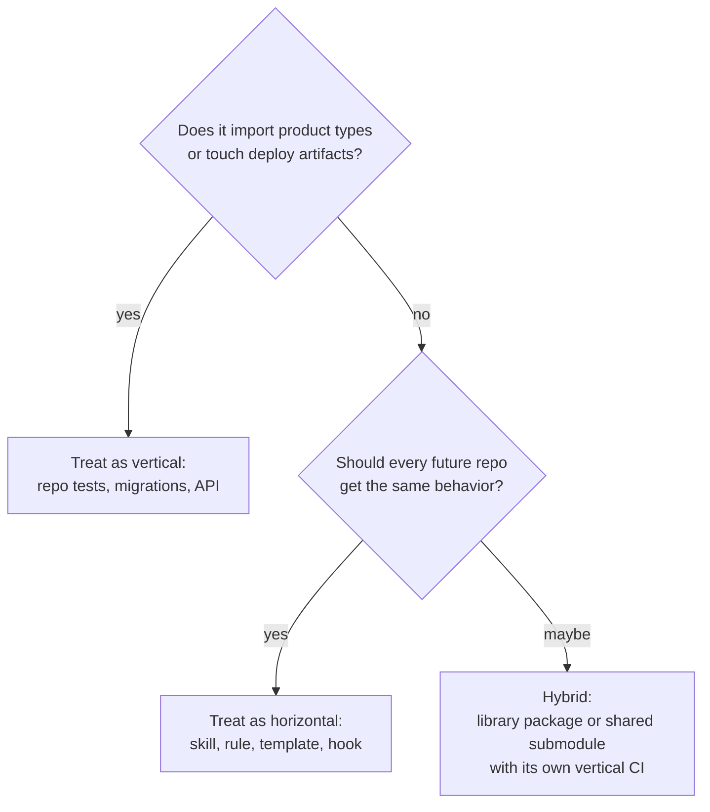
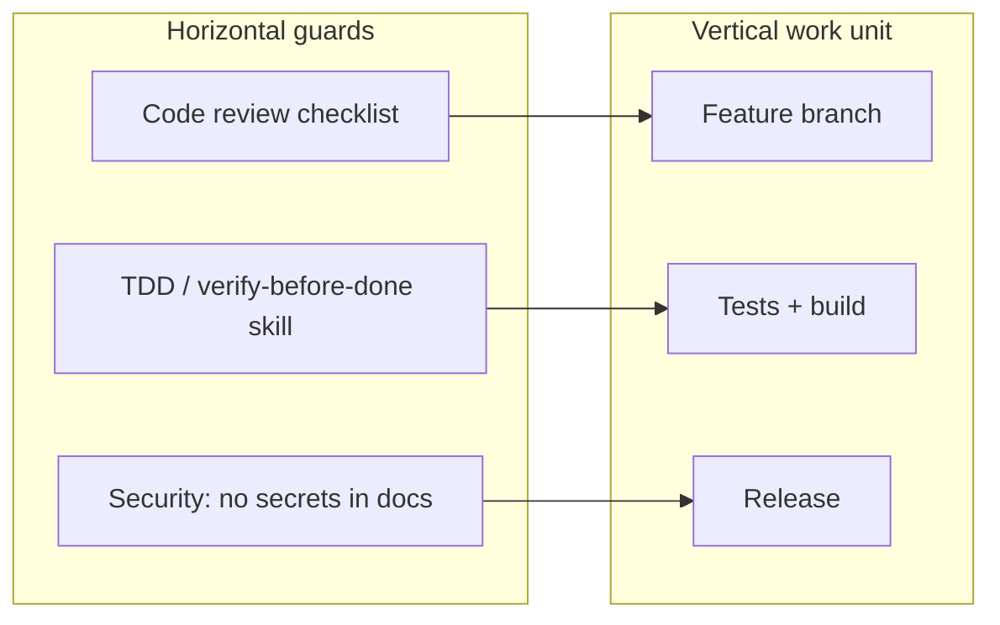

# Horizontal vs vertical logic — flows, Mermaid, and examples

**Path:** `/Users/steven/Guides/HORIZONTAL_VERTICAL_FLOWS_AND_EXAMPLES.md`

**Deep dives:** [`HORIZONTAL_LOGIC_COMPREHENSIVE.md`](./HORIZONTAL_LOGIC_COMPREHENSIVE.md) · [`VERTICAL_LOGIC_COMPREHENSIVE.md`](./VERTICAL_LOGIC_COMPREHENSIVE.md)  
**Companion (factor tables and long analysis):** [`PYTHON_MARKETPLACE_MASTER/Guides/HORIZONTAL_VERTICAL_FACTORS.md`](file:///Users/steven/PYTHON_MARKETPLACE_MASTER/Guides/HORIZONTAL_VERTICAL_FACTORS.md)  
**Cross-map (SupremePower × DeepTutor):** [`PYTHON_MARKETPLACE_MASTER/Guides/SUPREMEPOWERS_AND_DEEPTUTOR_CROSS_MAP.md`](file:///Users/steven/PYTHON_MARKETPLACE_MASTER/Guides/SUPREMEPOWERS_AND_DEEPTUTOR_CROSS_MAP.md)

This file is the **operational lens**: how horizontal and vertical **logic** show up in decisions, runtime, and tooling — with **diagrams** and **worked examples**. It does not replace the factor matrix; it **routes** you to it when you need depth.

---

## 1. Two sentences

- **Horizontal logic** answers: *“What should stay true no matter which repo or host I am in?”* — habits, skills, patterns, MCP contracts, checklists, naming rules.
- **Vertical logic** answers: *“What must stay true inside this one product boundary so the stack does not lie?”* — orchestration, types, persistence, auth, migrations, one deployable unit.

---

## 2. One picture — breadth vs depth

**How to read it:** Horizontal items **fan out** across many contexts. Vertical items **stack** inside one boundary. Good teams **spiral**: vertical work produces horizontal lessons; horizontal discipline speeds vertical delivery.

---

## 3. Where “logic” actually applies

| Layer | Horizontal logic tends to… | Vertical logic tends to… |
|-------|-----------------------------|-----------------------------|
| **Strategy** | Reuse positioning (“agent-native”, “verification-first”) | Pick one product’s scope and roadmap |
| **Architecture** | Plugin shapes, MCP tool schemas, façade pattern as *idea* | `UnifiedContext`, registries, DB schema, Docker compose |
| **Process** | Brainstorm → plan → verify skills | CI, migrations, release notes, API versioning |
| **Runtime** | Host picks which skill runs | App picks capability + tools for one turn |

---

## 4. Request / turn flow — vertical spine (example: DeepTutor)

Vertical logic **binds** at runtime: one message becomes one coherent execution path inside the product.

**Vertical invariants here:** one orchestrator choke point; manifests must match `ToolRegistry`; session and KB semantics are **owned by this app**, not by the IDE.

---

## 5. Same human hour — horizontal dispatch (example: host + skills)

Horizontal logic **does not** own the tutoring stack; it **coordinates how many stacks get touched** with consistent quality.

**Horizontal invariants here:** same verification bar before “done”; same pattern for MCP tool naming; same “read AGENTS.md before edit” habit — **each repo may implement differently**, the **habit** is portable.

---

## 6. Decision flow — “is this change horizontal or vertical?”

---

## 7. Interaction — horizontal guardrails on vertical work

**Example:** Adding a DeepTutor capability is **vertical**; running **verification-before-completion** before you merge is **horizontal** — it does not live inside DeepTutor’s wheelhouse, but it **shapes** how safely you change vertical code.

---

## 8. Worked examples (concrete)

| Situation | Mostly horizontal | Mostly vertical |
|-----------|---------------------|------------------|
| **New “always grep before refactor” habit** | Skill or rule in `my-supremepowers` / Cursor rules | N/A |
| **New DeepTutor capability `foo`** | Optional: document pattern in Guides atlas | `deeptutor/capabilities/`, manifests, `validate_tool_consistency` |
| **MCP server wrapping an API** | Tool schema style, naming, “how to document tools” | Actual server code, auth, rate limits in **that** server repo |
| **`MY_SETUP` fundamentals + ledgers** | Canonical paths, how marketplace connects | N/A (meta-repo layout, not one app runtime) |
| **TutorBot channel** | “Bots are optional extras” as a pattern doc | `deeptutor/tutorbot/`, deps in `pyproject.toml` extras |
| **Copy `SKILL.md` into another product** | Same *shape* of operator doc | Content must be rewritten for **that** product’s CLI |
| **Docker compose for DeepTutor** | “Always use `.env.example` as template” rule | `docker-compose.yml`, healthchecks, ports in **this** repo |

---

## 9. Anti-patterns (quick)

| Anti-pattern | Why it hurts |
|--------------|--------------|
| **Vertical sprawl in rules** | Cursor rules that import product-specific paths break when you switch repos. |
| **Horizontal sermon in hot paths** | 500-line “how to think” inside `orchestrator.py` — belongs in docs/skills, not runtime. |
| **Two sources of truth** | Same policy written in **both** a skill and `CONTRIBUTING.md` without sync — pick one canonical and link. |
| **Horizontal CI theater** | Pre-commit everywhere but **no** tests on the product — vertical quality still fails. |

---

## 10. When to open which doc

| Need | Open |
|------|------|
| **Matrices, factors, anti-patterns in depth** | `HORIZONTAL_VERTICAL_FACTORS.md` |
| **SupremePower vs DeepTutor mapping** | `SUPREMEPOWERS_AND_DEEPTUTOR_CROSS_MAP.md` |
| **Flows + examples + decision lens (this file)** | `HORIZONTAL_VERTICAL_FLOWS_AND_EXAMPLES.md` |
| **DeepTutor runtime wiring** | `DeepTutor-ARCHITECTURE_MAP_MERMAID_AND_EXPLORATION.md` |

---

*Edit this file for new diagrams and examples; extend the factor matrix in `HORIZONTAL_VERTICAL_FACTORS.md` when you add new **dimensions**, not duplicate paragraphs here.*
