# NotebookLM Ecosystem — Complete Architecture & Operations Guide

**Author:** AvaTarArTs
**Date:** 2026-05-15
**Source:** NotebookLM Skill v2.0 Enhanced + notebooklm-py API Client
**Repository:** `~/NotebookLM/` (backup: `/Volumes/bakUp/NotebookLM/`)

---

## Table of Contents

1. [Ecosystem Overview](#1-ecosystem-overview)
2. [Architecture: Two Projects, One Mission](#2-architecture-two-projects-one-mission)
3. [The Browser Automation Skill (notebooklm)](#3-the-browser-automation-skill-notebooklm)
4. [The API Client Library (notebooklm-py)](#4-the-api-client-library-notebooklm-py)
5. [Multi-Account Profile System (nlma / nlmcho)](#5-multi-account-profile-system-nlma--nlmcho)
6. [Query Lifecycle: From Question to Answer](#6-query-lifecycle-from-question-to-answer)
7. [Authentication Architecture](#7-authentication-architecture)
8. [Comparison: Custom Skill vs MCP Server](#8-comparison-custom-skill-vs-mcp-server)
9. [Improvement Roadmap](#9-improvement-roadmap)
10. [Security & Performance](#10-security--performance)
11. [Usage Examples](#11-usage-examples)
12. [Directory Map](#12-directory-map)

---

## 1. Ecosystem Overview

The NotebookLM ecosystem bridges AI coding agents with Google's NotebookLM — a Gemini-powered research tool that provides source-grounded, citation-backed answers from your curated document libraries. Rather than asking a generic LLM to hallucinate, you query your own documents through NotebookLM and receive answers anchored to specific sources.

Two complementary projects serve different needs:

| Project | Approach | Language | Use Case |
|---------|----------|----------|----------|
| **notebooklm** (skill) | Browser automation via Patchright | Python | Full-featured: multi-account, analytics, exports, GitHub integration |
| **notebooklm-py** (library) | Direct RPC/API calls | Python (async) | Lightweight: programmatic access, health checks, diagnostics |

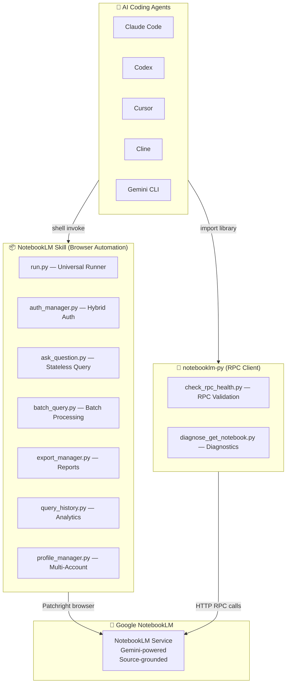

The skill is the workhorse — it opens a real Chrome browser (Patchright, an anti-detection Playwright fork), navigates to NotebookLM, types your question with human-like timing, waits for the Gemini-powered answer, and returns it. The API client skips the browser entirely and speaks NotebookLM's internal RPC protocol directly — faster but harder to maintain as Google changes their APIs.

---

## 2. Architecture: Two Projects, One Mission

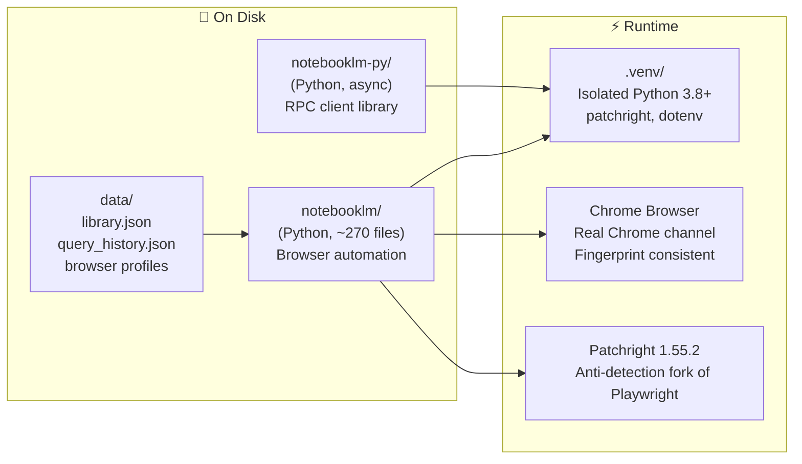

### Why Two Projects?

The browser automation skill exists because NotebookLM has no public API. Every interaction — asking questions, listing notebooks, checking sources — requires clicking buttons and typing text in a real browser. The skill handles all of this with stealth techniques: human-like typing speeds (320-480 WPM variable), random delays, and real Chrome (not Chromium) to avoid detection.

The API client library exists because NotebookLM *does* have an internal RPC protocol — the same one their web frontend uses. By reverse-engineering these calls, `notebooklm-py` can interact with NotebookLM programmatically without a browser. It's faster but brittle — Google changes RPC method IDs without notice.

---

## 3. The Browser Automation Skill (notebooklm)

### Directory Structure

```
notebooklm/
├── scripts/                    ← Core automation layer
│   ├── run.py                  ← Universal runner (venv + dep management)
│   ├── auth_manager.py         ← Google authentication (hybrid approach)
│   ├── notebook_manager.py     ← Library CRUD with metadata
│   ├── ask_question.py         ← Primary query interface (stateless)
│   ├── browser_utils.py        ← Stealth techniques + browser factory
│   ├── config.py               ← Centralized selectors/config
│   ├── export_manager.py       ← Report & export generation (v2.0)
│   ├── query_history.py        ← Query tracking & analytics (v2.0)
│   ├── batch_query.py          ← Batch processing (v2.0)
│   ├── profile_manager.py      ← Multi-account profiles ⭐
│   ├── browser_session.py      ← Session management (future persistent)
│   ├── cleanup_manager.py      ← Data cleanup utilities
│   └── setup_environment.py    ← Venv & dependency management
├── data/                       ← Local data storage (gitignored)
│   ├── library.json            ← Notebook metadata
│   ├── query_history.json      ← Query analytics database
│   ├── auth_info.json          ← Authentication metadata
│   └── profiles/               ← Per-account isolated data
│       ├── avatararts/         ← AvaTarArTs account
│       ├── ichoake/            ← Personal account
│       └── default/            ← Fallback
├── exports/                    ← Generated reports & exports
├── .venv/                      ← Isolated Python environment
├── nlm                         ← Main CLI wrapper (nlma/nlmcho)
├── SKILL.md                    ← Agent instruction manual
├── README.md                   ← User documentation
└── requirements.txt            ← Dependencies
```

### Component Interaction Flow

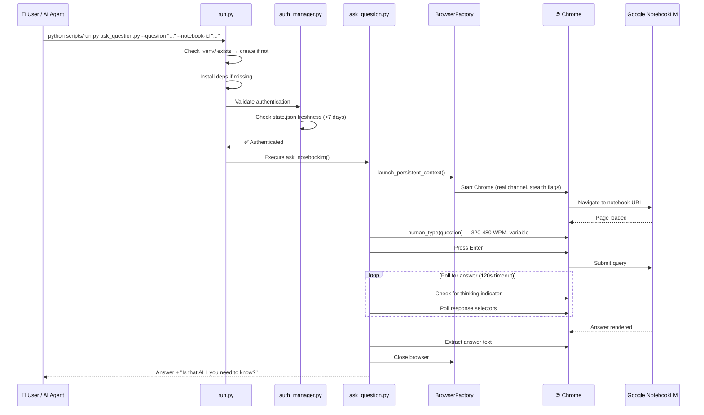

### Design Patterns

**1. Stateless Query Model**
Each question opens a fresh browser → asks → closes. No persistent sessions between queries.

- **Rationale:** Simplifies reliability. No session timeout management. No stale state.
- **Trade-off:** 2-4 second browser launch overhead per query. No conversational context between queries.
- **Mitigation:** Follow-up reminder appended to every answer: *"EXTREMELY IMPORTANT: Is that ALL you need to know? Think about it carefully before replying."*

**2. Hybrid Authentication**
Two mechanisms working together to maintain a valid Google session:

```
┌─────────────────────────────────────┐
│  Persistent Browser Profile         │
│  (user_data_dir on disk)            │
│  → Fingerprint consistency          │
│  → Chrome thinks you're the same    │
│    person every time                │
└──────────────┬──────────────────────┘
               │
               ▼
┌─────────────────────────────────────┐
│  Manual Cookie Injection            │
│  (state.json → cookies)             │
│  → Workaround for Playwright #36139 │
│  → Session cookies persist across   │
│    browser restarts                 │
└─────────────────────────────────────┘
```

Playwright has a known bug (#36139) where session cookies don't persist in persistent browser contexts. The hybrid approach stores cookies in `state.json` and manually injects them on each browser launch.

**3. Universal Runner Pattern (`run.py`)**

```bash
# Any script works without environment setup:
python scripts/run.py ask_question.py --question "..." --notebook-id "..."

# run.py handles:
# 1. Auto-creates .venv/ on first use
# 2. Installs dependencies from requirements.txt
# 3. Activates venv
# 4. Executes the target script with forwarded arguments
```

Users never touch `pip`, `venv`, or dependency management. One command, always works.

**4. Stealth Automation**

| Technique | Implementation |
|-----------|---------------|
| Human-like typing | 320-480 WPM, variable speed per keystroke |
| Random delays | 500-1500ms between actions |
| Real Chrome | Chrome release channel, not Chromium |
| Automation flags | Disabled (`--disable-blink-features=AutomationControlled`) |
| Fingerprint | Persistent `user_data_dir` across sessions |

---

## 4. The API Client Library (notebooklm-py)

A lightweight async Python library that speaks NotebookLM's internal RPC protocol directly — no browser required.

```
notebooklm-py/
├── src/notebooklm/
│   ├── __init__.py          ← Exported types
│   ├── auth.py              ← Auth token management
│   ├── _sources.py          ← Source operations
│   ├── _artifacts.py        ← Artifact operations
│   ├── cli/                 ← Click commands
│   └── rpc/                 ← RPC encoding/decoding
│       ├── types.py         ← RPC method IDs
│       ├── encoder.py       ← Request builder
│       └── decoder.py       ← Response parser
├── scripts/
│   ├── check_rpc_health.py  ← RPC method validation
│   └── diagnose_get_notebook.py ← GET_NOTEBOOK diagnostics
└── tests/
    ├── unit/
    ├── integration/
    └── e2e/
```

### RPC Health Check Flow

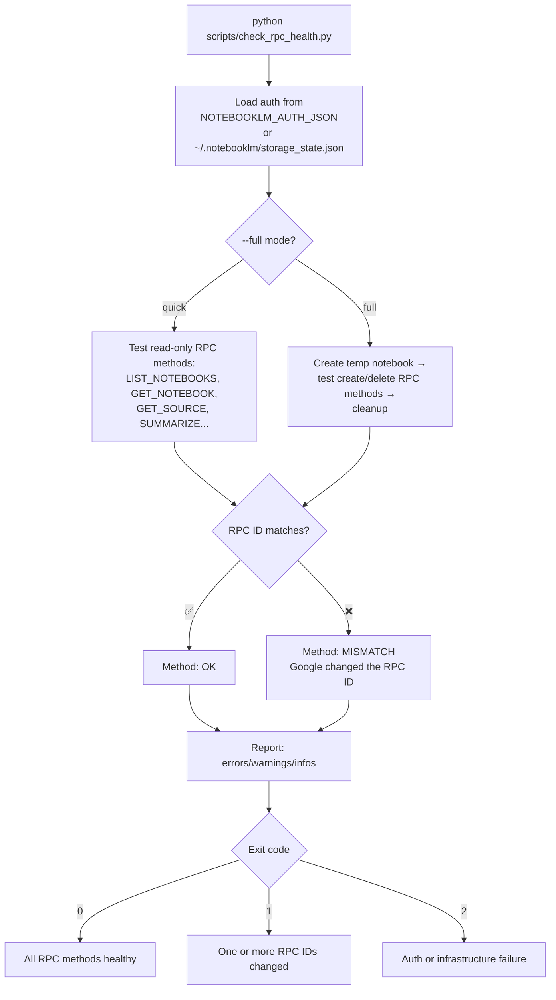

---

## 5. Multi-Account Profile System (nlma / nlmcho)

The profile system is the crown jewel — no other NotebookLM tool has multi-account support with automatic switching, isolated data, and per-profile GitHub integration.

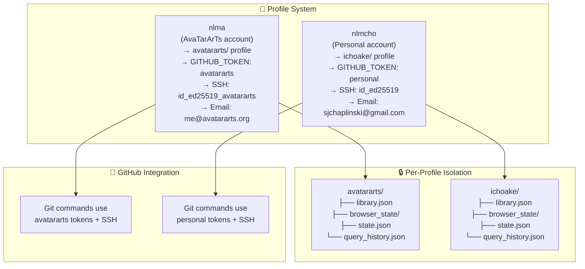

### Usage

```bash
# AvaTarArTs account
nlma list                              # List notebooks
nlma ask "What's the POD strategy?"    # Query
nlma stats                             # Analytics

# Personal account
nlmcho list                            # Different notebooks
nlmcho ask "What's in my notes?"       # Query
nlmcho export my-notebook              # Export

# Profile auto-switching is transparent:
# → nlma sets GITHUB_TOKEN, SSH keys, git email
# → nlmcho switches to personal identity
# → Each has isolated browser state, library, history
```

---

## 6. Query Lifecycle: From Question to Answer

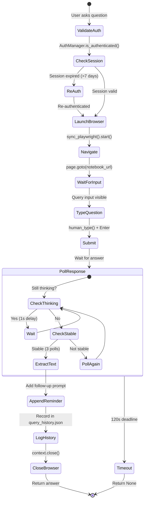

### Batch Query Flow

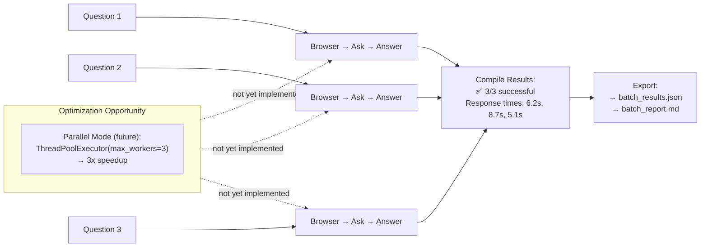

---

## 7. Authentication Architecture

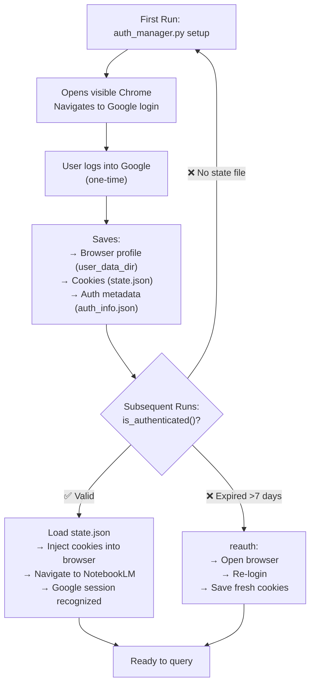

---

## 8. Comparison: Custom Skill vs MCP Server

Two implementations of the same concept coexist in the ecosystem:

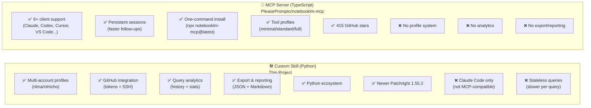

### Feature Matrix

| Feature | Custom Skill | MCP Server | Edge |
|---------|-------------|-----------|------|
| Installation | Manual clone | One command | MCP |
| Client support | Claude Code | 6+ clients | MCP |
| Session model | Stateless | Persistent | MCP |
| Multi-account | **Profile system** | Manual switching | **Custom** |
| GitHub integration | **Tokens + SSH** | None | **Custom** |
| Query history | **Full tracking** | None | **Custom** |
| Analytics | **Stats + trends** | None | **Custom** |
| Export | **JSON + Markdown** | None | **Custom** |
| Reporting | **Full reports** | None | **Custom** |
| Tool profiles | All tools | 3 modes | MCP |
| Cleanup | Basic | Comprehensive | MCP |
| Documentation | Excellent | Excellent | Tie |
| **Score** | **6** | **6** | **Tie** |

The score is tied, but the strengths are complementary. The MCP server wins on distribution and client reach. The custom skill wins on features — profiles, analytics, exports. Together they cover every use case.

---

## 9. Improvement Roadmap

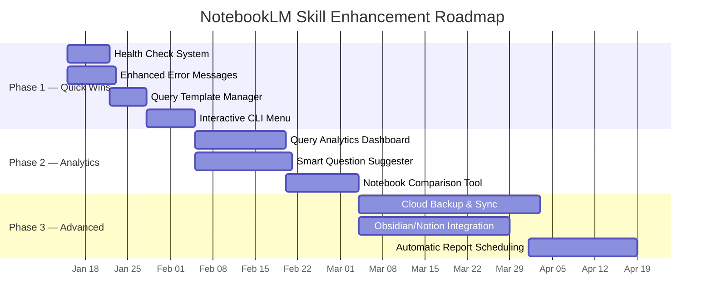

### Priority Matrix

| Enhancement | Impact | Complexity | Est. Hours | Dependencies |
|-------------|--------|-----------|-----------|--------------|
| Interactive CLI Menu | ⭐⭐⭐⭐⭐ | Low | 6-8 | prompt_toolkit, rich |
| Health Check System | ⭐⭐⭐⭐⭐ | Low | 5-7 | requests |
| Enhanced Error Messages | ⭐⭐⭐⭐⭐ | Low | 6-8 | None |
| Query Template Manager | ⭐⭐⭐⭐ | Low | 4-6 | None |
| Analytics Dashboard | ⭐⭐⭐⭐ | Medium | 10-15 | rich, plotly |
| Smart Question Suggester | ⭐⭐⭐⭐ | Medium | 12-16 | spacy (optional) |
| Notebook Comparison | ⭐⭐⭐ | Medium | 8-12 | None |
| Cloud Backup & Sync | ⭐⭐⭐⭐⭐ | High | 20-30 | google-api-client, boto3 |
| Obsidian/Notion Integration | ⭐⭐⭐⭐ | High | 15-25 | notion-client |
| Auto Report Scheduling | ⭐⭐⭐ | High | 12-18 | schedule |

---

## 10. Security & Performance

### Security Posture

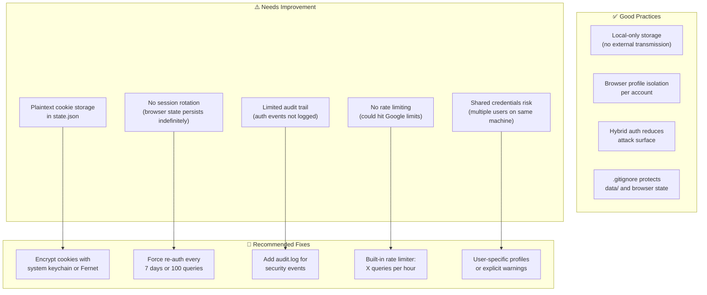

### Performance Optimization

| Strategy | Current | Optimized | Savings |
|----------|---------|-----------|---------|
| Browser pooling | Fresh launch per query (2-4s) | Keep 2 browsers warm | **-50%** latency |
| Parallel batch | Sequential queries | ThreadPoolExecutor(3) | **-66%** batch time |
| Query caching | No cache | SHA256 cache, 1hr TTL | **-100%** for repeats |
| Daemon mode | Cold start every time | Background browser daemon | **-60%** first query |

---

## 11. Usage Examples

### Basic Query

```bash
# Ask a single question
python scripts/run.py ask_question.py \
  --question "What are the key SEO strategies for AI tools?" \
  --notebook-id automation-manual

# Output:
# 💬 Asking: What are the key SEO strategies for AI tools?
# 📚 Notebook: automation-manual
# 🌐 Opening notebook...
# ⏳ Waiting for query input...
# ⏳ Typing question...
# 📤 Submitting...
# ⏳ Waiting for answer...
# ✅ Got answer!
#
# [NotebookLM answer with source citations...]
#
# EXTREMELY IMPORTANT: Is that ALL you need to know? ...
```

### Multi-Account Switching

```bash
# AvaTarArTs account
nlma list
# 📚 AvaTarArTs Notebooks:
#   automation-manual [ACTIVE] — NotebookLM Automation Manual
#   digital-empire-blueprint — Digital Empire Blueprint 2025
#   operations-manual — Digital Empire Operations Manual

nlma ask "What's the POD strategy for Q3?"

# Personal account (automatically switches GitHub tokens + SSH)
nlmcho list
# 📚 Personal Notebooks:
#   research-notes — Research Notes
#   meeting-notes — Meeting Notes

nlmcho ask "What did I discuss in the last strategy meeting?"
```

### Batch Processing

```bash
# From a questions file
python scripts/run.py batch_query.py run \
  --questions-file questions.txt \
  --notebook-id automation-manual \
  --output batch_results.json

# questions.txt:
# What is the main purpose of this notebook?
# What are the key automation strategies?
# What tools are recommended?
# What are common mistakes to avoid?

# Generates: batch_results.json + batch_report.md
```

### Export & Reports

```bash
# Export notebook summary as JSON
python scripts/run.py export_manager.py export \
  --notebook-id automation-manual

# Generate markdown report
python scripts/run.py export_manager.py report \
  --notebook-id automation-manual

# Full backup
python scripts/run.py export_manager.py export-all
```

### Query History & Analytics

```bash
# View recent queries
nlm history

# Query statistics
nlm stats
# 📊 Query Statistics (automation-manual):
#   Total queries: 47
#   Success rate: 95.7%
#   Average response: 8.2s
#   Peak hours: 9-11am
#   Most asked: "How to..."

# Search history
nlm hsearch "automation"
```

### Health Check

```bash
# Full system health check
python scripts/run.py health_check.py

# ═══════════════════════════════════════
# Health Check Report
# ═══════════════════════════════════════
# ✅ Environment → Python 3.11.5, venv active
# ✅ Authentication → Google session valid (1.4h fresh)
# ✅ Notebook Library → 3 notebooks, all URLs accessible
# ✅ Data Integrity → Query history: 47 entries, valid JSON
# ✅ Disk Space → 234 GB available
# ═══════════════════════════════════════
# Overall Health: EXCELLENT ✅
```

### Query Templates (Planned)

```bash
# List available templates
python scripts/run.py template_manager.py list

# Use deep research template
python scripts/run.py template_manager.py use \
  --template deep-research \
  --notebook-id automation-manual

# Deep Research template automatically asks:
# 1. What is the main purpose of this notebook?
# 2. What are the key concepts and frameworks discussed?
# 3. What are practical implementation details?
# 4. What are common pitfalls or best practices mentioned?
# 5. What are concrete examples or case studies included?
```

---

## 12. Directory Map

```
NotebookLM/                          ← Ecosystem root
│
├── notebooklm/                      ← Browser automation skill (Python)
│   ├── scripts/                     ← 15 core scripts
│   │   ├── run.py                   ← Universal runner
│   │   ├── auth_manager.py          ← Google auth (hybrid)
│   │   ├── notebook_manager.py      ← Library CRUD
│   │   ├── ask_question.py          ← Query interface
│   │   ├── batch_query.py           ← Batch processing
│   │   ├── export_manager.py        ← Report generation
│   │   ├── query_history.py         ← Analytics
│   │   ├── profile_manager.py       ← Multi-account ⭐
│   │   ├── browser_utils.py         ← Stealth + browser factory
│   │   ├── config.py                ← Centralized config
│   │   ├── cleanup_manager.py       ← Data maintenance
│   │   ├── setup_environment.py     ← Venv manager
│   │   ├── browser_session.py       ← Session mgmt (future)
│   │   └── generate_notebooklm_static_site.py ← Static site generator
│   ├── data/                        ← Local storage (gitignored)
│   │   ├── library.json             ← Notebook metadata
│   │   ├── query_history.json       ← Query database
│   │   ├── auth_info.json           ← Auth metadata
│   │   └── profiles/                ← Per-account isolation
│   │       ├── avatararts/          ← AvaTarArTs
│   │       ├── ichoake/             ← Personal
│   │       └── default/             ← Fallback
│   ├── exports/                     ← Generated reports
│   ├── .venv/                       ← Isolated Python env
│   ├── nlm                          ← CLI wrapper
│   ├── SKILL.md                     ← Agent instructions
│   └── [16 documentation files]
│
├── notebooklm-py/                   ← RPC client library (Python async)
│   ├── src/notebooklm/              ← Library source
│   │   ├── auth.py                  ← Auth tokens
│   │   ├── rpc/                     ← RPC protocol
│   │   └── cli/                     ← Click commands
│   ├── scripts/                     ← Diagnostics
│   │   ├── check_rpc_health.py      ← RPC validation
│   │   └── diagnose_get_notebook.py ← GET_NOTEBOOK diagnostic
│   └── tests/                       ← Pytest suite (90% coverage)
│
├── notebookllm/                     ← Planning & session exports
│   ├── IMPROVEMENT_ROADMAP.md       ← Full architecture + roadmap
│   ├── COMPARISON_MCP_VS_SKILL.md   ← MCP server comparison
│   ├── SKILL.md                     ← Skill documentation
│   └── [session export files]       ← Historical conversation logs
│
├── skill/                           ← Duplicate scripts (archival)
└── scripts/                         ← Top-level (stray files)
```

---

## Quick Reference

```bash
# ─── Authentication ─────────────────────────
python scripts/run.py auth_manager.py setup     # First-time Google login
python scripts/run.py auth_manager.py status    # Check auth status
python scripts/run.py auth_manager.py reauth    # Re-authenticate

# ─── Notebook Management ────────────────────
python scripts/run.py notebook_manager.py add --url URL --name NAME
python scripts/run.py notebook_manager.py list
python scripts/run.py notebook_manager.py activate --id ID

# ─── Queries ────────────────────────────────
python scripts/run.py ask_question.py --question "..." --notebook-id ID
python scripts/run.py batch_query.py run --questions-file file.txt --notebook-id ID

# ─── Multi-Account ──────────────────────────
nlma ask "..."     # AvaTarArTs account
nlmcho ask "..."   # Personal account

# ─── Analytics ──────────────────────────────
nlm history         # Recent queries
nlm stats           # Query statistics
nlm hsearch "term"  # Search history

# ─── Export ─────────────────────────────────
python scripts/run.py export_manager.py export --notebook-id ID
python scripts/run.py export_manager.py report --notebook-id ID
python scripts/run.py export_manager.py export-all

# ─── Health ─────────────────────────────────
python scripts/run.py health_check.py
python scripts/run.py health_check.py --fix

# ─── RPC Diagnostics ────────────────────────
cd notebooklm-py
python scripts/check_rpc_health.py
python scripts/check_rpc_health.py --full
python scripts/diagnose_get_notebook.py --notebook-id ID
```

---

*Guide compiled 2026-05-15 from the IMPROVEMENT_ROADMAP.md architecture document, COMPARISON_MCP_VS_SKILL.md analysis, and live project inspection of the NotebookLM ecosystem. Author: AvaTarArTs.*
