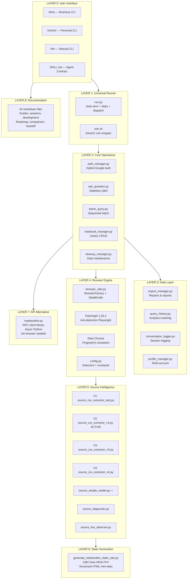
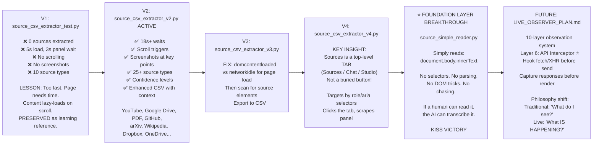
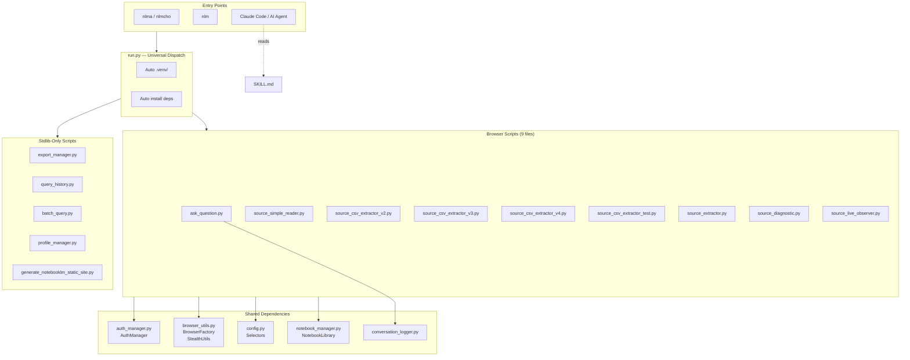
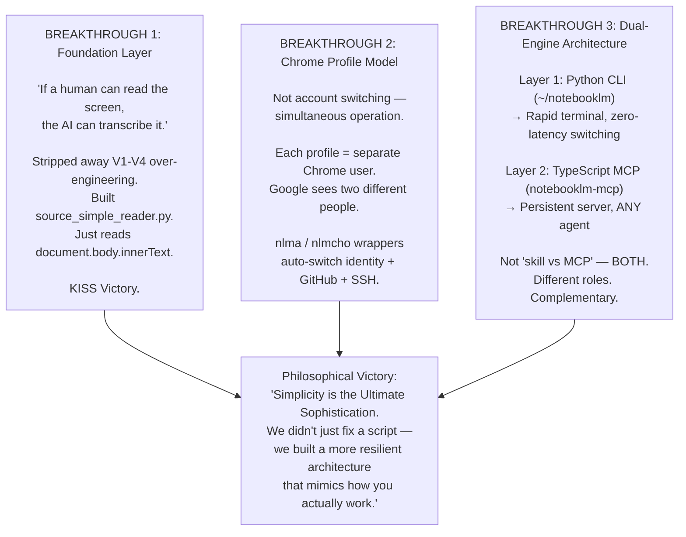
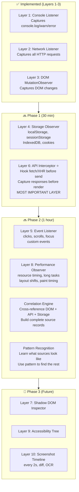

# NotebookLM: Fractal Code Analysis & Architecture Mindmap

**Author:** AvaTarArTs
**Date:** 2026-05-15
**Source:** Deep-dive analysis of `/Volumes/bakUp/NotebookLM/notebooklm/` and `/Volumes/bakUp/NotebookLM/scripts/`

---

## Fractal Mindmap: The Full System

```mermaid
mindmap
  root((NotebookLM Ecosystem))
    Browser Automation
      Core Query Engine
        ask_question.py :: Stateless Q&A
          Hybrid Auth :: browser profile + cookie injection
          StealthUtils :: 320-480 WPM human typing
          Stability Detection :: 3-polls-stable = done
          Follow-up Reminder :: "Is that ALL you need to know?"
        batch_query.py :: Sequential batch
          Subprocess calls to ask_question.py
          JSON + Markdown reports
        source_simple_reader.py :: Foundation Layer ⭐
          KISS Victory :: document.body.innerText
          No selectors. No parsing. Just read.
          Defeated V1-V4 over-engineering
      Source Extraction Evolution
        V1 :: source_csv_extractor_test.py
          Extracted 0 sources. Too fast.
          Lesson: page needs time, content lazy-loads
        V2 :: source_csv_extractor_v2.py :: ACTIVE
          18s+ waits, scroll triggers, screenshots
          25+ source types detected
          Confidence levels, enhanced CSV
        V3 :: source_csv_extractor_v3.py
          Fix: domcontentloaded vs networkidle
        V4 :: source_csv_extractor_v4.py
          Key insight: Sources is a top-level TAB
          Not a buried button — role/aria selectors
      Live Observation Architecture :: LIVE_OBSERVER_PLAN.md
        Layer 1-3 :: Console, Network, DOM Mutation :: IMPLEMENTED
        Layer 4 :: Storage Observer :: localStorage, IndexedDB
        Layer 5 :: Event Listener :: clicks, scrolls, custom events
        Layer 6 :: API Interceptor ⭐ :: hook fetch/XHR, capture responses
        Layer 7 :: Shadow DOM Inspector
        Layer 8 :: Performance Observer :: resource timing
        Layer 9 :: Accessibility Tree Observer
        Layer 10 :: Screenshot Timeline :: every 2s, diff, OCR
      Source Diagnostics
        source_diagnostic.py :: DOM structure inspector
          ARIA roles, tab structure, content areas
        source_live_observer.py :: Stream & capture live
          Console + Network + Mutation observers pre-load
    Account Management
      Profile System :: profile_manager.py ⭐
        nlma :: me@avatararts.org :: AvaTarArTs
        nlmcho :: sjchaplinski@gmail.com :: ichoake
        Per-profile isolation
          Separate browser_state/
          Separate library.json
          Separate query_history.json
          Separate auth_info.json
        Auto-switching :: transparent identity swap
      GitHub Integration :: Unique Feature
        Per-profile GITHUB_TOKEN
        Per-profile SSH keys
        Per-profile git email
        Auto-loaded on profile switch
    Data & Analytics
      Query History :: query_history.py
        Track all queries with metadata
        Per-notebook stats
        Search history
        Export history
      Export & Reports :: export_manager.py
        JSON summaries
        Markdown reports
        Library-wide statistics
        Per-notebook insights
        Batch reports
      Conversation Logger :: conversation_logger.py
        Per-profile daily markdown logs
        Cumulative CSV files
    Infrastructure
      Universal Runner :: run.py
        Auto-creates .venv/
        Auto-installs dependencies
        Shields users from Python complexity
      CLI Wrappers
        nlm :: Primary CLI :: ask, list, add, search, stats, history, report, batch, backup, auth, profile
        nlm.sh :: Generic zsh pass-through :: auto-cleans .pyc
      Auth Manager :: auth_manager.py
        Hybrid approach :: browser profile + cookie injection
        Workaround for Playwright bug #36139
        Session validation :: <7 days
        Re-auth workflow
      Browser Factory :: browser_utils.py
        Persistent context launch
        Stealth automation flags
        Anti-detection measures
      Configuration :: config.py
        QUERY_INPUT_SELECTORS
        RESPONSE_SELECTORS
        Centralized constants
    Static Site Generator
      generate_notebooklm_static_site.py :: 1381 lines HEALTHY
        Walks notebook directories
        Groups artifacts into episodes
        Grid / compact / list views
        Versioned builds :: site/versions/NNNN/
        site/latest symlink
        Pure stdlib :: no external deps
    Documentation Hub
      START_HERE.md :: Onboarding landing page
      SKILL.md :: Claude Code contract
      BROWSE_DOCS.md :: Curated doc browser
      INDEX.md :: Codebase overview + script map
      MULTI_ACCOUNT.md :: 216-line setup guide
      PROFILE_MAPPING.md :: Technical reference
      IMPROVEMENT_ROADMAP.md :: Full architecture + 10 enhancements
      MASTER_HANDOFF_2026-01-14.md :: Breakthrough narrative
      LIVE_OBSERVER_PLAN.md :: 10-layer observation architecture
      SOURCE_EXTRACTION_VERSIONS.md :: Evolution history
      COMPARISON_MCP_VS_SKILL.md :: MCP vs Custom comparison
    API Client :: notebooklm-py
      check_rpc_health.py :: RPC method validation
      diagnose_get_notebook.py :: GET_NOTEBOOK diagnostic
      Async Python library :: RPC protocol reverse-engineering
```



---

## Fractal Layers: From Surface to Core



---

## The Evolution of Source Extraction: V1 → Foundation Layer



---

## Dependency Web: Who Calls What



---

## Script Health Map

| Script | Lines | Status | Role |
|--------|-------|--------|------|
| `generate_notebooklm_static_site.py` | 1,381 | ✅ HEALTHY | Static site generator |
| `ask_question.py` | 20 | ❌ COLLAPSED | Core Q&A engine |
| `source_simple_reader.py` | 96 | ❌ COLLAPSED | Foundation reader |
| `source_csv_extractor_v2.py` | 14 | ❌ COLLAPSED | Active V2 extractor |
| `source_csv_extractor_v3.py` | 13 | ❌ COLLAPSED | V3 with domcontentloaded fix |
| `source_csv_extractor_v4.py` | 14 | ❌ COLLAPSED | V4 tab-aware extractor |
| `source_csv_extractor_test.py` | 14 | ❌ COLLAPSED | V1 test (preserved as lesson) |
| `source_extractor.py` | 15 | ❌ COLLAPSED | Original extractor |
| `source_diagnostic.py` | 11 | ❌ COLLAPSED | DOM structure inspector |
| `source_live_observer.py` | 13 | ❌ COLLAPSED | Live stream observer |
| `export_manager.py` | 31 | ❌ COLLAPSED | Reports & exports |
| `query_history.py` | 9 | ❌ COLLAPSED | Analytics tracking |
| `batch_query.py` | 16 | ❌ COLLAPSED | Batch processing |
| `profile_manager.py` | 12 | ❌ COLLAPSED | Multi-account profiles |
| `conversation_logger.py` | 10 | ❌ COLLAPSED | Session logging |

**Collapse pattern:** 14 of 15 scripts share the same minification damage — code jammed onto single lines without proper newlines. The healthy script (`generate_notebooklm_static_site.py`) was authored separately or regenerated after the collapse event. The original source at `~/.claude/skills/notebooklm/` likely has the intact versions.

---

## The Three Breakthroughs (from MASTER_HANDOFF)



---

## Live Observer: The Unbuilt Future



---

## The nlm CLI Command Map

```
nlm
├── ask|query|q <question>     → ask_question.py
├── list|ls                     → notebook_manager.py list
├── add <url> <name> ...        → notebook_manager.py add
├── search <query>              → notebook_manager.py search
├── activate|use <id>           → notebook_manager.py activate
├── stats                       → query_history.py stats
├── history [limit]             → query_history.py list
├── report <id>                 → export_manager.py report
├── batch <args>                → batch_query.py run
├── backup                      → export_manager.py export-all
├── auth                        → auth_manager.py status
├── profile
│   ├── list                    → profile_manager.py list
│   ├── switch <name>           → profile_manager.py switch
│   ├── logout <name>           → profile_manager.py logout
│   ├── current                 → profile_manager.py current
│   ├── create <name> <email>   → profile_manager.py create
│   └── info <name>             → profile_manager.py info
└── help                        → prints full banner
```

---

## Documentation Map (44 files)

```
notebooklm/
├── 🚪 ENTRY POINTS
│   ├── START_HERE.md           ← First thing to read
│   ├── BROWSE_DOCS.md          ← Curated navigation
│   └── INDEX.md                ← Codebase overview + script map
│
├── 📖 GUIDES
│   ├── QUICK_ACCOUNT_REFERENCE.md
│   ├── MULTI_ACCOUNT.md        ← 216-line comprehensive guide
│   ├── MULTI_ACCOUNT_LOGOUT.md
│   ├── PROFILE_MAPPING.md      ← Technical reference
│   ├── QUICK_START_MULTI_ACCOUNT.md
│   ├── QUICKSTART_V2.md
│   ├── AUTHENTICATION.md
│   ├── USE_FROM_CLI.md
│   ├── USAGE_OUTSIDE_CLAUDE.md
│   ├── SKILL.md                ← Claude Code contract
│   ├── QUICK_REFERENCE.md
│   └── REFERENCE.md
│
├── 🏗️ ARCHITECTURE & PLANS
│   ├── IMPROVEMENT_ROADMAP.md  ← Full architecture + 10 enhancements
│   ├── LIVE_OBSERVER_PLAN.md   ← 10-layer observation system
│   ├── CODEBASE_ANALYSIS.md
│   ├── COMPARISON_MCP_VS_SKILL.md
│   ├── IMPROVEMENTS_SUMMARY.md
│   └── SOURCE_EXTRACTION_VERSIONS.md
│
├── 📝 SESSIONS & HISTORY
│   ├── docs/sessions/MASTER_HANDOFF_2026-01-14.md
│   ├── docs/ORGANIZATION_PLAN.md
│   ├── SESSION_SUMMARY_2026-01-14.md
│   ├── HANDOFF_ANALYSIS.md
│   ├── HANDOFF_COMPLETE.md
│   └── CONVERSATION_LOGS.md
│
├── 🔧 SETUP & CONFIG
│   ├── ACCOUNT_TOKENS.md
│   ├── ACCOUNTS_INDEX.md
│   ├── ACCOUNTS_SUMMARY.md
│   ├── GITHUB_TOKEN_SETUP.md
│   ├── GITHUB_REPOSITORIES.md
│   ├── SSH_SETUP.md
│   ├── SETUP_COMPLETE.md
│   ├── NLM_SHORTCUT.md
│   └── requirements.txt
│
├── 📦 OPERATIONS
│   ├── CLEANUP_COMPLETE.md
│   ├── DIRECTORY_CLEANUP_GUIDE.md
│   ├── PUSH_INSTRUCTIONS.md
│   ├── PUSH_SUCCESS.md
│   └── MCP_TROUBLESHOOTING.md
│
├── 🌐 INTEGRATION
│   ├── AVATARARTS_ECOSYSTEM_NOTEBOOK.md
│   ├── AVATARARTS_NOTEBOOKLM_INTEGRATION_GUIDE.md
│   └── QWEN.md
│
└── 📊 CHANGELOG & VERSION
    ├── CHANGELOG.md
    └── ENHANCEMENTS.md
```

---

*Analysis compiled 2026-05-15 from deep-dive code review of 15 scripts and 44 documentation files. Author: AvaTarArTs.*
