# 🐍 ~/pythons/ — Complete Architecture Review

**Date:** 2026-05-15
**Scale:** 1.1GB | 8,314 .py | 1,180 .md | 935 .backup | 198 .csv | 605 root scripts | 38 subdirectories

---

## 1. Ecosystem Architecture

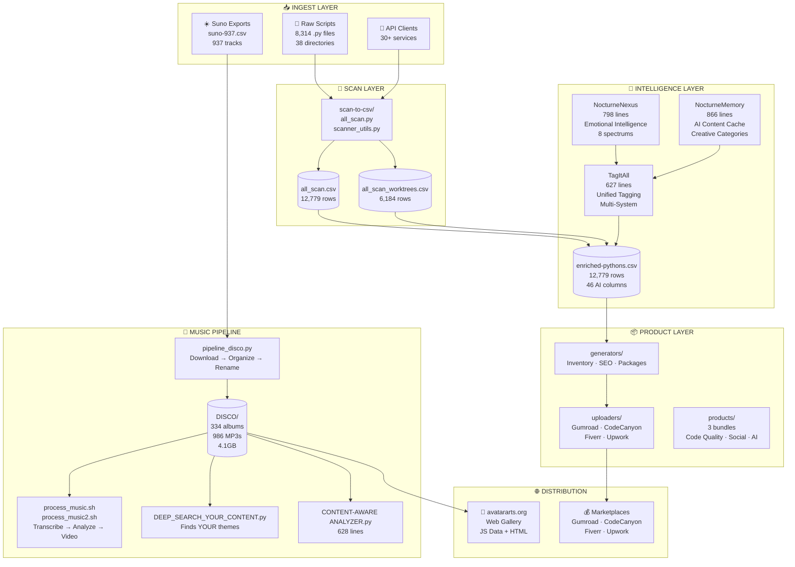

---

## 2. Script Lifecycle — From Raw to Revenue

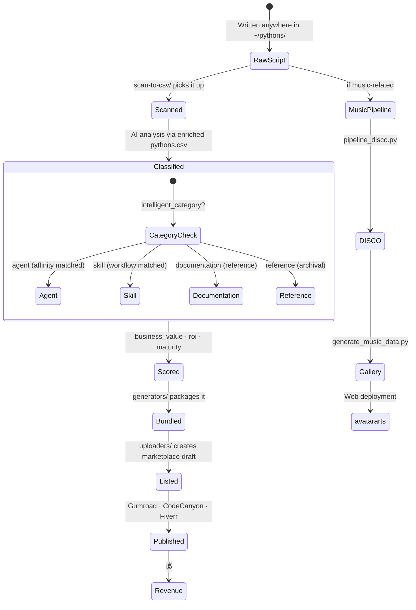

---

## 3. Directory Heatmap

---

## 4. The Three Core Engines

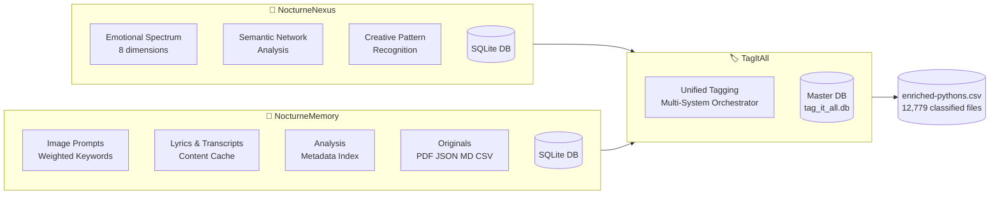

### NocturneNexus Emotional Spectrum

| Dimension | Keywords |
|-----------|----------|
| serene | peaceful, calm, tranquil, soothing |
| melancholic | sad, sorrowful, wistful, regretful |
| dreamy | dreamlike, ethereal, surreal, visionary |
| introspective | reflective, contemplative, thoughtful, meditative |
| romantic | love, passion, tender, affectionate, devoted |
| mystical | mysterious, spiritual, sacred, divine, transcendent |
| nocturnal | night, darkness, moonlight, shadows, midnight |
| celestial | stars, cosmic, heavenly, astral, infinite |

---

## 5. Music Pipeline — End to End

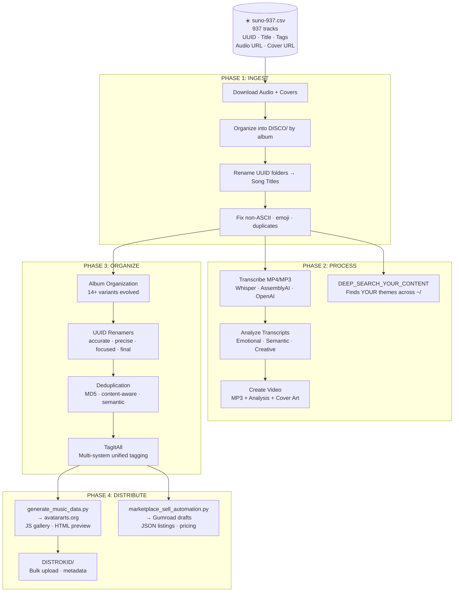

---

## 6. Content Discovery Logic

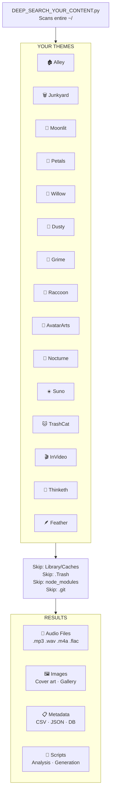

---

## 7. Marketplace Pipeline — Script to Sale

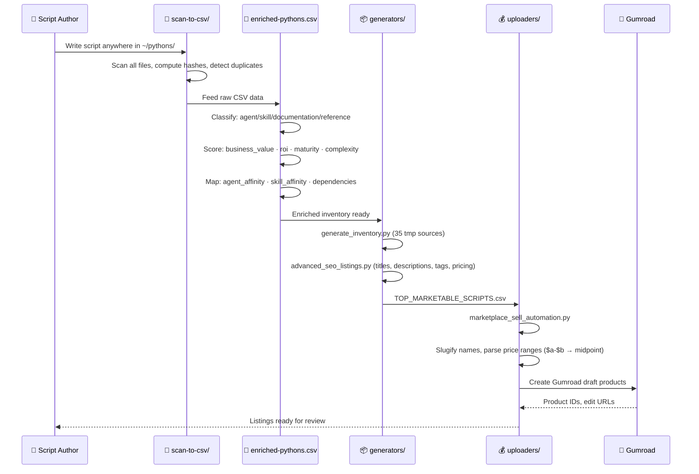

---

## 8. Duplicate & Evolution Pattern

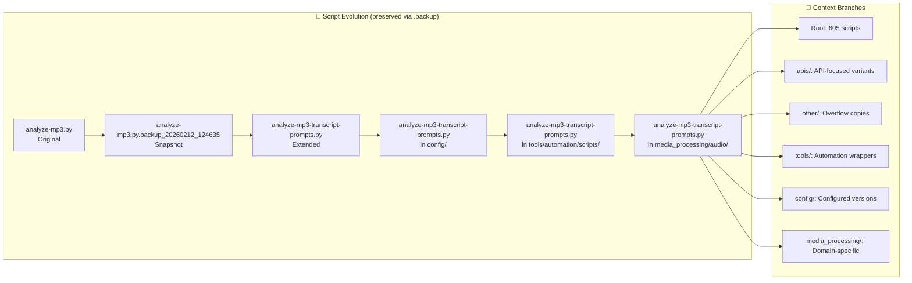

**935 .backup files** preserve every evolution step. Scripts branch into multiple directories as they adapt to different contexts. This is not duplication — it's the fossil record.

---

## 9. API Integration Map

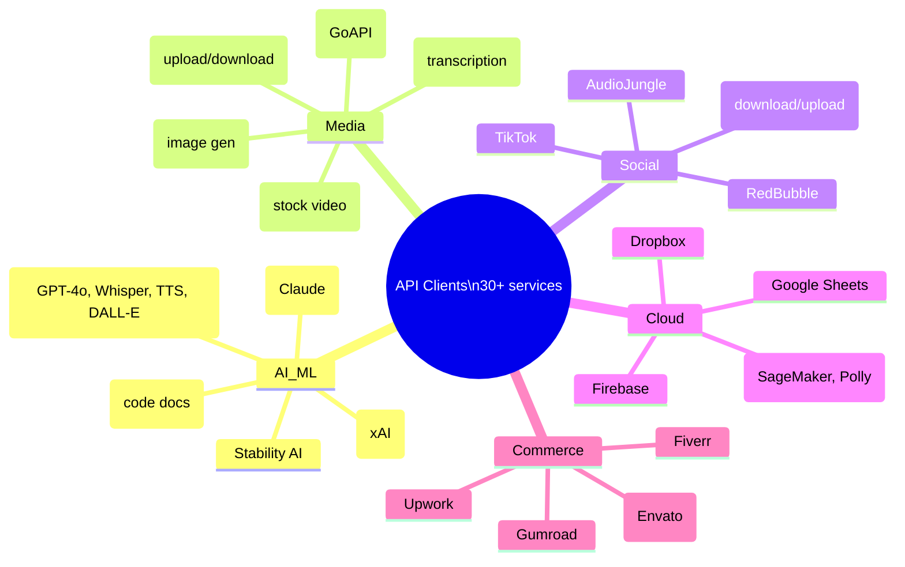

---

## 10. The 14 Album Organization Scripts — Evolution Preserved

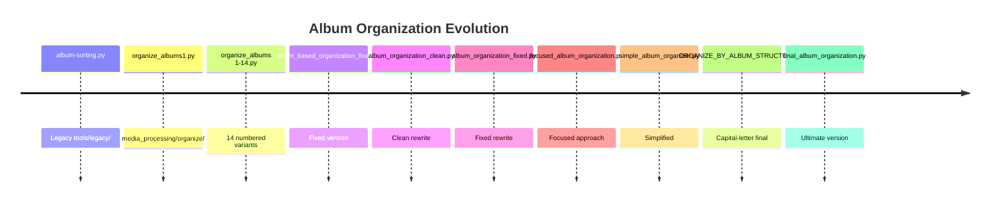

Every approach preserved. Each version learned from the last. None deleted.

---

## 11. Project Sub-ecosystems

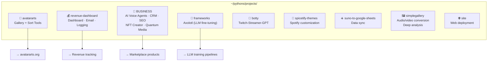

---

## 12. The HeartMuLa Gap

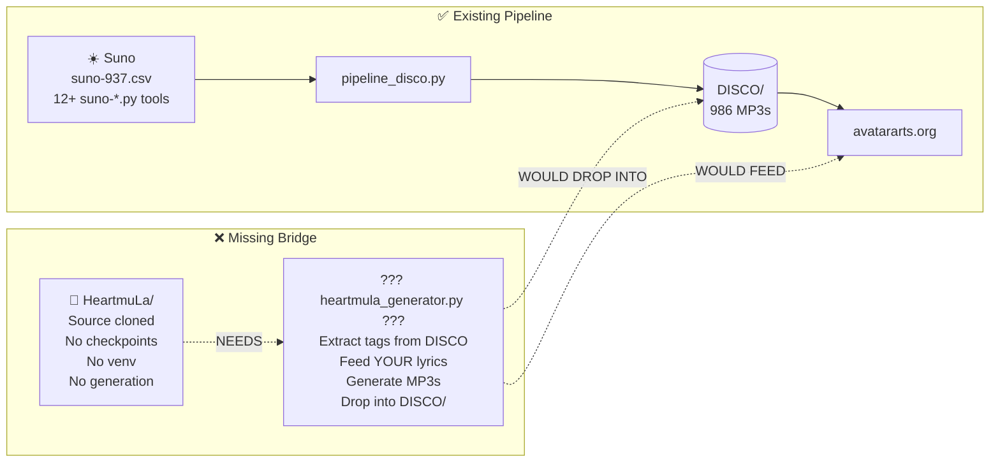

HeartMuLa is the right engine at the wrong end of the pipeline. Everything needed to bridge it exists: tags in the DISCO filenames, lyrics across 334 albums, genre keywords in `generate_music_data.py`, emotional spectrums in NocturneNexus. The gap is a single script that extracts your style → generates with HeartMuLa → feeds back into the existing DISCO → gallery → marketplace pipeline.

---

## 13. Key Metrics Summary

| Metric | Value |
|--------|-------|
| Total size | 1.1GB |
| Python scripts | 8,314 |
| Documentation files | 1,180 |
| CSV data files | 198 |
| Backup snapshots | 935 |
| Root-level scripts | 605 |
| Subdirectories | 38 |
| Largest directory | psd-tools/ (57M) |
| Core processing | data_processing/ (53M, 663 files) |
| Project count | 13 subprojects |
| API integrations | 30+ services |
| Music tracks | 986 MP3s in 334 albums |
| Classified inventory | 12,779 rows (enriched-pythons.csv) |
| Raw file scan | 12,779 rows (all_scan.csv) |
| Worktree scan | 6,184 rows (all_scan_worktrees.csv) |

---

## 14. Quick Reference — Key Scripts

| Script | Lines | Purpose |
|--------|-------|---------|
| `nocturne_nexus.py` | 798 | Emotional + semantic content intelligence |
| `nocturnememory.py` | 866 | AI creative content cache |
| `nocturnememory_ai.py` | — | AI-enhanced variant |
| `nocturnememory_ai_enhanced.py` | — | Further enhanced variant |
| `tag_it_all.py` | 627 | Unified multi-system tagging |
| `CONTENT-AWARE ANALYZER.py` | 628 | Deep env/volumes content analysis |
| `pipeline_disco.py` | 273 | Complete DISCO pipeline (download → organize) |
| `generate_music_data.py` | 252 | CSV → JS web gallery generator |
| `DEEP_SEARCH_YOUR_CONTENT.py` | 298 | Finds YOUR themes across entire ~/ |
| `marketplace_sell_automation.py` | 287 | Gumroad draft products from CSV |
| `generate_inventory.py` | 696 | Marketplace inventory from 35 sources |
| `nocturne_core.py` | 417 | SQLite content intelligence base |

---

*Review generated 2026-05-15 from comprehensive analysis of ~/pythons/ ecosystem.*
