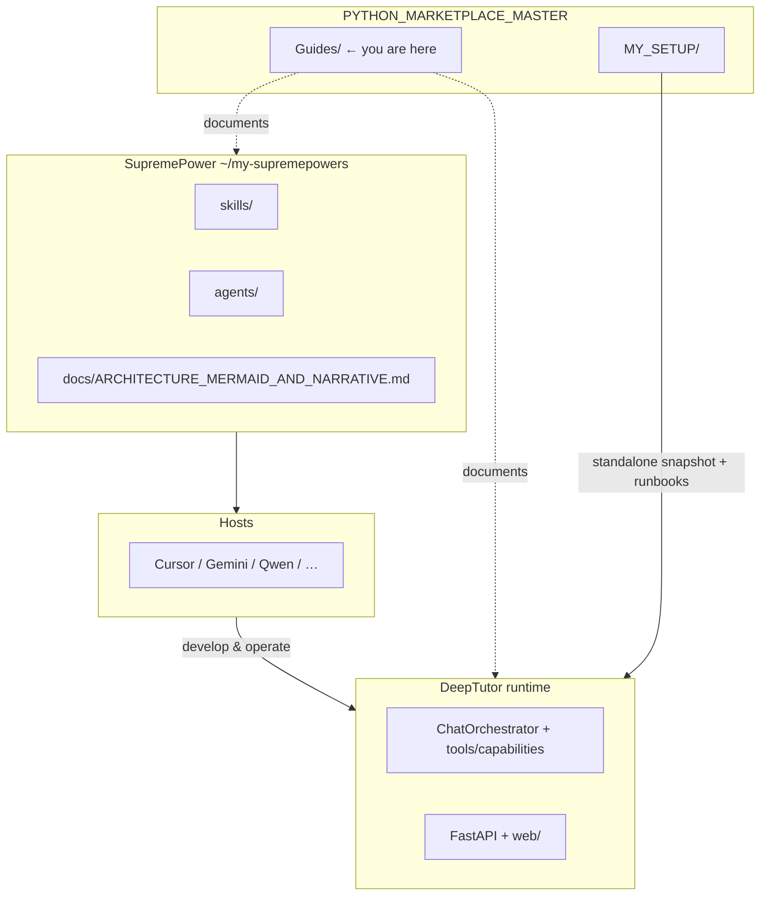

# SupremePower × DeepTutor × MY_SETUP — cross map

**Canonical copy:** `~/PYTHON_MARKETPLACE_MASTER/Guides/SUPREMEPOWERS_AND_DEEPTUTOR_CROSS_MAP.md`

Single landing page: where **workflow libraries** (SupremePower), **product runtime** (DeepTutor), and **your hub notes** (`MY_SETUP`) connect.

---

## Link table

| Topic | Path |
|--------|------|
| SupremePower — Mermaid + narrative | [`/Users/steven/my-supremepowers/docs/ARCHITECTURE_MERMAID_AND_NARRATIVE.md`](file:///Users/steven/my-supremepowers/docs/ARCHITECTURE_MERMAID_AND_NARRATIVE.md) |
| SupremePower — doc index | [`/Users/steven/my-supremepowers/docs/INDEX.md`](file:///Users/steven/my-supremepowers/docs/INDEX.md) |
| DeepTutor — architecture atlas | [`DeepTutor-ARCHITECTURE_MAP_MERMAID_AND_EXPLORATION.md`](./DeepTutor-ARCHITECTURE_MAP_MERMAID_AND_EXPLORATION.md) |
| DeepTutor — upstream How-To | [`/Users/steven/Downloads/Compressed/DeepTutor-main/How-To.md`](file:///Users/steven/Downloads/Compressed/DeepTutor-main/How-To.md) |
| MY_SETUP — fundamentals | [`/Users/steven/PYTHON_MARKETPLACE_MASTER/MY_SETUP/FUNDAMENTALS.md`](file:///Users/steven/PYTHON_MARKETPLACE_MASTER/MY_SETUP/FUNDAMENTALS.md) |
| MY_SETUP — standalone DeepTutor tree | [`/Users/steven/PYTHON_MARKETPLACE_MASTER/MY_SETUP/deeptutor-mimic/MIMIC_OVERVIEW.md`](file:///Users/steven/PYTHON_MARKETPLACE_MASTER/MY_SETUP/deeptutor-mimic/MIMIC_OVERVIEW.md) |
| **Horizontal vs vertical — full factor analysis** | [`HORIZONTAL_VERTICAL_FACTORS.md`](./HORIZONTAL_VERTICAL_FACTORS.md) |

---

## Relationship (Mermaid)



---

## One-line distinctions

- **SupremePower** — *how you work* (skills, personas, hooks) loaded by **hosts**.
- **DeepTutor** — *what the tutoring product does* when **`deeptutor` / `start_web.py`** runs.
- **`MY_SETUP`** — *your machine’s ledger* and optional **full tree copy** under `deeptutor-mimic/`.

---

## Horizontal vs vertical (summary)

**Horizontal** = patterns that span many repos/hosts (skills, agents). **Vertical** = one product stack end-to-end (UI → API → orchestrator → domain).

Full tables (strategy, architecture, process, safety, ops, knowledge, economics), diagrams, decision guide, and anti-patterns:

**[`HORIZONTAL_VERTICAL_FACTORS.md`](./HORIZONTAL_VERTICAL_FACTORS.md)**

---

## Optional ledger (append as you change layout)

```text
+ GUIDES_CROSS_MAP=this file
```
