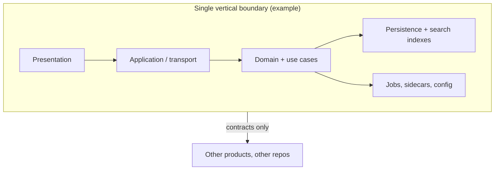
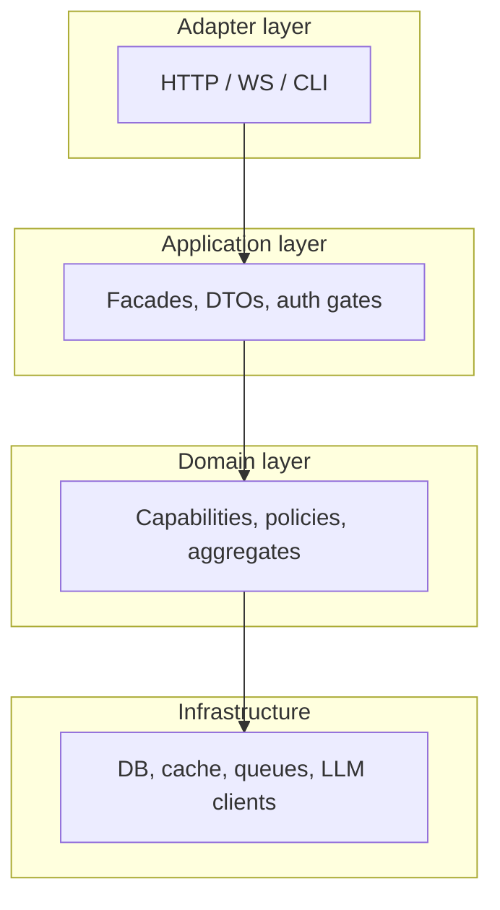
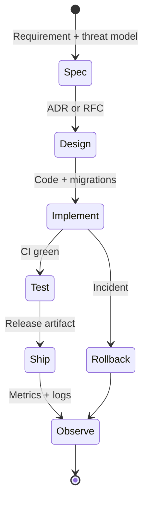
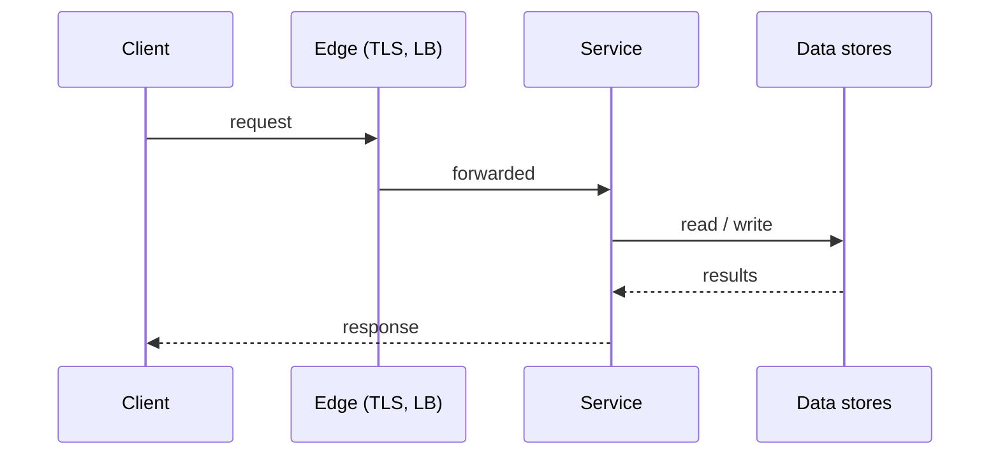
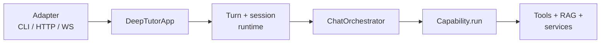
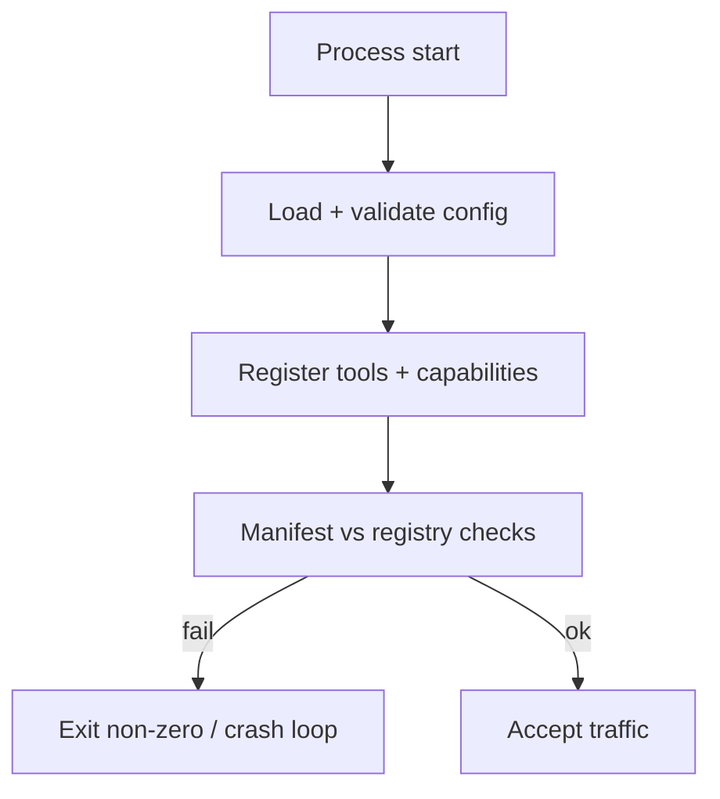
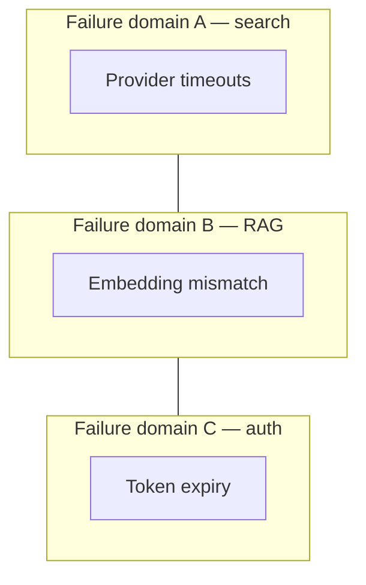
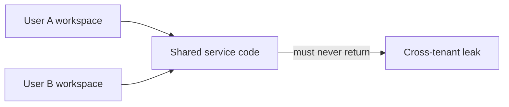
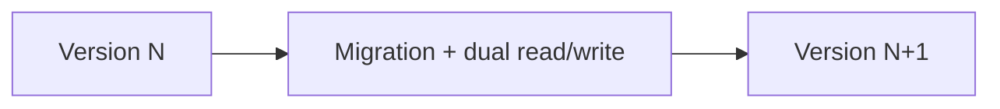
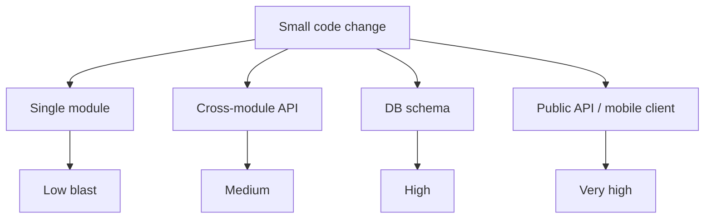

# Vertical logic — comprehensive guide

**Path:** `/Users/steven/Guides/VERTICAL_LOGIC_COMPREHENSIVE.md`

**Paired doc:** [`HORIZONTAL_LOGIC_COMPREHENSIVE.md`](./HORIZONTAL_LOGIC_COMPREHENSIVE.md)  
**Bridge (flows + quick examples):** [`HORIZONTAL_VERTICAL_FLOWS_AND_EXAMPLES.md`](./HORIZONTAL_VERTICAL_FLOWS_AND_EXAMPLES.md)  
**Factor matrix:** [`PYTHON_MARKETPLACE_MASTER/Guides/HORIZONTAL_VERTICAL_FACTORS.md`](file:///Users/steven/PYTHON_MARKETPLACE_MASTER/Guides/HORIZONTAL_VERTICAL_FACTORS.md)  
**DeepTutor atlas (vertical product reference):** [`PYTHON_MARKETPLACE_MASTER/Guides/DeepTutor-ARCHITECTURE_MAP_MERMAID_AND_EXPLORATION.md`](file:///Users/steven/PYTHON_MARKETPLACE_MASTER/Guides/DeepTutor-ARCHITECTURE_MAP_MERMAID_AND_EXPLORATION.md)

---

## How to use this document

Use this guide when you are **inside one deployable boundary** — one repo, one service mesh owned by one team, one mobile app plus backend, or one “product” folder such as `My-Deep-Proprietary/`. Vertical logic is where **invariants** are enforced by **types, tests, startup checks, and data**, not by good intentions.

---

## Part A — Core concepts

### A1. Definition (precise)

**Vertical logic** is reasoning and commitment under the constraint:

> *If this claim is false, something inside this boundary must fail loudly — build, test, boot, or migration — not just a human noticing later.*

Vertical artifacts tend to be:

- **Imperative and structural** — modules, classes, SQL, protobuf, OpenAPI, Docker layers.
- **Versioned as a unit** — semver, migrations, changelog, compatibility promises.
- **Owned by runtime** — orchestrators, session stores, auth middleware, feature flags evaluated server-side.

**Non-goals:** Vertical code should not silently embed **personal** path habits (`~/foo`) or **global** workflow doctrine that belongs in horizontal skills — inject via config and document in horizontal hub.

### A2. The vertical boundary (what counts as “one stack”)

A vertical boundary is usually:

1. **One deployable** (container image, mobile binary + its API backend treated as one product), or  
2. **One strongly coupled monorepo app** (Next.js + FastAPI in one release train), or  
3. **One bounded context** in DDD terms — if two services share a DB schema casually, you may have **leaked vertical** boundaries.

### A3. Vertical truth hierarchy

When documents and code disagree, vertical resolution order is typically:

1. **Executable code** on the running path  
2. **Schema** (DB, API, config validation)  
3. **Tests** that run in CI  
4. **Operational runbooks** actually exercised in incidents  
5. **Marketing or old wiki** — suspect until reconciled  

Horizontal docs **do not** override vertical truth for runtime behavior.

---

## Part B — Layers inside the boundary (reference model)

### B1. Classic layering (web + API product)

**Vertical rule:** Dependencies point **inward** — domain does not import random HTTP details.

### B2. DeepTutor-shaped vertical (concrete mapping)

| Layer | DeepTutor-shaped location (illustrative) |
|-------|------------------------------------------|
| Adapter | `deeptutor_cli/`, `deeptutor/api/routers/` |
| Application | `deeptutor/app/` façade, turn/session managers |
| Domain orchestration | `deeptutor/runtime/orchestrator.py`, registries |
| Domain modes | `deeptutor/capabilities/`, `deeptutor/agents/` |
| Tools / effects | `deeptutor/tools/`, `deeptutor/knowledge/` |
| Infrastructure | `deeptutor/services/` (LLM, embeddings, stores) |

This mapping is **product-specific**; the **layer logic** generalizes.

---

## Part C — Dimensions of vertical logic

### C1. Deployment and release topology

**What:** Images, compose files, Helm charts, feature flags, canary rules.

**Why vertical:** Only **this** product’s SLO and blast radius apply.

**Signals:** One pipeline produces one artifact digest trusted by prod.

**Anti-pattern:** “Works in compose” but never matches prod env vars — vertical configuration drift.

### C2. Data and consistency

**What:** Transactions, idempotency keys, vector index versioning, attachment storage.

**Why vertical:** Data gravity is **inside** the product; cross-product joins are explicit contracts.

**Signals:** Migrations are reviewed like code; rollback path exists.

**Anti-pattern:** Silent dual-writes to two stores without reconciliation story.

### C3. API and contract evolution

**What:** OpenAPI, WS message schemas, backward compatibility rules.

**Why vertical:** Breaking clients is a **product** event with semver semantics.

**Signals:** Deprecation headers, sunset dates, contract tests.

**Anti-pattern:** Undocumented WS fields that only the web client understands.

### C4. AuthN and AuthZ

**What:** Sessions, JWT validation, multi-user scoping, admin grants.

**Why vertical:** Threat model is **per deployment**, not per skill pack.

**Signals:** `require_auth` paths audited; least privilege default.

**Anti-pattern:** Auth “TODO” behind a feature flag accidentally enabled.

### C5. Configuration surface

**What:** `.env`, settings UI, provider catalogs, embedding dimensions.

**Why vertical:** Misconfiguration crashes **this** process at boot or first RAG query.

**Signals:** `validate_tool_consistency()`-style fail-fast checks.

**Anti-pattern:** 200 env vars with combinatorial untested states.

### C6. Observability inside the boundary

**What:** Structured logs, traces, metrics, SLO dashboards.

**Why vertical:** Signals describe **this** request path’s latency and errors.

**Anti-pattern:** Logs with no `request_id` — vertical debugging becomes archaeology.

### C7. Background work and schedules

**What:** Cron, queues, outbox pattern, TutorBot schedules.

**Why vertical:** Retry and poison-queue policy are **product** decisions.

**Anti-pattern:** Fire-and-forget asyncio tasks with no supervisor.

### C8. Frontend vertical slice (when present)

**What:** Next.js routes, client state, optimistic UI, API client.

**Why vertical:** UX coherence is **per product**; design system tokens may be horizontal **design** but implementation is vertical.

**Anti-pattern:** Client builds URLs by string concat that drift from server routes.

### C9. Extensibility inside the product

**What:** Plugin manifests, registries, optional extras (`pip install .[tutorbot]`).

**Why vertical:** Registration happens at **this** process startup with **this** dependency cone.

**Anti-pattern:** Optional import that half-registers tools — `validate_tool_consistency` exists to catch this class.

### C10. Testing pyramid (vertical)

**What:** Unit, integration, e2e, smoke scripts.

**Why vertical:** Tests lock **this** behavior; they do not travel to other repos unchanged.

**Signals:** Flaky test budget trending down.

**Anti-pattern:** E2E only — slow; vertical feedback arrives too late.

---

## Part D — Lifecycle of vertical change

| Stage | Vertical quality gate |
|-------|------------------------|
| **Spec** | Who is impacted? What breaks if we are wrong? |
| **Design** | Contract impact (API, DB, WS)? |
| **Implement** | Migrations reversible? Feature flag? |
| **Test** | Minimal happy path + failure injection |
| **Ship** | Rollback documented |
| **Observe** | Dashboards updated for new failure modes |

---

## Part E — Deep diagrams (vertical)

### E1. Single request spine (generic)

### E2. DeepTutor turn spine (reference architecture)

**Vertical invariant:** One capability selection per turn (routing), many tool calls possible **inside** the capability.

### E3. Startup as vertical “constitution day”

DeepTutor example: tool/capability manifest consistency checks belong here.

### E4. Failure domain isolation

**Vertical discipline:** Circuit breakers and fallbacks **scoped per domain** — avoid one catch-all “retry everything”.

---

## Part F — Vertical coupling types (engineer vocabulary)

| Coupling | Description | Mitigation |
|----------|-------------|------------|
| **Temporal** | A must happen before B | Explicit state machine / job status |
| **Data** | Shared tables without ownership | Bounded contexts, foreign keys with clear owner |
| **Control** | Feature A silently changes B’s defaults | Config namespaces, explicit merge rules |
| **Compile-time** | Giant import graph | Interfaces, smaller modules |
| **Operational** | Two services must roll together | Blue/green pairing, contract tests |

---

## Part G — Pattern catalog (vertical)

| Pattern | Good when | Cost | Example |
|---------|-----------|------|---------|
| **Facade over subsystems** | Multiple adapters | Indirection | `DeepTutorApp` |
| **Registry + manifest** | Plugins with drift risk | Boilerplate | Tool + capability registries |
| **Fail-fast validation at boot** | Misconfig expensive | Slower boot | Tool consistency check |
| **Idempotent migrations** | Zero-downtime deploys | Migration authoring time | Expand-contract DB pattern |
| **Versioned indexes** | RAG / vector rebuild semantics | Storage | KB index versioning |
| **Optional extras in packaging** | Channel deps heavy | User confusion | `pip install .[tutorbot]` |
| **Attachment sandbox** | User uploads | CPU / MIME validation | Document extractors |

---

## Part H — Vertical logic in AI-native products

### H1. Model routing is vertical

Which provider executes **this** chat turn belongs in **product config** and code paths — not in a global skill that hardcodes vendor choice.

### H2. Prompts are vertical assets (usually)

Prompt text that encodes **product tone**, **disallowed content**, and **stage machine** for a capability is **versioned with the product** — not copied into a generic “chat skill” without scoping.

Exception: **horizontal** “safe completion” guardrails may be shared — but merge carefully to avoid product identity dilution.

### H3. Tool schemas are vertical contracts

Tool names and JSON schemas exposed to the model are part of the **runtime API** of the agent loop inside the product.

### H4. Streaming and cancellation

Stream lifetimes, backpressure, and user “stop generation” are **vertical** UX contracts — implemented per transport (WS/SSE/CLI).

---

## Part I — Multi-tenant and multi-user (vertical concern)

When `AUTH_ENABLED` or multi-user workspaces exist:

- **Horizontal** principle: “tenants must not read each other’s data” as policy text.  
- **Vertical** enforcement: path scoping, grants, tests under `tests/multi_user/`.

---

## Part J — Migrations and evolution (vertical hardest problem)

**Rules:**

1. Prefer **expand → migrate → contract** for schema.  
2. Ship **backward compatible** API first, then remove old fields.  
3. Document **rollback** as a first-class path, not a footnote.

---

## Part K — Metrics (vertical)

| Metric | What it tells you |
|--------|-------------------|
| **p95 latency** per route | Adapter and domain hot paths |
| **Error budget burn** | Reliability of vertical stack |
| **Migration success rate** | Vertical evolution safety |
| **RAG recall@k / groundedness** (if measured) | Vertical retrieval quality |
| **Startup time to ready** | Boot validation cost |

---

## Part L — Anti-patterns encyclopedia (vertical)

1. **Leaky domain** — HTTP headers parsed inside pure domain functions.  
2. **God service** — one deployable owns unrelated bounded contexts.  
3. **Config soup** — env vars read in 40 modules with no single loader.  
4. **Silent fallback** — RAG fails → model hallucinates without telling user.  
5. **Unversioned external API** — calling partner API without pinning or contract tests.  
6. **Shared DB as integration bus** — every team writes same tables.  
7. **Feature flags without expiry** — permanent `if flag` branches.  
8. **Test data in prod paths** — accidental writes to real buckets.  
9. **Undocumented WS protocol** — only one client ever worked.  
10. **Vertical secrets in repo** — `.env` committed “temporarily”.

---

## Part M — Scenarios (worked)

### M1. Add a new capability to DeepTutor

**Vertical steps:** manifest, `tools_used`, registry bootstrap, pipeline under `agents/`, API/CLI surface, tests, startup validation.  
**Horizontal hook:** update cross-repo atlas **after** behavior stabilizes.

### M2. Change embedding dimensions

**Vertical:** migration/reindex, config UI, provider matrix, failure messages.  
**Horizontal:** document “embedding host is full URL” lesson in guides once.

### M3. Add OAuth to a channel (TutorBot)

**Vertical:** dependency extra, secrets, channel manager, tests.  
**Horizontal:** “never log tokens” reminder in security checklist.

---

## Part N — Glossary (vertical)

| Term | Meaning here |
|------|----------------|
| **Boundary** | Deployable or bounded context |
| **Invariant** | Must always hold; enforced by code or schema |
| **Adapter** | Translates wire format to domain |
| **Orchestration** | Routing and lifecycle inside the boundary |
| **Migration** | Schema or data transform under version control |

---

## Part O — Further reading

- [`DeepTutor-ARCHITECTURE_MAP_MERMAID_AND_EXPLORATION.md`](file:///Users/steven/PYTHON_MARKETPLACE_MASTER/Guides/DeepTutor-ARCHITECTURE_MAP_MERMAID_AND_EXPLORATION.md)
- [`DeepTutor-REPO_LAYOUT_FLOWS_AND_HOWTO.md`](file:///Users/steven/PYTHON_MARKETPLACE_MASTER/My-Deep-Proprietary/docs/guides-from-home-Guides/DeepTutor-REPO_LAYOUT_FLOWS_AND_HOWTO.md) — merged snapshot inside proprietary tree (refresh from `~/Guides` if you maintain a copy there)
- [`AGENTS.md`](file:///Users/steven/Downloads/Compressed/DeepTutor-main/AGENTS.md) — upstream agent-native summary

---

## Part P — FAQ (vertical)

**Q: Is a database migration vertical if SQL lives in a shared repo?**  
**A:** The **effect** is vertical for every consumer of that DB; the **file location** is secondary. Ownership must be clear.

**Q: Are feature flags horizontal or vertical?**  
**A:** The **framework** for flags can be horizontal (library); **each flag’s semantics** are vertical product decisions.

**Q: When does microservice extraction stop being vertical?**  
**A:** When two services must release in lockstep forever — you may still have two deployables but **one vertical release train**; treat as single product operationally.

**Q: Should LLM prompts live in git?**  
**A:** Yes for **product** prompts (vertical). For **personal** prompt hacks, keep horizontal docs or private gists — do not mix into production paths.

**Q: Who owns rollback?**  
**A:** The **vertical** team on call — horizontal playbooks help but do not absolve ownership.

---

## Part Q — Extended vertical scenarios

### Q1. Splitting a monolith

**Vertical work:** carve interfaces, duplicate data temporarily, traffic shadowing, cutover.  
**Horizontal:** update “service boundary” training for engineers — **after** the technical cut is credible.

### Q2. Caching layer introduction

**Vertical:** cache keys, TTL, invalidation on writes, stampede protection, metrics.  
**Horizontal:** naming doc for cache key components — optional, small.

### Q3. Internationalization (i18n)

**Vertical:** translation files shipped with product, locale-aware formatting in UI.  
**Horizontal:** “do not concatenate translated strings with punctuation assumptions” guideline.

### Q4. Disaster recovery

**Vertical:** backups, restore drills, RPO/RTO tested for **this** stack.  
**Horizontal:** generic incident comms template — reused across products.

---

## Part R — Checklist: “is this change safely vertical?”

- [ ] **Contracts** updated (API, WS, DB)?  
- [ ] **Migrations** reversible or have compensating transaction?  
- [ ] **Feature flag** or gradual rollout for risky paths?  
- [ ] **Tests** at lowest feasible layer (not only e2e)?  
- [ ] **Observability** — logs/metrics/traces show new failure modes?  
- [ ] **Runbook** snippet for on-call?  
- [ ] **Security** — authz paths reviewed for new endpoints?

---

## Part S — Vertical “blast radius” map

Use this mentally when arguing for **smaller vertical steps** vs a big-bang release.

---

## Part T — Closing synthesis

Vertical logic is where **money and reputation** convert from promises to proof. Invest when:

- Users depend on **correctness** and **latency** under load, or  
- Regulators or customers require **auditable** controls, or  
- You are **tired** of horizontal docs being ignored because runtime does not enforce them.

Pull horizontal lessons **out** of vertical incidents — but never confuse a postmortem PDF with a failing test.

---

*Vertical logic is where promises become liabilities if you lie. Horizontal logic is where habits become leverage if you tell the truth. Ship verticals; compound horizontals.*
